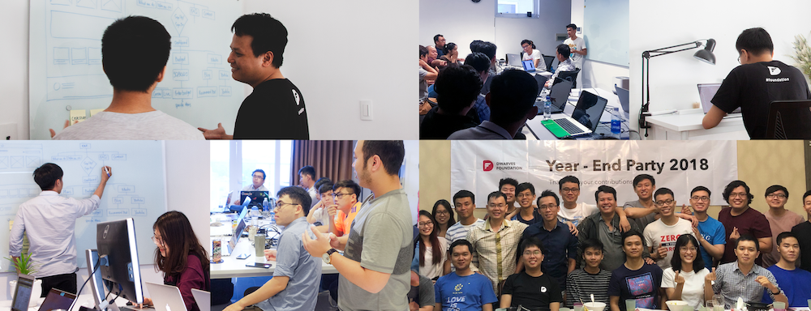
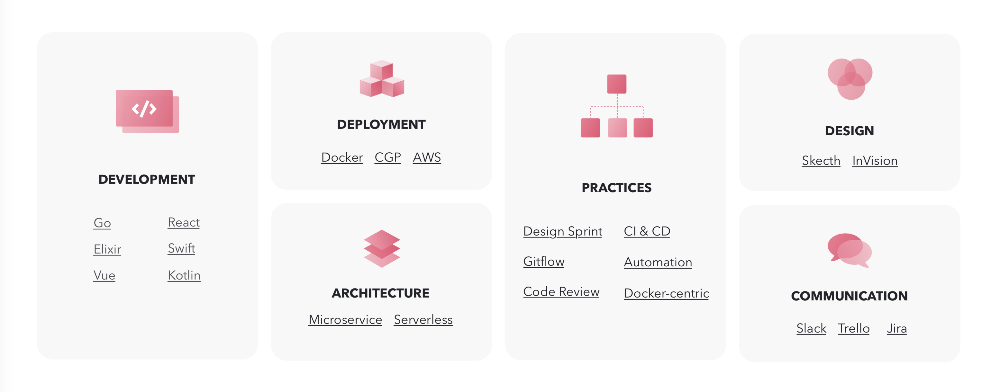
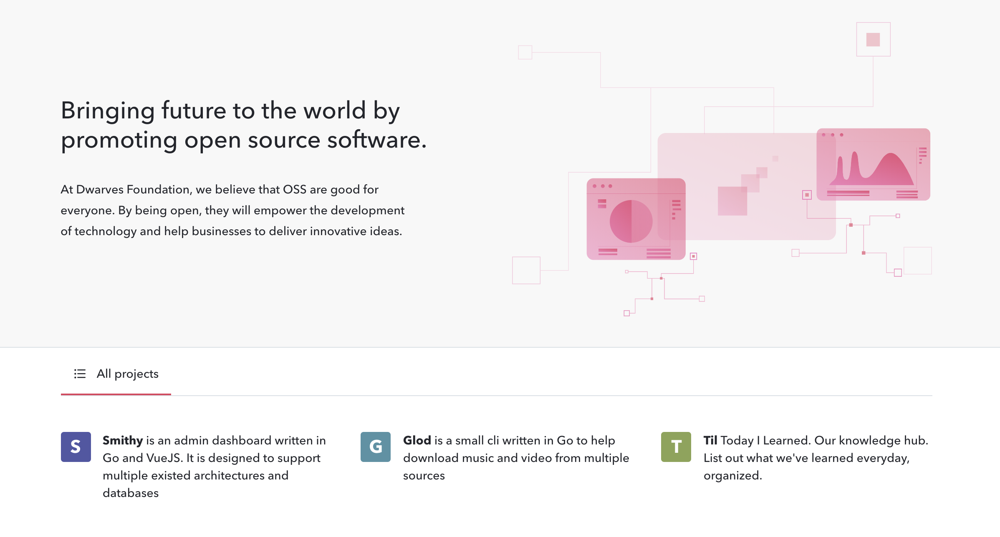

# Open positions

#### Engineering

- 3 x [Backend Engineer](./open-positions/Golang.md)
- 3 x [Web Engineer, React.js](./open-positions/Frontend.md)
- 1 x [Quality Assurance Engineer](./open-positions/QA.md)

#### Design

- 1 x Web/App Designer
- 1 x UI Designer

#### Business

- Sales Partner
- Client Partner

## The Dwarves

Dwarves is a software consulting firm registered in Delaware, USA. Since 2012, we have been on a mission to create a sustainable future, by distributing our technology practices and helping companies deliver their innovative software products.

- Businesses work with us to build their in-house products & software.
- Tech startups collaborate with us to launch and scale.
- Oversea clients partner with  us to extend their development capacity.

## We're seeking for the bright minds.

Hiring means we need help. Hiring means there is something we simply cannot accomplish without an additional to our team. That's why we like 'better' people. People who can tell us what to do, not the other way around. We like people who not only get the job done right now, but also keeps getting better and grow with us.

You'll join our HCM office as part of our technology R&D Lab. This group brings together product minds and digital capabilities to build the software that we can all be proud of.

Our application process is as followed:

- Pre-assessment: We'll be evaluating the “mind”, English skill, personalities in non-interrupted 30 minutes online session.
- Assignment: You'll desmonstrate your skills and thought process on tackling problems through a small assignemnt.
- Interview: With a 60 minute call, we'll show you everything you need to know about us, while you'll show us in greater depth about your software expertise.
- Culture: If we get here, it means we really like you already. This one last step helps make sure you will fit right in with us, and that we are the right team for you. 

## What we pursue

### We are an engineering driven company

Since day 1, we have spared no effort in building a company where software engineering could shine. 
- We see software as a craft that requires expertise and passion.
- We don't compromise quality. We aim to raise standards with every piece we produce.
- We invest in the brilliant minds behind the craft. For us it's never wasted effort to uplift our engineers and boost their career growth. 

### We live in tech

It doesn't make sense if a tech company doesn't invest heavily in tech. We keep ourself in the movement through various activities:

#### Tech Radar

Our framework to learn the newest and the best technology out there to enhance the output quality, speed up the development process, also to bring the best pieces of software to life.

https://d.foundation/radar

#### Memo

Learned by engineers. Experimented by engineers. Experienced by engineers.
Written by Dwarves for product craftsmen.

https://d.foundation/memo

### We build the resilient future

Software is transforming our world. It's a good time to be alive for us, as we get work with innovative clients and produce exciting, never-seen-before projects.

Internally, we also build our own products. We build things we love as a way learn, while sharing them with thousands of people.

### We have no hierarchy.

All voices are equal here — we hire people to have opinions and perspectives.

If you have a great idea and the will to make it work, that’s what we’ll do, regardless of your role or seniority. If you see changes on how we could make this team even better, we'll roll up our sleeves and make it happen with you.

Nothing is off limits — we’re constantly looking for improvements in our people, our processes, and our products.

### We are result-driven.
We don't manage chairs, as well as we don't monitor your screen to know if you're working. If we decide hire you, it is our duty to trust that you excel at what is expected of you. The end results are the only metrics we take into account.

### Remote culture
Because we don't need to manage your chairs, you are encouraged to work from anywhere. Just make sure you can be around when your folks needed.

If you need a space to work, we have 2 office at:
* HaDo Centrosa, HCMC
* Dalat, Vietnam

### We care, and we give back.

#### CSR
Technology is changing life. At Dwarves we use our tech expertise to change life for the better, one social impact at a time.

#### Community
The Dwarves actively takes part in dev communities to bring makers and tech-enthusiasts together.

##### GolangVN

We use Golang as our main backend language of choice to rewrite the modern world and effortlessly scalable services. We help to organize meetups, conferences and other activities. We started Golang Vietnam Community in the beginning of our journey on Jan 2015 and be a part of it till today.

##### Webuild Community

A platform that connects developers in Vietnam, where they can share their knowledge and experience, while working, learning, and building cool stuffs together.

#### Opensource software
We do a lot of opensource, too. We are strong believers of 'sharing is caring'. Most of our opensource projects contribute to bringing comfort and convenience at work to tech people.

- [Hidden](https://github.com/dwarvesf/hidden)
- [Blurred](https://github.com/dwarvesf/blurred)
- [Session Buddy](https://github.com/dwarvesf/session-buddy)

https://d.foundation/opensource

## Sounds a good place for you?

Working with means having and building a career, not just a job. Come build with us.

Send us an email at team@d.foundation, the email should provide:
- detailed info (background, skills, experience, .etc) related to your wished position
- links to your public profiles (i.e. Linkedin, Twitter, GitHub, personal blog, Behance, Dribbble...)
- portfolios of projects you've been working on (ideally with links for AppStore/PlayStore/websites/.etc)
- references, if you have any

If you want to stay in touch, talk about technology, hang around with us, ... Come & join our discord at: https://discord.gg/wYsgxzyDMP 