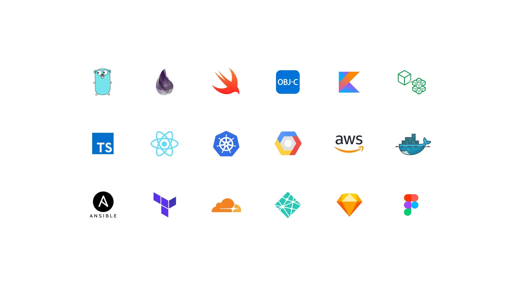

We're forging a band of craftspeople to shape the future: one well-crafted line of code, design, or idea at a time. Think of it like building a sturdy longhouse; it starts with skilled hands, a clear purpose, and a team that thrives together. If you're ready to wield your talents and join our woodland crew, here's what you need to know.

## Why we're here

We believe the future isn't stumbled upon, it's built, piece by piece, with care and grit. Software's changing the world, and we're here to make sure it's done right. Our purpose? To craft innovative tools, solve real problems, and leave things better than we found them. Since 2013, our 50+ strong team has been hammering away at that vision, and we'd love for you to grab a hammer too.

Here's the heart of it: we're looking for folks who live for tech, ship quality work fast, and bring a bit of kindness to the table. Sound like you? Let's dig into the details.

## Open roles at the forge

We've got spots open for engineers, designers, marketers, and learners ready to grow. Whether you're a seasoned smith or just sharpening your skills, there's a place for you in our woodland.

### Engineering

- [💻 Software engineer - AI consulting](open-positions/software-engineer.md)

### Business

- [Growth lead](open-positions/growth-lead.md)
- [Sales manager](open-positions/sales-manager.md)

### Apprenticeship program [Opening late 2025]

Ready to master AI-driven development? Our six-month AI apprentice program bridges traditional software engineering with intelligent systems. Perfect for engineers with solid fundamentals who want to advance into the AI era. Learn more about the [AI apprentice program](apprentice/README.md).

## What you'll gain

We're not just about shipping great software, we want you to thrive while doing it. Joining the Dwarves means you're part of our greatest treasure: our people. Here's what we offer to keep your fire burning bright:

- 💸 **Fair pay**. Your role, skills, and experience set the rate.
- 🏅 **Focus on results**. We judge the work, not the hours.
- ⏰ **Time off when you need it**. No tracking, just keep your crew posted.
- 🌎 **Work where you're strongest**. HCMC, Da Nang, Hanoi, or a quiet forest somewhere.
- 🌿 **Health support**. Yearly Bao Minh insurance package.
- 🤝 **A stake in the hall**. Shares based on what you bring to the table.
- ✔️ **Extra bucks**. A 13th-month paycheck, every year.
- 🫂 **Bonuses for big wins**. Projects, R&D, referrals, we celebrate it all.
- 📖 **Learning fuel**. Yearly budget for books, courses, whatever sharpens your axe.
- 🔆 **Shared bounty**. Profit-sharing based on your time with us.

No one's hovering over your shoulder here. We trust you to craft great stuff, and we measure success by what you build, not how long you sit at the workbench.

## What we craft together

Our days are filled with meaningful work that echoes through the tech world. Here's a glimpse:

**Software that lasts**. We've worked for [Setel](https://setel.com), [Momos](https://www.momos.io), and [Chotot](https://chotot.com), helping them grow strong.

**Tools for all**. Open-source projects like [Hidden Bar](https://apps.apple.com/us/app/hidden-bar/id1452453066?mt=12) and [Blurred](https://github.com/dwarvesf/blurred) are our gifts to the community (see more at [d.foundation/opensource](https://dwarves.foundation/opensource)).

**Knowledge shared freely**. We're deep into Blockchain, AI, and more. Join the chat on [Discord](https://discord.gg/dfoundation) or explore [Brainery](https://memo.d.foundation).

**Roots in the community**. We power [Golang Vietnam](https://golang.org.vn), [WeBuild](https://webuild.community) and projects like [Techie Story](https://techiestory.net).

Want the full story? Our [handbook](https://github.com/dwarvesf/handbook/) and [playbook](https://github.com/dwarvesf/playbook) lay out how we work and why it matters.

## Who we seek

We're a fast-moving clan with endless trails to blaze. We need Dwarves who:

- **Ship with speed**. You tackle challenges and deliver, no dawdling.
- **Love the craft**. New tech and tough problems light your fire.
- **Master their tools**. You know your code (or designs) inside out and can explain it clear as day.
- **Strengthen the hall**. Calm, kind, and ready to lead when it's time.

Our [Manifesto](manifesto.md) dives deeper into why craftsmanship is our north star.

## Tales from the woodland

Here's what some Dwarves say about life in our hall:

- "Learning's woven into everything here. You'll grow in ways you didn't expect."
  - **Thanh Pham**, Engineering manager ([LinkedIn](https://www.linkedin.com/in/thanh-pham-466326108/))
- "I moved to a client's team, and Dwarves cheered me on. It's about your path."
  - **An Duong**, Alumnus ([LinkedIn](https://www.linkedin.com/in/duongtruongan/))
- "Challenges are chances to level up. This place thrives on that."
  - **Minh Luu**, Full-stack engineer ([LinkedIn](https://www.linkedin.com/in/minhluuquang/))

Curious about the journey? Check out stories from [Huy Tieu](https://techiestory.net/post/23-huy-tieu), [An Tran](https://memo.d.foundation/careers/life/life-at-dwarves-with-an-tran/), and [Ngoc Thanh](apprentice/2022/2022-meet-ngoc-thanh-pham.md).

## How to step into the hall

**Found your role above?** Great! Each position has its own application process. Click through to the specific role for detailed requirements and next steps.

**Don't see a perfect match?** No worries. Send us a message at [hr@d.foundation](mailto:hr@d.foundation) with:

- Your skills, experience, and what type of role interests you most
- Links to your work (GitHub, portfolio, anything you've crafted)
- A nod from someone who's seen you shine, if you've got it

**What happens next**:

- A 60-minute chat to swap tales: your skills, our vision
- We'll explore where you might fit best in our woodland
- If there's a match, we'll guide you through the specific role's interview process

No role catching your eye right now? Stick around on [Discord](https://discord.gg/dfoundation), we'll holler when something new opens up.

Building software is like crafting a fine axe, it takes skill, purpose, and a steady hand. At Dwarves, you'll wield all three alongside a crew that's got your back. Let's forge something great: reach out today.

---

Next: [Life at Dwarves](life.md)
