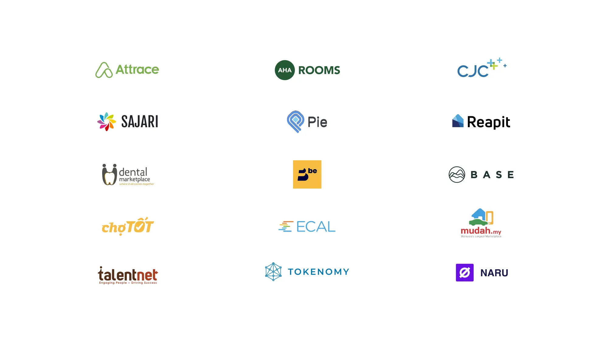
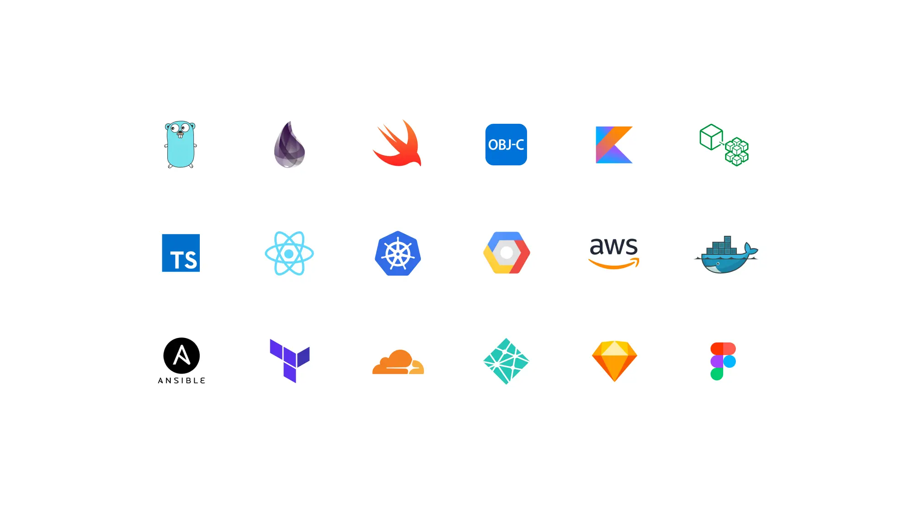
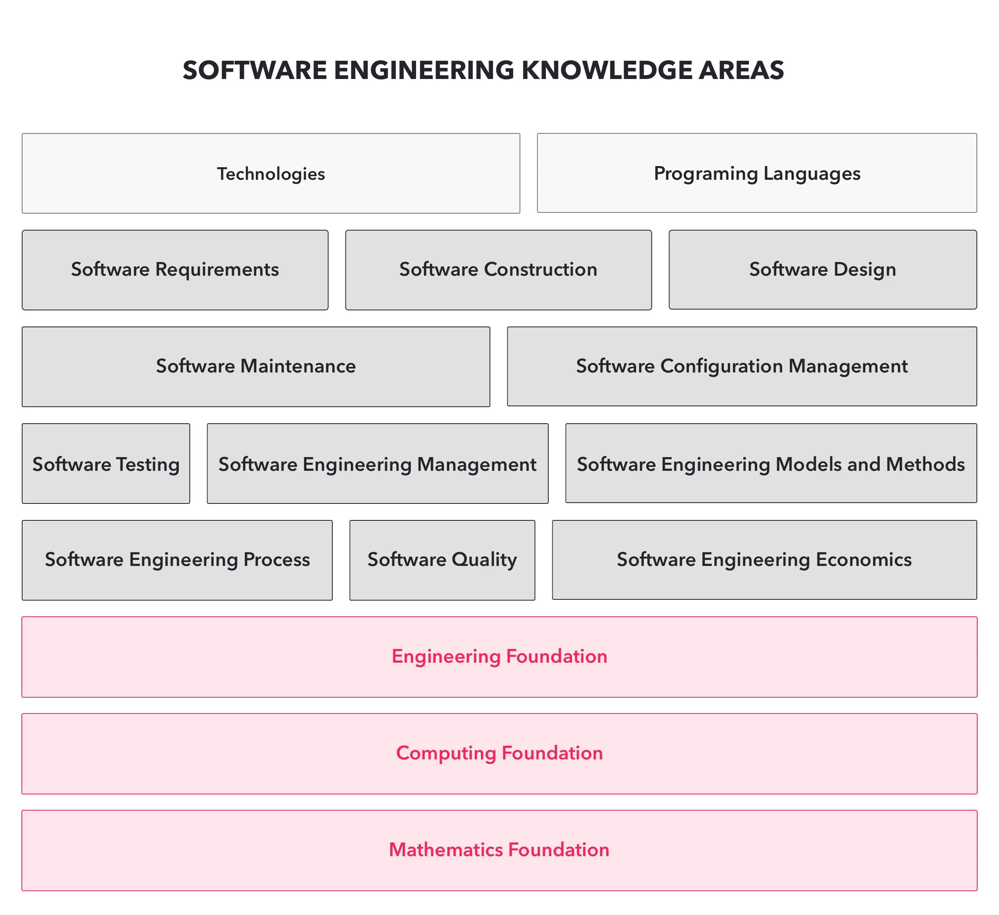

---
tags:
  - dwarves
  - work
title: WeAreHiring
date: 2023-11-27
description:  We want people who are passionate about software, talented at what they do, and respect craftsmanship. People who understand precisely what goes into their codes, and have no problem explaining it.We want people who are calm, kind, and responsible. People who take the reign, run the show instead of waiting to be told what to do.
authors: 
show_frontmatter: true
hide_on_sidebar: true
---
# WeAreHiring
- [[hiring/_index.md|Careers]]

### Marketing
* [Marketing Lead](https://github.com/dwarvesf/WeAreHiring/blob/master/open-positions/Growth.md)

### Engineering
* Backend Engineer, Go/Elixir/Rust
* [Web Developer, React.js](https://github.com/dwarvesf/WeAreHiring/blob/master/open-positions/Frontend.md)
* [App Developer, Apple Platform](https://github.com/dwarvesf/WeAreHiring/blob/master/open-positions/iOS.md)
* [QA Engineer, Automation](https://github.com/dwarvesf/WeAreHiring/blob/master/open-positions/QA.md)
* QA Engineer, Manual
* Data Engineer
* AI/ML Engineer
* Engineering Manager

### Design
* UX Designer (Blockchain/Fintech)
* UX Designer (Productivity/Dev Tool)
* UI Designer
* Lead Designer

### [Apprenticeship Training Program](#Apprenticeship-Program)
(1+ year exp. required)

* Backend Engineer
* Web Developer

## Table of Content
* [Dwarves: Team of craftsmen](#dwarves-team-of-craftsmen)
* [We believe the future is built, not discovered](#we-believe-the-future-is-built-not-discovered)
* [We get things done a bit differently](#we-get-things-done-a-bit-differently)
  * [Built with the purpose](#built-with-the-purpose)
  * [Engineering-driven culture](#engineering-driven-culture)
  * [Work where you feel best](#work-where-you-feel-best)
  * [Win as a team](#win-as-a-team)
  * [Giving back](#giving-back)
* [Our masterpiece](#our-masterpiece)
  * [Products we ship](#products-we-ship)
  * [Cutting-edge Tech Index](#cutting-edge-tech-index)
  * [Dwarves handbook](#dwarves-handbook)
  * [Apprenticeship Program](#apprenticeship-program)
  * [Knowledge exchange activities](#knowledge-exchange-activities)
* [How to apply](#how-to-apply)

## Dwarves: Team of craftsmen
We are on the mission to empower innovations. Our vision is to build Dwarves Foundation, one of the top software innovation firms that impact the modern world. We spare no effort in building a company where software engineering can shine, and we know it starts with the people. 

At Dwarves, we enable you with the trust, independence, tools, facilities, and training so you could perform at your best. 

With 50+ people in the team, we have been distributing our technology practices and helping companies building software since 2013.

* Businesses work with us to build their in-house software.
* Tech startups collaborate with us to launch and scale their products.
* Others partner with us to extend their development capacity and level up their tech team.

## We believe the future is built, not discovered
Software is eating the world. Whatever the future holds, it is a good bet that software will remain an essential part. As computer software becomes more sophisticated, it will help people with more complex challenges.

Dwarvish magic was fundamentally technological know-how. With software is continuing to change the world, we want to build a company where software engineering disciplines could shine; innovative & quality products are shipped and change the world for the better.

We choose innovation to be one of our core values that undoubtedly form ideas to affect society. Innovation is not for geniuses working alone; it is an activity that requires a team effort. Being innovative is a part of approaching the new future.

We believe the future is built, not discovered, and we work every day to create the future where we want to live.

## We get things done a bit differently
### Built with the purpose
Everything we do comes with [the purpose behind](https://github.com/dwarvesf/handbook/blob/master/purpose.md), from the product to every decision made. We want to enable an environment where people can freely express themselves and bring on their unique values.

We don't check attendants around here, as well as we don't monitor your screen to check if you're working. If we decide to hire you, it is our duty to trust that you excel at what is expected of you. The end result is the only metric we take into account.

### Engineering-driven culture
We build a company where software engineering could shine, innovative products are shipped, and change the world for the better. In every software, the engineering team is one of the most crucial factors to make it successful. Software is more of artisanship, and software engineers aren't a replaceable cog. Thus, engineering-driven culture is essential. 

We see software as a craft that requires expertise and passion. As we aim to raise standards with every piece we produce, we thoroughly invest in the craft's brilliant minds. 

 > 
 > We wrote more about it in [our manifesto](https://d.foundation/manifesto)

### Work where you feel best
After six years, we evolved as a team that works and communicates from anywhere. Some of us choose to work from coffee shops, others feel better in their PJs and start a virtual meeting, while the rest spend their day at our Saigon office.

We endorsed and adopted Remote culture from early 2019. Till now, it brings more benefits to the team and helps us to transform the way we collaborate. We don't manage chairs. People have more time for the family and their alone zone to get things done. They focus on quality conversation and output rather than random interrupting messages.

Work anywhere you like; be it in the office or under a coconut tree on a beach, to ensure that you are around the clock and be there when your folks need you.

### Win as a team
Becoming a dwarf means you are a part of us. You represent the team in any actions that you make. We share joy and pride together. And based on that, the benefits package is designed to benefit people who have the most contribution to our success as a team.

We have a profit-sharing & employee stock option plan for those who want to stay and make a fortune with us. The other crucial aspects like insurance and healthcare are included. 

 > 
 > Check out the full list at our [handbook/benefit](https://github.com/dwarvesf/handbook/blob/master/benefits-and-perks.md)

### Giving back
#### Community, Event and Meetup
The Dwarves actively take part in developer communities to bring makers and tech-enthusiasts together. Below is the list of communities that we participate in and are involved in their operations.

* [Golang Vietnam](https://golang.org.vn): Google Go language community in Vietnam
* [WeBuild Community](http://webuild.community/): Viet programmer online community.
* [Techie Story](https://techiestory.co): feature the untold story of tech people in the tech industry.

#### Open Source Software
We are strong believers in "sharing is caring." Most of our open-source projects contribute to bringing comfort and convenience at Work to teach people. 

By being open, the open-source software will empower the development of technology and help businesses to deliver innovative ideas.

[Hidden](https://github.com/dwarvesf/hidden), [Blurred](https://github.com/dwarvesf/blurred), [Session Buddy](https://github.com/dwarvesf/session-buddy) are just a few that we have built and given access for free. Check out more at http://d.foundation/opensource.

#### Social Responsibility Programs
At every chance we get, we use our tech expertise to change lives for the better, one social impact at a time. 

* [Code for Vietnam](https://webuild.community/code-for-vietnam)
* [Salt Cancer Initiatives](https://www.saltfightcancer.org)
* [The Library Project](https://www.library-project.org)

In fewer words, if you consider yourself a passionate software engineer, a nonstop learner, a kind and thoughtful teammate, you probably are the one we're looking for.

#### Investing in future
In 2018, we started Dwarves Fund as a dedicated venture fund. Come with Product and Technology R&D capability; Dwarves commits to delivering a scalable and sustainable business.

We make angel-size investments into early-stage startups, makers, and hustlers building next-generation tools and digital products for netizens.

## Our masterpiece
### Products we ship
List of products that we are proud to be a part

### Cutting-edge Tech Index
We pick up the technology that brings true impact and helps build software efficiently.

### Dwarves handbook
[The handbook](https://github.com/dwarvesf/handbook/) is where we try to share what’s worth knowing about the Dwarves, the company, our culture, our process, and our history. It’s a guide to understanding what people are talking about, what a benefits package looks like, and hopefully everything in-between. The handbook also offers us an opportunity to clarify who we are as a company. What do we stand for? How should we work?

Also, [the playbook](https://github.com/dwarvesf/playbook), on the other hand, contains our practices in software development, guides for getting things done, programming well, programming in style, and collaborating to make them successful.

### Apprenticeship Program
Apprenticeship is a way to learn about being a **professional software developer**. Specifically, it is a way to learn to be like the most skilled software developers you can find. It involves seeking out good teachers, and taking opportunities to learn by working alongside them.

Apprenticeship is a total six-month, **earn-and-learn** training program, designed for the individuals who

* are looking for the zen way to ship quality software
* or haven't figured out the clear path to a job in tech industry
* or with non-traditional work and educational background to find full-time roles

The program provides real-world experience

* Work on real projects with a team, and partner with a mentor for help throughout the program
* Develop professional skills and gain insight with feedback and performance reviews from peers, mentors, and managers
* Gain additional learning opportunities and resources provided throughout the program

Checkout & apply at [**Apprenticeship Program**](https://github.com/dwarvesf/WeAreHiring/blob/master/open-positions/Apprentice.md)

### Knowledge exchange activities
We do a variety of things at Dwarves to uplift our engineers and grow us to the next level.

* Radio Talk: happen on Monday; this is where we casually discuss related events in the tech industry. A few episodes have been up.
* [Memo](https://d.foundation/memo): Our knowledge hub, including our thoughts, experiments, lessons learned in well-written format.
* [Tech Radar](https://d.foundation/radar): The framework we use to assess and adopt new technology into our growing stack. 

---

## How to apply
Send us an email at [**team@d.foundation**](mailto:team@d.foundation), with the following info:

* Detailed info related to your wished position (background, skills, experience, .etc)
* Links to your public profiles (i.e., Linkedin, Twitter, GitHub, Behance, Dribbble, personal blog)
* Portfolios of projects you've been working on (ideally with links for AppStore, Play Store, or websites)
* References, if you have any

### Application process
You'll join our HCM office as part of our technology R&D Lab. This group brings together product minds and digital capabilities to build the software we can all be proud of.

Our application process is simple. We only care about two things, your **tech experience** and if you are **like-minded**.

* Technical interview: Within a 60-minute session, we show you everything you need to know about us while you show us in great depth about your experience.
* Culture fit: If we get here, it means we like you already. This one last step helps make sure you fit in with us and that we are the right team for you.

After that, there will be two follow-up checkpoints for every candidate.

* The fully paid [probation review](https://github.com/dwarvesf/handbook/blob/master/who-does-what.md#expectation).
* The sixth month [checkpoint](https://github.com/dwarvesf/handbook/blob/master/routine.md#the-second-period).

## Keep in touch
Don't see any position that fits you? No worries, let's still keep in touch. We will send you updates whenever we look to hire. Simple come hang out with us on [**our Discord server**](https://discord.gg/wYsgxzyDMP) where we talk about technology and life as developers.
