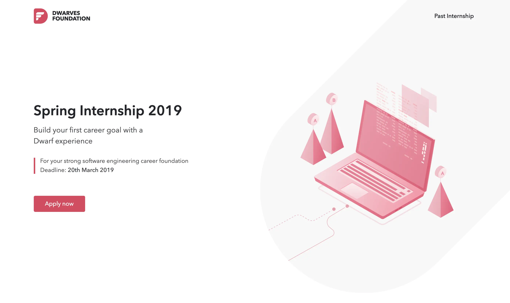

---
tags:
  - operations
  - hiring
  - team
title: How we hire
date: 2023-12-15
description: Hiring means we need help. We only hire people who tell us what to do, not the other way around. We always look for long-term teammates that why we want to ensure the new hire is a value fit and culture fit. 
authors: 
- han
- nikki
show_frontmatter: true
---

Hiring means we need help. We only hire people who tell us what to do, not the other way around. We always look for long-term teammates that why we want to ensure the new hire is a value fit and culture fit.

### Rounds

Several Dwarves will talk to the candidates to walk them through 4 rounds

* Pre-assessment: We evaluate the logic, English, and the personalities in non-interrupted 30 minutes online test.
* Assignment: Its objective is to gauge the candidate skills, give them an idea of how they approach tasks relevant to the job and provide us with some talking points.
* Interview: In the 60-minute interview, the candidates would know more about Dwarves working style & philosophy, and impress us with their background and skills.
* Culture: This is an occasion for the team to learn more about the candidates in a casual way.

### We hire the manager of one

What’s that mean? A manager of one is someone who comes up with their own goals and executes them. They don’t need heavy direction. They don’t require daily check-ins. They do what a manager would do — set the tone, assign items, determine what needs to get done, etc. — but they do it by themselves and for themselves.
These people free you from oversight. They set their direction. When you leave them alone, they surprise you with how much they’ve gotten done. They don’t need a lot of handholding or supervision.

How can you spot these people? Look at their history. Have they been self-sufficient at previous jobs? Have they defined their role before? Have they started their own site/company before? Or done their own thing in some other way? Find someone with initiative and a budding entrepreneurial spirit. And then nurture it.
You want someone who’s capable of building something from scratch and seeing it through. When you find these people, it frees up the rest of your team to work more and manage less.

### Sideway Program

There are also two other programs that we hold bi-yearly in Spring and Summer.

* The Internship program is for students with or without Engineering background from top universities.
* The Apprenticeships are six-month paid career development programs for people with non-traditional technical backgrounds from underrepresented groups in tech.

Those programs were designed with the purpose to give an opportunity for candidates to experience the real world projects. No coffee runs. We love watching talented people learn and explore their skills.

### Referral

We usually hire and to keep the quality bar the Dwarves are encouraged to recommend friends that you think they match with the team. We think your suggestions should be helpful as you have to know the person.

We also want to spend the bonus on you rather than the headhunting agency. The company will pay a one month salary as a referral bonus to any employee who refers an applicant to our company who is hired by the company to a full-time position. The bonus is paid upon completion of the newly hired employee’s first 90 days of employment. The referring employee must still be employed with the company at the time the bonus is to be given.
