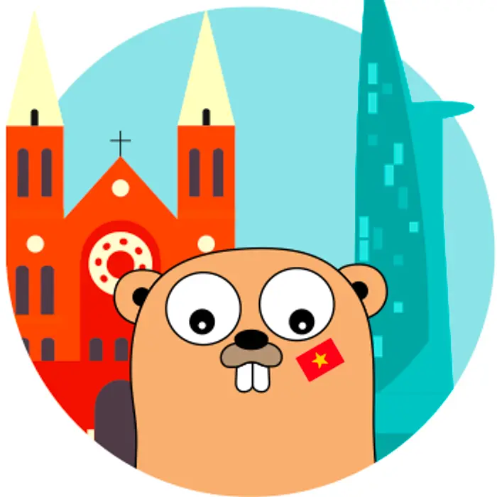

---
tags:
  - hiring
  - lifeatdwarves
  - team
  - career
title: Life at Dwarves
date: 2023-12-05
description: We build this company like we build a product. There are roadmaps for growth; there are phases; there are iterations. There might also be bugs, places where the company crashes because of bad organizational design, or cultural oversights.
authors:
  - duy
  - nikki
---

> We're like-minded teammates who pursue ambitious goals with tech culture and codes of conduct.

  <h2>Build a place we love to work at</h2>
  
We build this company like we build a product. There are roadmaps for growth; there are phases; there are iterations. There might also be bugs, places where the company crashes because of bad organizational design, or cultural oversights.

  
That means we advocate for changes. Changes always start with making our people better.

  
  <table>
    <tr>
      <td>
        <strong>Education Allowance</strong> 
        Annual budget for learning and development goals.
      </td>
      <td>
        <strong>Referral Bonus</strong> 
        Sponsorship to recommend peeps that fit the team.
      </td>
    </tr>
    <tr>
      <td>
        <strong>Work Gear Supplies</strong> 
        Team fund to back you up for work-related expenses, such as work gears or subscriptions.
      </td>
      <td>
        <strong>Travel Support</strong> 
        Annual travel package to Dwarves Hubs across the country.
      </td>
    </tr>
    <tr>
      <td>
        <strong>Learning Sponsorship</strong> 
        Monthly pool for internal & external input in the team's knowledge hub.
      </td>
      <td>
        <strong>Healthcare Package</strong> 
        Annual Bao Minh Insurance for overall & specialized healthcare check ups.
      </td>
    </tr>
  </table>
  
  <blockquote>
    
And other exclusive company support, as in <a href="https://github.com/dwarvesf/handbook/blob/master/benefits-and-perks.md">Dwarves Benefits & Perks</a>.

  </blockquote>
  
  <h2>Foster a learning culture</h2>
  
We take learning as the north-star metric. At Dwarves, we value you not only for the projects that you do for the company but also for how you strive to grow yourself. Learning at Dwarves takes place in all formats.

  
  <table>
    <tr>
      <td>
        <strong>Radio Talks</strong> 
        Weekly sharing on practices, new findings & demos.
      </td>
      <td>
        <strong>Dwarves Memo</strong> 
        Practice sharing, real-case demos & key takeaways.
      </td>
    </tr>
    <tr>
      <td>
        <strong>Dwarves Brainery</strong> 
        All-in-one knowledge source for Dwarves and friends.
      </td>
      <td>
        <strong>Lecturer Training</strong> 
        Occasional training from university lecturers to reinforce working style & engineering mindset.
      </td>
    </tr>
    <tr>
      <td>
        <strong>Tech Event</strong> 
        Monthly sit with Vietnam tech talents for global real-world experiences.
      </td>
      <td>
        <strong>#TIL Channels</strong> 
        Jotted down channels for daily news & tips sharing.
      </td>
    </tr>
  </table>
  
   
  
  <table class="three-columns">
    <tr>
      <td>
        
        <a href="#">Nam Nguyen: Keep pushing oneself towards the goal</a>
      </td>
      <td>
        
        <a href="#">My Anh: From Data to Backend, an apprentice sharing</a>
      </td>
      <td>
        
        <a href="#">Hieu Vu: Python, Java or NodeJS? Golang!</a>
      </td>
    </tr>
  </table>
  
  <h2>Get things done in style</h2>
  
We proudly ship out challenging products with the support from top-notch technology, latest toolings and frameworks. We apply Agile methodology at scale. The development phase is run in sprints, and V-model testing is applied simultaneously. Our <a href="https://github.com/dwarvesf/playbook">Dwarves Playbook</a> contains teamwork ethics, engineering principles and other protocols we play by.

  
  <table class="four-columns">
    <tr>
      <td>
        <strong>Product Design</strong> 
        - Design Sprint 
        - AARRR Framework 
        - UX Research 
        - The Design System 
      </td>
      <td>
        <strong>Production</strong> 
        - Logging 
        - Monitoring 
        - Production Checklist 
        - Handover Checklist 
      </td>
      <td>
        <strong>Business</strong> 
        - Overall Process 
        - Fixed Budget, Scope Controlled 
        - Collaboration Guideline
      </td>
      <td>
        <strong>Developing</strong> 
        - Setup 
        - Practices 
        - Platforms 
      </td>
    </tr>
  </table>
  
  
  
  <h2>Community support</h2>
  
Driven to turn what we know into impactful products & insights for community support. Over the past few years, the Dwarves has participated in countless campaigns and become the sponsor of different tech communities.

  
  <table class="four-columns">
    <tr>
      <td>
        <strong>Golang Vietnam</strong>
        
      </td>
      <td>
        <strong>WeBuild Community</strong>
        
      </td>
      <td>
        <strong>Techie Story</strong>
        
      </td>
      <td>
        <strong>Startup.vn</strong>
        
      </td>
    </tr>
  </table>

