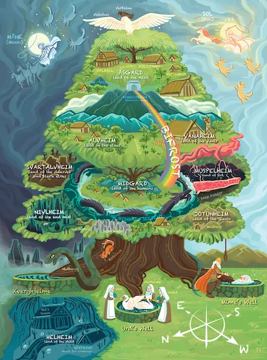
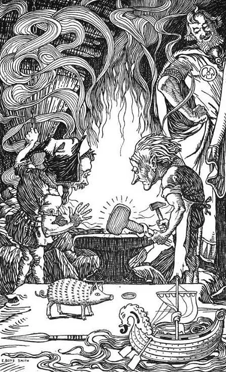

---
tags:
  - team
  - operations
  - hiring
title: What we stand for
date: 2023-12-15
description: More than telling people how to do things, as a firm, we take responsibility for collaboratively creating the product of innovation with the client. We value the long-term partnership, and we brought the economic impact through massive product distribution and brought to the market by the clients. 
authors: 
- han
show_frontmatter: true
---

## Empower Innovation with Software Craftsmanship

Innovation happens. There are many startups found and raise fund every day. They focus on making significant positive changes, impact millions of people, lead to breakthroughs and support the foundation of economic growth.

Building an innovation startup requires lots of different things, and it is tough. Most of them have to deal with business development, legal, fundraising, team recruitment, and product development at the same time. Tech startups need to move fast and break things.

At some points, growing a startup needs a strong and experienced team behind. The software team that can help to design the system, design the database, produce the well-crafted software, keep the system stable, avoid the technical debt and deliver values is one of the critical pieces to solve the puzzle.

Another motivation for Dwarves Foundation was the lack of respect that service firms receive. Most software companies out there focus on digital transformation and consultancy. The nature of the business with a tight deadline and budget force them to do tricks. They hit and run. The codebase and software they produced are full of crap, and it damages our pride.

**This is where Dwarves Foundation comes in.**

Despite the fact that service firms scale linearly, their ultimate size is capped and small, they don’t have life-changing exits for their founders, we start Dwarves Foundation as we want to build things right. I’ve always felt that companies like Dwarves Foundation are more important to the economy than the mildly pejorative phrase used to describe them.

**Dwarves Foundation is an innovation service firm**.

 We have been building an organization with high standard software practices and business growth capabilities, helping tech startups, entrepreneurs and makers deliver their innovative software product since 2013.

**We stand for the craftsmanship in software development**.

More than telling people how to do things, as a firm, we take responsibility for collaboratively creating the product of innovation with the client. We value the long-term partnership, and we brought the economic impact through massive product distribution and brought to the market by the clients.

This is what we do here. It takes many forms, and we’re always working towards better software craftsmanship.

## The name: Dwarves

It begins in Norse Mythology. After the executed of Ymir, the very first giant of the universe, by Odin has conceived a whole new universe. In the new world, Yggdrasill is a giant ash tree located at the center cradles the nine realms of the cosmos.

Dwarf is the small and misshapen creatures that originated as maggots from Ymir’s corpse. They dwell in the mountains deep down in the dark underground of **Svartalfheim**. Dwarves are wisdom, natural good at smithing, mining, and crafting. They are well known for being the best blacksmiths throughout the nine worlds, not only do they have natural abilities to craft weapons and jewelry. They are also excellent engineers and architects.

Dwarvish magic was fundamentally technological know how. They had an unusually high level of skill. There was no shimmering light around the Dwarves, just first rate workmanship. Dwarves greatly pride themselves in their craftsmanship, be it smithing or anything else.

The dwarf is an example of a creature who has the ability that surpasses the known world, presaging the rise of a universe beyond this physical realm. Whatever their origin, the dwarf’s existence plays a role in expanding the imagination.

Aspiring to create a positive breakthrough that can be able to rewrite the new world, we chose the name Dwarves Foundation as the commitment to the vision that we follow.

At our woodland, the Dwarves are encouraged to thoroughly assess and evaluate the product quality before handing it to the customers. By participate in every detail of the work, we take craftsmanship as one of the most fundamental factors of the career transformation for engineers. World-class products require world-class engineers and craftsmanship is what makes it done. Craftsmanship is what flows among the team spirit, or does not exist at all.

We choose innovation to be one of our core values that form ideas to affect the general society undoubtedly. Innovation is not for geniuses working alone, it is an activity that requires the team effort. Being innovative is a part to approach the new era. What that rewards, what can I say, can genuinely lead to significantly remodel the cosmo.

