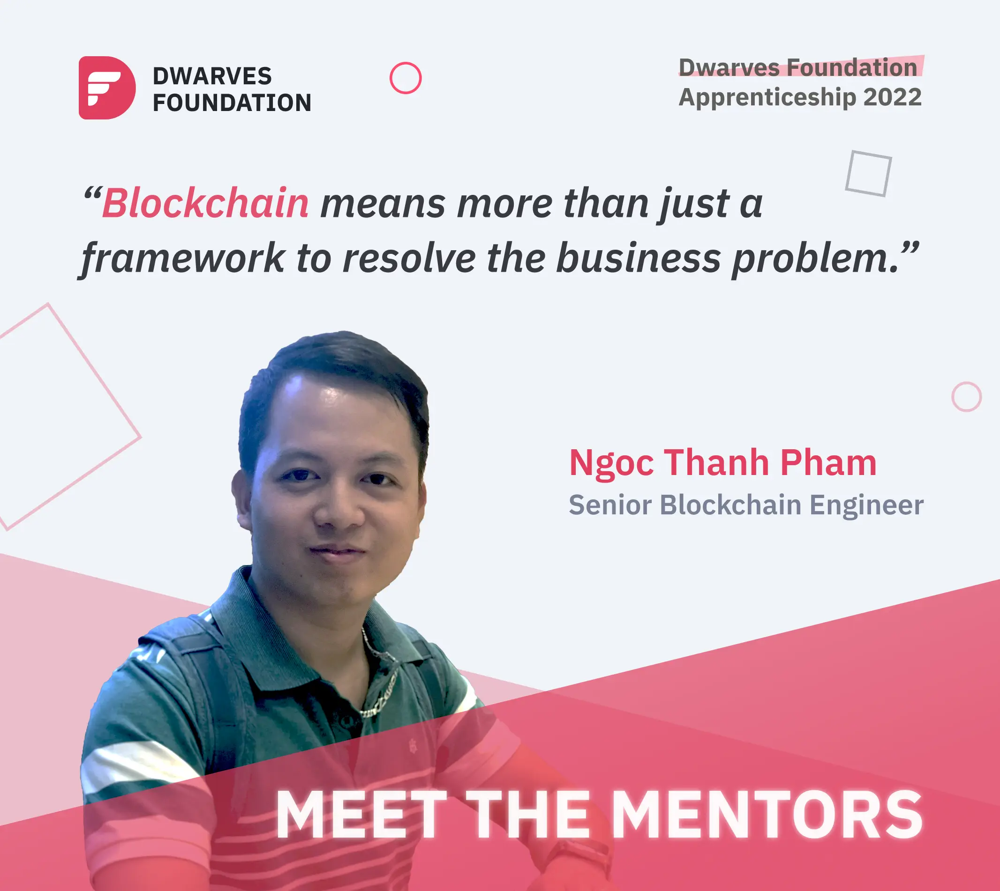

Dwarves Team is shifting our focus to blockchain technology. We offer study groups and blockchain-based projects for peeps to grow and catch up with this rising trend. Thanh is one of the vital elements of this team; and we know he’ll be more than happy to have you onboard.

### What raises your interest for Dwarves?
“My path at Dwarves began with the zeal to develop web3 and blockchain products. It's the rising star of modern software. The ecosystem revolves around cryptocurrency, NFTs, games, trading platforms and everything in between.

Blockchain projects at Dwarves stretch to different potential corners of web3, from trading platforms to blockchain games. All of this call for comprehension of cross-chain and swapping technique.

To seamlessly craft an output with a deliverable quality, understanding the product requirements is a sine qua non.”

### Do you think blockchain knowledge is critical to engineer's career paths?
“Having quite an experience working with blockchain, it came to my acknowledgement: This technology means more than just a framework to resolve the business problem. It no longer stays as a platform where you build and develop an application. Blockchain offers an open platform and foundation to create a decentralized application and its ecosystem.

The foundation of blockchain derives from the backend technique. But as time goes by, its potential bypasses all the ongoing notions of software engineering. From what I concept, once people place reliance on blockchain technology and its ability, it grows as a burgeoning software foundation. This opens another career path alongside frontend or backend engineering. It's an alternative to explore and surpass one's seniority.”

### Say, an engineer is ready to get started with blockchain. What key factor he should note?
“What caught my interest in the current youngsters is their proficiency in picking up new things. Some only need a few months to enroll and start their career with blockchain. This also brings a downside. They dive in too fast, get things done and somehow forget the critical factor of making a decent product: The long-term value.

Blockchain requires a level of accuracy and meticulousness. That comes with a logical mindset and testing approach to deliver a product that brings value. This concept must be grasped before you design, test and validate any model.”

### What makes a product reach its definition of success?
“For a product to succeed, it must first solve a user's need. No matter what you're building, a utility, a platform or an application, that product should empower the company revenue and align with the business goal. It's a target an engineer seeks to meet when he gets hands-on developing anything.”

### Your secret sauce as a mentor?
“I understand the urge to rush into something and want to excel it in no time. Rome wasn't built in a day. It's a mentor's mission to soothe down a hustle mentee and coach them to take one thing at a time. This forms a habit of paying attention to details and knows exactly what went wrong when an issue shows up.

Learning on the job can't give you everything. Cloning a project source code and editing it refrains one from acknowledging where the error came from. Combine the best practices, project experiences, research and document them all. It provides a bird-eye view for the big picture, and you'll know why you do this.”

---

Dwarves Foundation Apprenticeship 2022 is a 6-month fully paid work-study-train program to shape your software skills and define your career path. Opening to mid-level software engineers anywhere.
