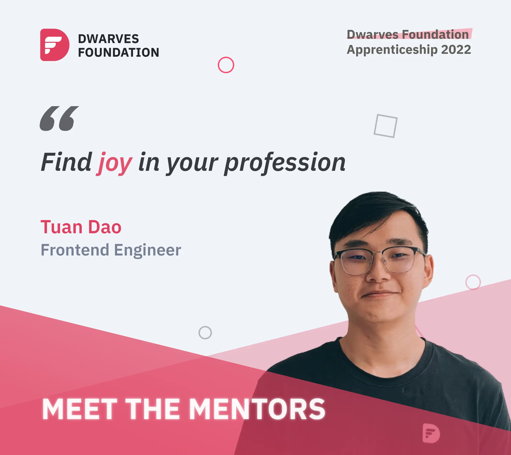

**Tuan Dao - Senior Frontend/ Blockchain Engineer**

Tuan has 4+ years of experience under his belt, 2 out of those 4+ was spent at Dwarves Foundation. Tuan’s years of experience don’t quite do him justice though, for he’s skilled and knowledge beyond the year, and has took part in projects of various sizes and domains.

When asked what’s the force behind, Tuan shared it’s because of is very own principle of working: “*To find joy in your profession”*. The joy comes from multiple of factors, a few include having a sense of ownership of exciting products, learning and applying new things, having people who he can rely on at work.

“*I’m pretty confident in my technical skill with React*”, he said, smiling. And that’s what he’s bringing to the table for our Apprenticeship program. Tuan’s in charge of boosting apprentices’ FE skills and teaching on how to be flexible and patient with the constantly changing requirements in software development.

Soft skill wise? With the 1:1 training method influenced by his own mentor at Dwarves, he plans to adapt it in his training. Tuan’s main purpose being creating an environment for mentee to feel that they are cared for, and that the mentor provides accurate guidance for them to develop their abilities as much as possible.
___

Dwarves Foundation Apprenticeship 2022 is a 6-month fully paid work-study-train program to shape your software skills and define your career path. Opening to mid-level software engineers anywhere.
