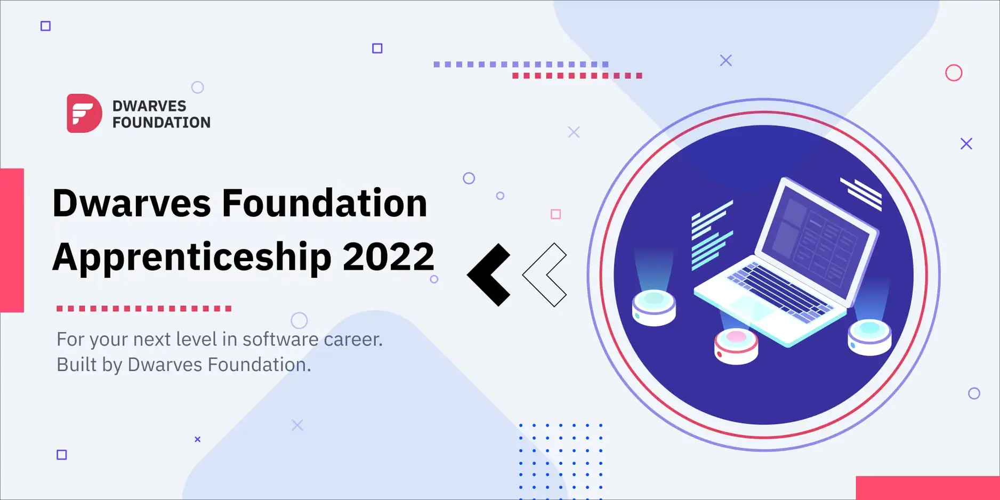
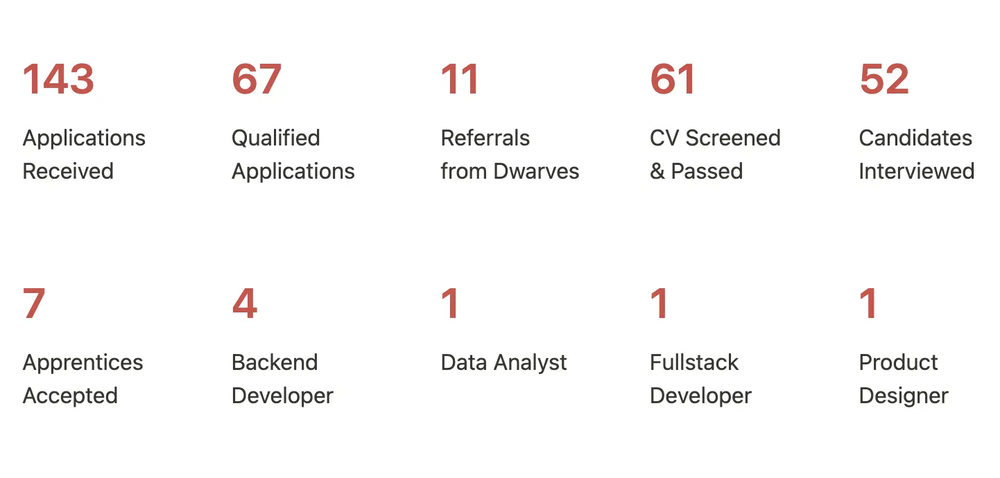
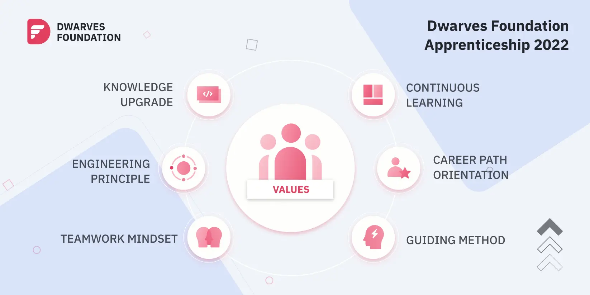
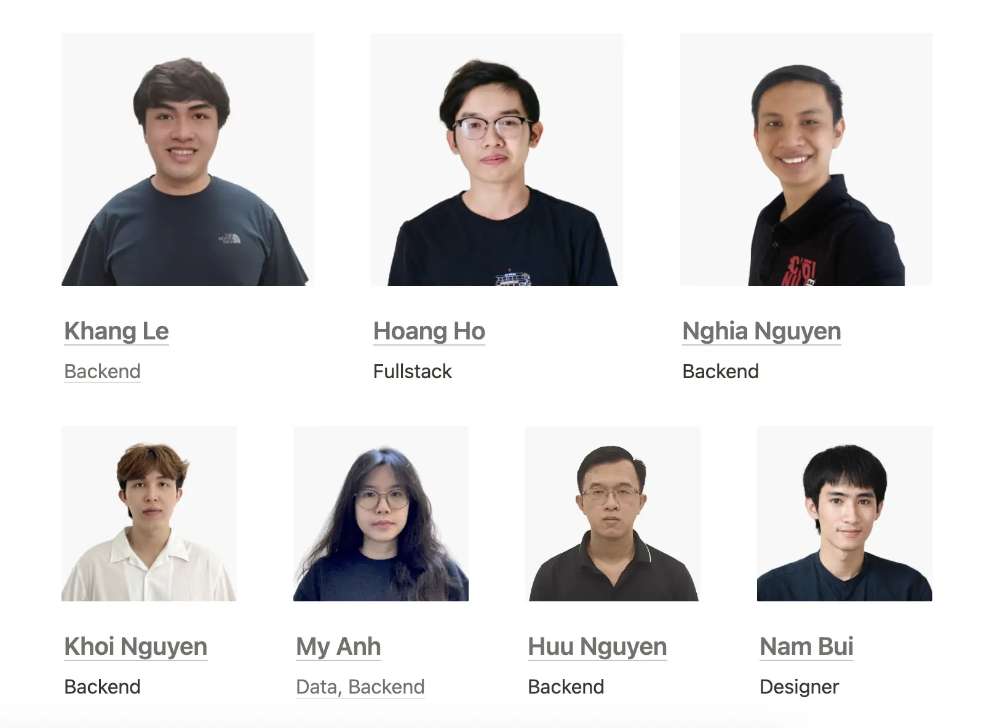

It's our second attempt rolling out this program. But the motivation stays the same: Accelerating someone's current software development skillset.

It's neither for interns nor veterans. As stated in the beginning, our goal is to empower software engineers with at least 1 years of experience to rebuild their foundation through:

- Software Development Practices
- Real-projects Scenarios
- Engineering Work Ethics & Principles

### The stats speak

Although keeping the bar high might extend the searching time, but we maintain [a solid standard](https://github.com/dwarvesf/handbook/blob/master/how-we-work.md) for every batch.

To convert from applicant to apprentice mode, peeps must finish 6 key factors

- Real-work experience
- Open-minded attitude
- Can-do mindset
- Learning spirit
- Proactivity
- English competency

With this in mind, we're selective in choosing the next people for our squad. Narrowing down from over 140 applicants to the 7 newly joined isn't an easy call. It's a successful ratio of 1 to 20.

### The value generated

After every training session, we required the apprentices to share their feedback on the program. There were both positive and constructive feedback. The best part was knowing how Apprentices were able to advance and hone their skills.

- **Knowledge Upgrade**: Apprentices were asked to systemize the foundation and learn about the latest best practices of software development.
- **Continuous Learning**: Besides project works, apprentices must pick their own domain of interest, learn then share back with the team. Our learning & discussion rooms on Discord were piled up with programming tips and #TILs.
- **Career Path**: Most Apprentices get a more defined view on their career growth. As a highlight, a DS and a Fullstack developer have chosen to switch their path into Backend. It's interesting and exciting for not the peeps themselves, but for us as well.
- **Engineering Principle**: Engineering mindset was enforced at all phases, nurturing a protocol to be responsible and harness a sense of ownership of what they do.
- **Guiding Method**: Instead of the traditional mentor-mentee method, we'd prefer a peer-to-peer collaboration. Apprentices are trusted with their work and free to raise their ideas.
- **Teamwork Mindset**: Regardless of roles and seniorities, we provide the absolute support for those who need it.

### The next roster

#### Fostering a data team

As stated in the latest [Dwarves Updates](https://memo.d.foundation), our bet goes for data, due to its high demand in engineers, and the powerful value data brings to solve complex business problems.

The data market is full of potential, but the number of good data engineers and analysts is still few and far between. Our decision placed on the new Data team, prepping research and discussion environments to prepare a closer and more novel look at data, every ins and outs.

#### Introducing a new power squad

With this summary, we're delighted to welcome a new batch of well-trained Apprentices - who are now ready to participate in bigger projects, in various domains, with an eagerness to challenges themselves further.

None We have a lot to learn ourselves, and we hope to improve them at our next year program. Until then, let's meet the **Dwarves Apprentices, batch of 2022** ↓

