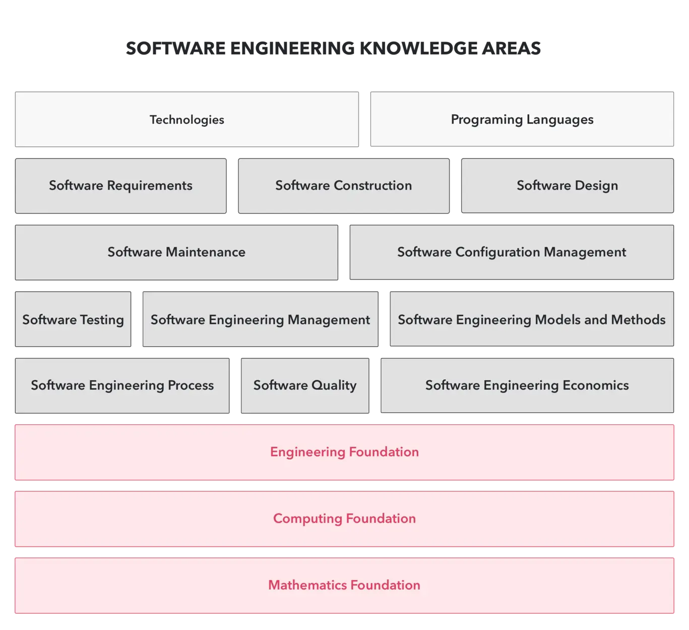

## About the program

Apprenticeship is a six-month **earn-and-learn** training program - a way to learn about being a **professional software developer**. It's about learning to model yourself after skilled developers by working alongside them and seeking their guidance.

The program is designed for people who:

* Want to master the craft of shipping quality software
* Haven't found a clear path into the tech industry yet
* Come from non-traditional work and educational backgrounds

Working with us provides real-world experience where you will:

* Work on actual projects with a team and pair with a mentor throughout the program
* Develop professional skills through feedback and performance reviews from peers, mentors, and managers
* Access additional learning resources and opportunities

## What you will learn & explore

During your six months with us, you'll collaborate with our Dwarves on these key areas:

### Part 1: Catch up with the state of the art

Learn modern software engineering practices from foundational principles to cutting-edge tech stacks.

**Engineering**

* Work with multiple programming languages
* Master your editor of choice
* Apply DevOps practices: containerization, continuous integration/delivery
* Build APIs that comply with REST/GraphQL and HTTP semantics
* Practice readme-driven development
* Conduct effective code reviews
* Pair program with experienced developers
* Understand the difference between engineering and programming
* Set up efficient development environments
* Monitor production applications
* Build your software engineering foundation
* Create effective software models
* Navigate the software development lifecycle
* Apply the 12-factor methodology for building quality software

**Design**

* Implement design thinking principles
* Understand design processes within the software development lifecycle
* See software development from designer, developer, and product manager perspectives
* Address human needs through the ideas and value chain
* Use the domain research framework
* Work with business models and lean canvas
* Apply the AARRR funnel
* Use UX design frameworks
* Structure information architecture
* Implement atomic design principles
* Apply visual design principles
* Work with design systems
* Follow platform-specific design guidelines

### Part 2: Be a team player

Learn to collaborate effectively with different stakeholders.

* Understand software engineering team structures
* Navigate team development stages
* Measure software team performance
* Master team communication
* Manage expectations effectively
* Develop professional work habits
* Follow the software engineering code of ethics

### Part 3: Factors of quality software

Learn to measure and improve the quality of your deliverables.

* Understand your working domain
* Navigate the software development triangle
* Apply software approach manifestos
* Define what makes software well-crafted
* Manage risks and avoid common pitfalls
* Master the art of software delivery

### Part 4: Software industry movements

Stay current with industry trends by understanding past developments and participating in future directions.

**Revolution of software industry**

* Hardware & operating systems: kernel development
* Network, internet and dotcom evolution
* Cryptography, network security & deep web
* The transition from developer to engineer
* Traditional processes vs. agile approaches
* Products vs. services
* The era of mobility
* Virtualization & cloud computing
* Internet of things & wearable devices
* Big data & data mining
* Data privacy considerations
* Human-computer interaction, AI/ML & deep learning
* Blockchain technology & decentralization
* Quantum computing fundamentals

**Startup knowledge**

* Overview of startups, business models, enterprises, and fundraising

### Part 5: Exploring your strength

Identify your strengths to build a sustainable career in tech. This is essential for working with the Dwarves - a group of innovation advocates and high-potential professionals.

* Software distribution and impact measurement
* Shipping your own software projects
* Understanding career path options
* Developing your T-shaped career profile

## Program timeline

Here's what you'll experience during your six months:

### Your first month: Warming up

* Pre-assessment & performance calibration
* **Group training**: Catch up with our tech stack, workflow, and practices through bi-weekly sessions led by seniors
* **Pairing**: Team up with an assigned peer and practice what you've learned by working on their project
* First checkpoint review session

### Next three months: Performing

* **On your own feet**: Join one of our product teams as an official member to learn teamwork in action
* **Mentoring sessions**: Participate in bi-weekly one-on-one mentoring to process feedback and improve together
* Second review session

### The following months: Exploring

Experience the various ways we help our engineers grow to the next level:

* **Group study**: Learn from peers to continuously improve
* **Tech radar**: Explore specific topics and evaluate cutting-edge technologies
* Apply your knowledge by shipping impactful software
* Group presentation & final review session
* Reach the final checkpoint to qualify as a Dwarf

## How to apply

Remember, this program is designed for people who:

* Want to master the craft of shipping quality software
* Haven't found a clear path into the tech industry yet
* Come from non-traditional work and educational backgrounds

Submit your application through this [**form**](https://form.typeform.com/to/LfCWfoml), and we'll get in touch.
