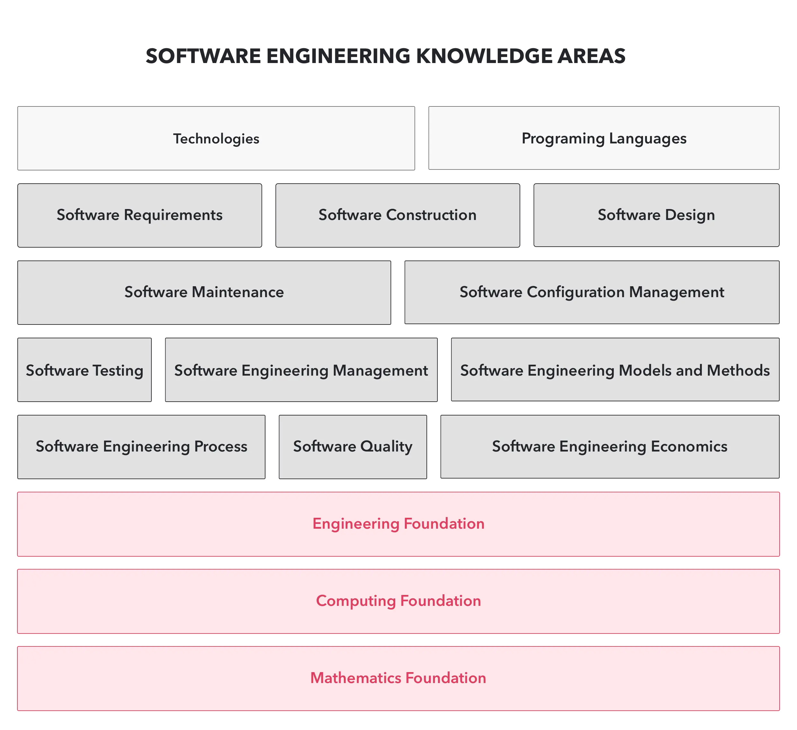

## About the program
Apprenticeship is a six-month **earn-and-learn** training program; it's a way to learn about being a **professional software developer**. Specifically, it is a way to learn to be like the most skilled software developers you can find. It involves seeking out good teachers and taking opportunities to learn by working alongside them.

Apprenticeship is designed for the individuals who

* are looking for the zen way to ship quality software
* or haven't figured out the clear path to a job in the tech industry
* or with non-traditional work and educational background to find full-time roles

The program provides a real-world experience where you will

* Work on real projects with a team and pair with a mentor for help throughout the program
* Develop professional skills and gain insight with feedback and performance reviews from peers, mentors, and managers
* Gain additional learning opportunities and resources provided throughout the program

## What you will learn & explore
During your six months program, you will sit down with our Dwarves and do group studies on the following topics:

### Part 1: Catch up with the state of the art
Learn the state of the art of software engineering in action, from the foundation of engineering to the cutting-edge tech stack and best practices.	

**Engineering**

* Speak multi programming language at once
* Master in any Editor of your choice
* Apply basic DevOps: Containerized, Docker, Continuous Integration, Continuous Delivery
* Restful / GraphQL API comply HTTP semantics
* Readme Driven Development
* Code Review the right way
* Pair programming
* Engineering \<\> Programming
* Environment setup
* Production monitoring
* Foundation of Software Engineering
* Software modelling
* Software Development Lifecycle & Manage deliverables
* The 12-factor app methodology on how to make a good software

**Design**

* Design Thinking
* Design Process & Sofware development lifecycle
* Software Development from perspective of Designer, Developer & Product Manager
* Human needs, ideas & value chain
* Domain Research Framework
* Business model & Lean canvas
* AARRR funnel
* UX Design framework
* Information Architecture 
* Atomic Design
* Visual Design Principle
* Design System
* Apply guidelines for designing on different platform

### Part 2: Be a team player
Teamwork understanding and learn how to collaborate smoothly with different kinds of stakeholders.

* Structure of Software Engineering Team
* Stages of Team development
* Software Team Performance
* Team Communication
* Expectation Management
* Professionalism
* Software Engineering Code of Ethics

### Part 3: Factors of quality software
Learn and measure all the factors that construct the quality aspect of your delivery.

* Getting to know the working domain
* The Software Development Triangle
* The Software Approach Manifesto
* What defined a well-crafted software
* Risk Management & Top 10 common risks
* Art of Software Delivery

### Part 4: Software industry movements
The software industry keeps moving and continuously reach the new stage of craftsmanship. We will look back at a recent decade, learn the past, the broader tech industry that you haven't known yet, and also participate in the next movements.

**Revolution of Software Industry**

* Hardware & Operation Systems: Kernel Development
* Network, Internet and Dotcom
* Cryptography, Network Security & Deep web
* Developer vs. Engineer
* Tradition processes vs. Agile approach
* Products vs. as Services
* Era of Mobility
* Virtualization & Cloud Computing
* Internet of Things & Wearable devices
* Big Data & Data mining
* Data Privacy
* Human-computer Interaction, AI/ML & Deep Learning
* Blockchain Technology & Decentralization
* Quantum Computing

**Startup**

* Overview of Startup, Business, Enterprise, and Fund Raising

### Part 5: Exploring your strength
Getting to know your strength will keep you stay with the industry many years ahead. It's also the requirement to work with the dwarves, an innovation advocates group, and a high potential workforce.

* Software distribution and impacts
* Shipping your own software
* Grokking the career path
* Picking up your T-shaped career

## Program Timeline
Below is the list of activities during your six months 

### Your first month: Warming-up
* Pre-assessment & Performance calibration
* **Group Training**: We will help you catch up with our tech stack, workflow, practices through bi-weekly training sessions from the seniors.
* **Pairing**: You will team up with an assigned peer, hands-on his project, and start to practice what you have learned by pairing with him. It is where theory meets practice.
* First checkpoint review session

### Next three months: Performing
* **On your own feet**: You will join one of our product team as an official member to learn how to be a team player.
* **Mentoring session**: We will have a bi-weekly 1-on-1 mentoring session to process feedback on how we can do better together.
* Second review session

### The following months: Exploring
We do various things at Dwarves to uplift our engineers and grow us to the next level.

* **Group study**: Learn from the peers to keep improving yourself
* **Tech radar**: continuously exploring the specific topics and evaluate state-of-the-art technology
* Apply the knowledge to ship your impact through software
* Group presentation & final review session
* Reach the last checkpoint to be qualified as a dwarf

## How to apply
Again, this program is designed for the individuals who

* are looking for the zen way to ship quality software
* or haven't figured out the clear path to a job in the tech industry
* or with non-traditional work and educational background to find full-time roles

Please submit this [**form**](https://form.typeform.com/to/LfCWfoml), and we will get in touch.
