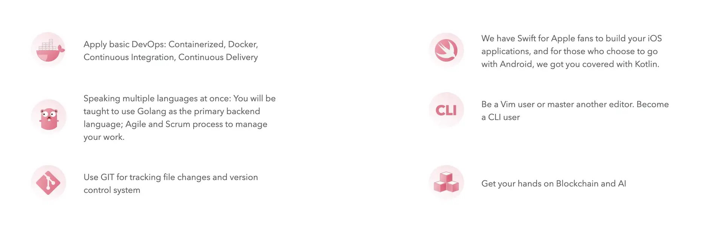

## The Program

In 2018, we launched the first Summer Internship Program for students with or without Engineering background from top universities. The program was designed with the purpose to give an opportunity for candidates to experience the real world projects. No coffee runs here. We love watching talented people learn and explore their skills.

We strive to create a generation of new tech enthusiasts who possess the [same DNA](../additional-info/what-we-value.md) with us, to generate a solid groundwork and go along with the company’s triumph.

* Collect an outline vision with the team leader's mentorship for you career roadmap.
* Live your value and foster your skills through the code of craftsmanship.
* You get paid for your experience with an allowance worths $300/month.
* Expand your network and boost your competencies.

## About Us

Found in 2014, Dwarves Foundation is an innovation service firm. [We stand for the craftsmanship](../additional-info/what-we-stand-for.md) in software development. Our woodland is a sum of great technology, engineering culture, and smart people. The numbers speak for themselves:

* 5 years in the market
* 40 talented members
* 10 common team size per deployments
* 3 Vietnam Development Communities Influenced

## The Syllabus

To make sure your time with us is well-spent, we offer you real projects with our adepts and the chance to work with global customers. Bring your best curiosity and initial to make your way in these open doors:

* Apply basic DevOps: Containerized, Docker, Continuous Integration, Continuous Delivery
* Speaking multiple languages at once: You will be taught to use Golang as the primary backend language; Agile and Scrum process to manage your work.
* Use GIT for tracking file changes and version control system
* We have Swift for Apple fans to build your iOS applications, and for those who choose to go with Android, we got you covered with Kotlin.
* Be a Vim user or master another editor. Become a CLI user

We want to help you become the product person. We know that things take steps to learn and we will help you persuit the **can-do-everything** mindset. The problems solving skill is the key and lifetime skill that you also need to learn.

### How to be a mining intern?

You can [**apply for the program**](https://internship.dwarves.foundation) on March or July. Or you can send us your **short CV** or any similar piece of information at [spawn@d.foundation](mailto:spawn@d.foundation) with

 >
 > Subject: Mining Intern - Be an awesome dwarf

Honestly, we don't really care about your level of formal education, math skill, or so on. We want to see that you are potential to do something.
