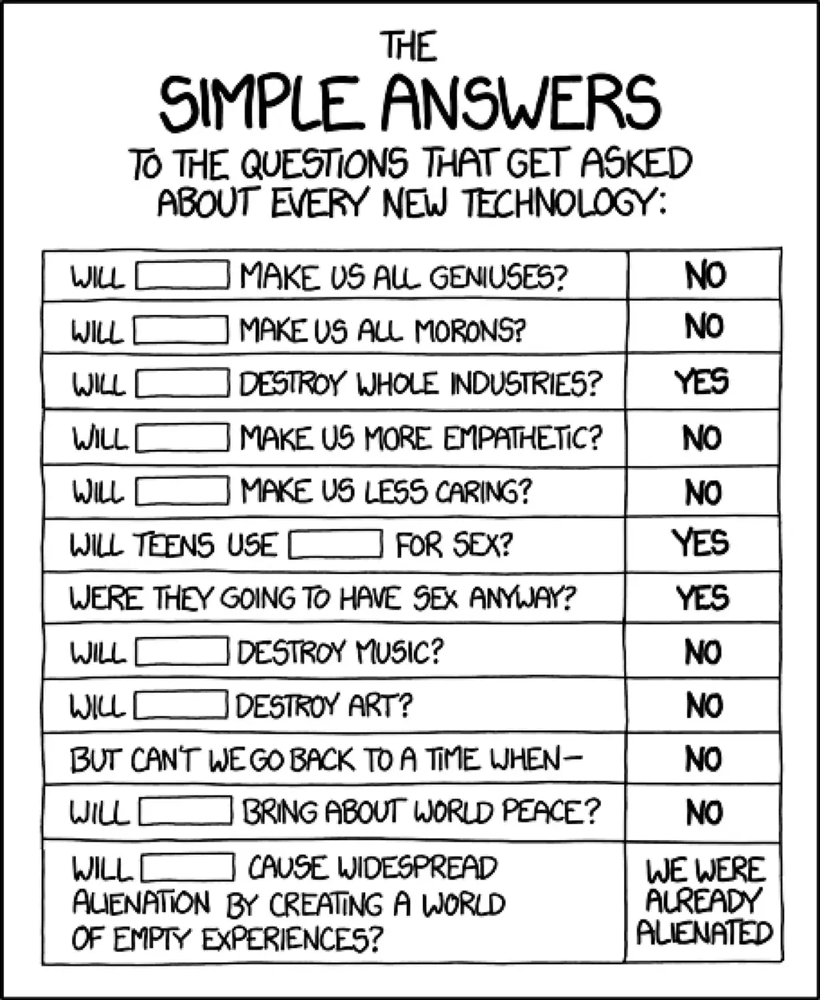

## Towards growth

Keep learning and growing. We started this team out of software practice advancement. The continuous study lays the foundation for the future growth. Just like software, knowledge must evolve and be useful. We collect the lesson learned and input into our [**team knowledge base**](https://github.com/dwarvesf/handbook/blob/master/knowledge-base.md).

## Purpose-built

Everything we do comes with [**the purpose behind**](https://github.com/dwarvesf/handbook/blob/master/purpose.md). Good software is software that works and provide actual value. Effort is count when it's placed on things that matter.

They are apps and systems for mass market. But they can also be a custom script to automate the build pipeline; a website for a non-profit organization, or an open source desktop app.

## Effective > productive

We try to work on things that create the most value possible in a certain amount of time. Know your priority and do things that matter.

Being productive is about occupying your time, filling your schedule to the brim and getting as much done as you can.

Being effective is about finding more of your time unoccupied and open for other things besides work. We don't believe in busyness. We believe in effectiveness.

## Keep it simple

So everyone could understand. Going simple makes everyone easy to follow.

Take boring solutions and legacy tooling. Use simple words rather than Cambridge-based synonyms.

After all, what's important is the problem was solved, not what fancy tool we picked.

Shiny toys can cloud our judgement. Sometimes, simple is harder than complex.

## Go the extra mile

Try to do more than what required to do. Make the 5% impossible possible.

Spend a bit extra effort. Little things count. How you approach. How you solve or react to it. You'll be amazed by how effective it becomes by [going extra](https://memo.d.foundation/Go-the-extra-mile-4f4051d924444c62bb309cc4864b40df).

Software gets updated to bring a better experience. That should applies in everything else. Every time you look back on your work, there should be something to improve.

## Think long-term

Making any kind of actions, we think about the long-term effects. Every decision we make today can lead to an impact in the future. The technology we endorse, the solution we choose to solve the problem; The founder we backed, the startup we invest into; The people we work with, the way we handle the customers. It also includes how we talk about ourselves, the attitude toward peers.

## Pay it forward

Give before you get. We foster a place for collaboration and productivity, a pay-it-forward chain is vital. It's about passing on wisdom and taking the time to engage in valuable grasp for the less-experienced one.

It creates a culture of mentoring and ensures we're all moving forward.

## Bond through goals

We move toward mutual goal. Having a share sense in goal drives us closer to success without distraction.

Though the execution methods might be different, a consensus in goal will synchronize the output and get things done seamlessly.

## Value the difference

Having multiple authenticity and the will to do right things helps us see differently with fisheye views.

It gives us more on what we currently know. We trust on that to diversify the team in knowledge base and social experience.

## Making decision as team

The skillset is essential, but it isn't as important as vision and coordination.

It's ok to know more, but it's better to learn more. Everyone has something that they could improve upon, including yourself.

Be supportive and values every decision as long as it contributes to the team benefit.

## Thoughts on software

Software is continuously changing the world. It's the tunnel to the future. One of our bet is on the Web3, the Open Internet and the next gen automation software using AI and Big Data.

That's happening and will continue to impact the entire world for the next 10 years. And with that believe, we want to be a one that construct the next future of things.

## Engineering discipline

Software engineering is about collaboration. It is what happens to programming when you add time and other programmers.

**Discipline is required** to follow the flow. Not applying software engineering methods results in more expensive, less reliable software, and it can be vital in the long term.
