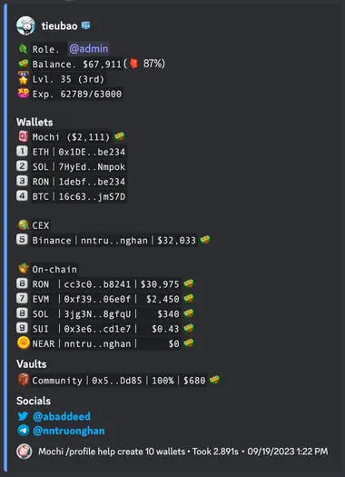

---
tags:
  - tooling
title: Trend Command
product: null
date: 2023-08-17
description: null
authors:
  - thanh
menu: earn
due_date: null
status: Done
PICs:
  - tropicaldog
completion_date: null
bounty: 60
hide_frontmatter: true
type: tooling
---

## Requirements
### `?trend` command
The idea is to create a `?trend` Discord command that will list the top 15 trending repositories on GitHub.

We can reference https://github.com/trending to make our list. Otherwise, we will need to identify what should count as trending on our end (stars/day, commits/day, etc).

There are no particular design requirements for this command, but it should use an embed and look similar to the outputs of our other commands.

### Filters
Not all repositories are relevant to everyone. We need to support some kind of filtering scheme on Discord to filter by, but not limited to:

- Programming Language (Python, JavaScript, Go)
- Time Range (Today, Week, Month)
- Spoken Language (English, Vietnamese, Dutch, …)

### Implementation
There are no restrictions on how to implement this command and where to get the data. Scraping from https://github.com/trending is also a viable approach.

We do mostly code our Discord bots in Go, but there are no hard requirements in programming language for this Discord command as of the time of this writing.
