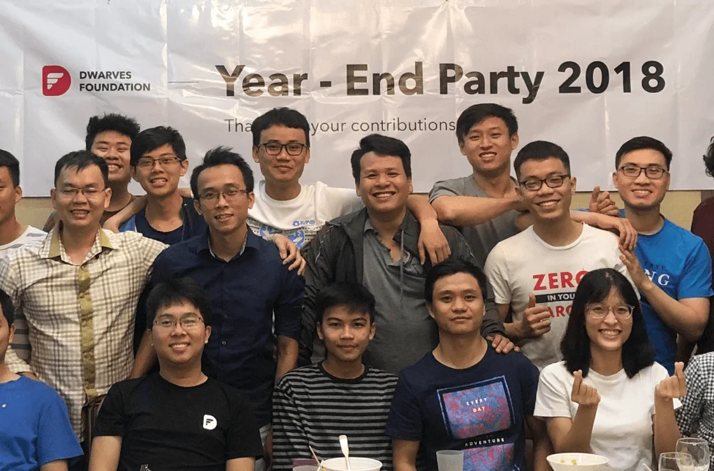
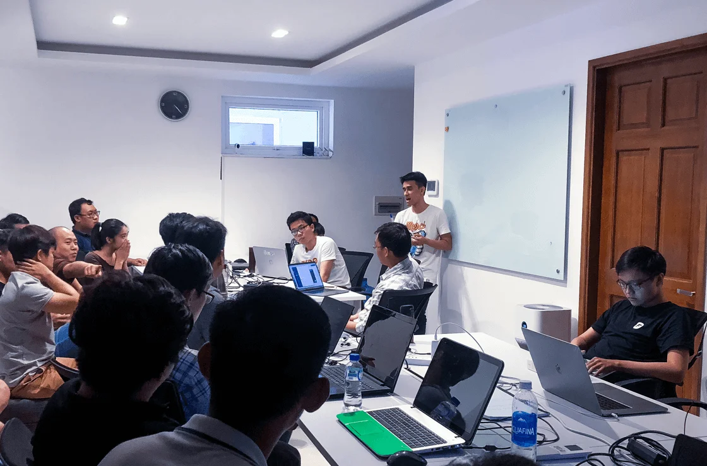

Build your first career goal with a Dwarves experience. 
We’re calling for senior techophiles.

Deadline: 20th March 2019

> [**Apply Now**](#)

---

## Why dwarves

We strive to create a generation of new tech talents who possess the same DNA as us, in the solid groundwork to go along with the company’s triumph.

- **Collect the outline mentorship** with the head of the team
- **Live your value and foster your skills** through the code
- **Get paid experience** with an allowance of $500/month
- **Expand your network**

## Who we are

An offshore software woodland that strives to become a part of global companies by offering the technical partnership that brings world-class quality cooperation and maintenance.

We opt for microservice & serverless. We take Golang, ReactJS, Elixir, Swift, and more as our main voices. As a startup, we take the pledge of bringing the next development to a whole new level.

## What we have

Our woodland is a sum of great technology, engineering culture, and smart people. The numbers speak it for themselves:

- 5 years in the market
- 40 talented members
- 10 common team size per deployments
- 3 Vietnam Development Community Influenced

## Our syllabus

To make sure you’re well-spent, we offer you projects and the chance to work with global clients. Bring your best curiosity and initial door to make these in the open

- **Deployment**: Apply basic DevOps, containerized Docker, Continuous Integration, Continuous Delivery
- **Programming**: Speaking multiple languages at once. You will be trained in the language and Agile/Scrum process to manage your work
- **Use GIT** for tracking file changes and version control system
- **Work with Swift for Apple fans.** We build apps for iOS and macOS. We got you covered in Kotlin
- **Be a Vim user or master another.** Become a CLI cluster
- Get hands on **Blockchain and AI**

### And for the practical training

- **Find friends:** Find friends in an app that locates them and shares their locations with you
- **Fortress:** A web app for management based on Dofus game features
- **And others for AI and Blockchain!**

## Reap your reward

> There’s no shortcut to help you grow than to get your hands on obedience. More than the proficiencies to microservices, web, and mobile apps, we hope to encourage you to live up and surge and urge to create world-class products by cutting-edge technologies.

## Leader’s message

> I believe at the time at Dwarves Foundation leaves you with not only experience but the spirit of being a tech engineer. Every Dwarves is expected to be a talent who is self-motivated, self-disciplined, and constituted, and we genuinely believe you can help the talent win games, teamwork, and intelligence win championships. We are here to help you grow, to move forward, to achieve more, and I can’t wait to see what you guys will do next.

**Loc Nguyen**  
VP of Engineering

---

## Our alumni

Take a look at our latest

<iframe width="560" height="315" src="https://www.youtube.com/embed/FWW6hve0GR8" frameborder="0" allowfullscreen></iframe>

**Phat Nguyen**  
Backend Developer

> Interning at Dwarves Foundation was one of the best decisions I’ve ever made. It shaped me to be a better developer and taught me how to work with talented mentors.

**Khiem Vo**  
Backend Developer

> After the 3-month internship, I decided to start a production project to select a suitable technology to get things done. With all the knowledge I gained, I stepped out of my comfort zone.

## How to apply

This 30-minute pre-assessment test below helps us to see the suitable books for candidates to contact for further details

[**Start Now**](#)
