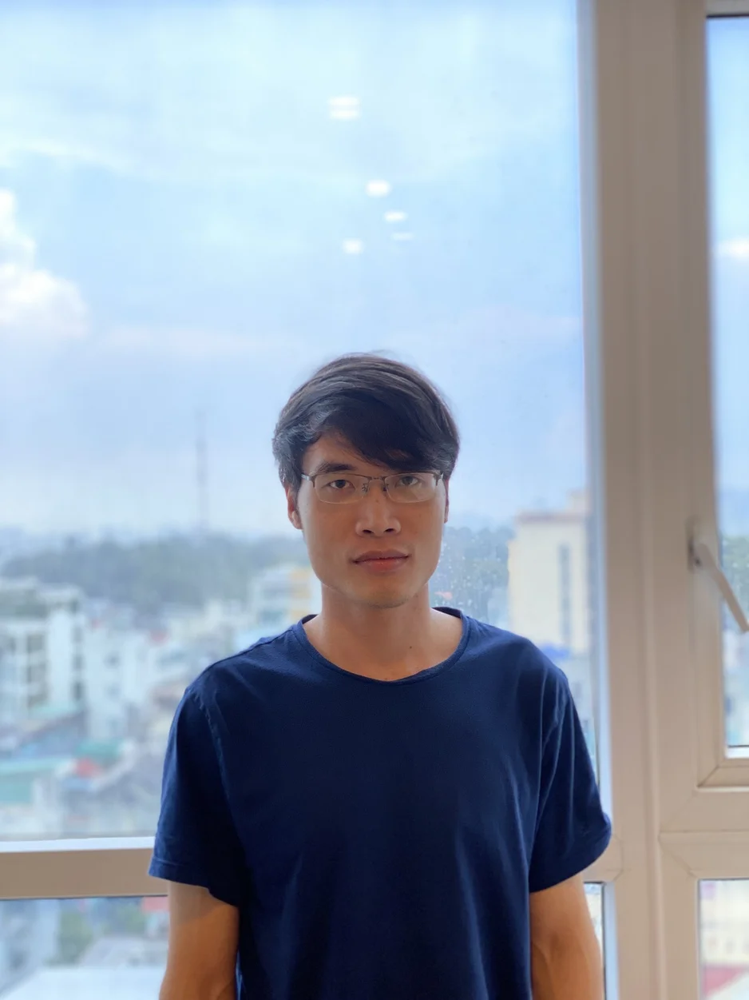
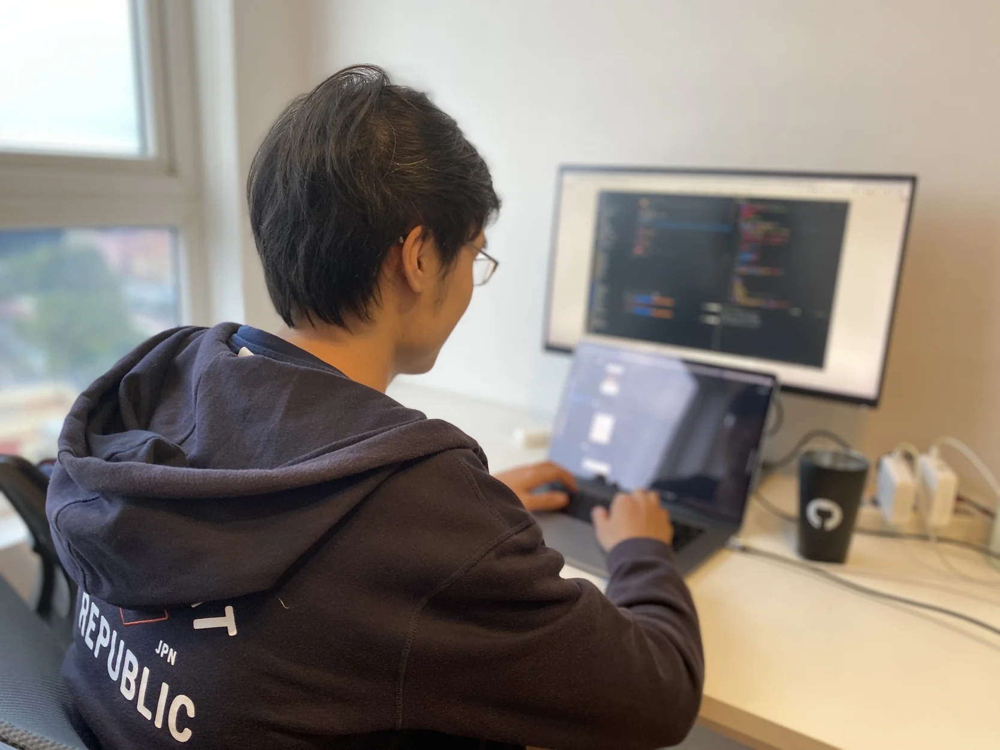

**A Front-end Engineer who transitioned from design reflects on finding his place at Dwarves Foundation, where enthusiasm, meticulousness, and diligence earned him recognition in the company's Hall of Fame for two consecutive years, while emphasizing that shared goals and learning opportunities matter more than financial benefits.**

Thanh joined Dwarves 2 years ago as a Front-end Engineer. It was his first company after he left the university. Taking a major in Design at first, there was something about code that attracted Thanh to make a few turns, ultimately developing expertise in both Design and Engineering.

He landed a spot in our Hall of Fame 2 years in a row. Enthusiasm, meticulousness, and diligence are what we've heard from the interns about him.

There was some change in my university orientation back then. When working on a product, although I knew something was wrong with it, I didn't know how to fix it in a UI-oriented way. So I thought Front-end would best fit my needs. It's related to UI anyway, isn't it?

I looked up Dwarves Foundation on both their website and GitHub while Dwarves was still a small office with very few people. I was impressed, to be honest, seeing the photos of them and their clients. Back at that time, my goal was to be part of a small gang, to learn more, and to know my ideas matter.

Income and benefits are sorts of bonuses, I believe. I expect more on what the team is up to and how their pursuits can fit mine. As long as their goal and mine are the same, we're good to go. As long as there are still things to learn, we're down to keep striving. It's more than just making a living. It's how they make us want to grow more.

