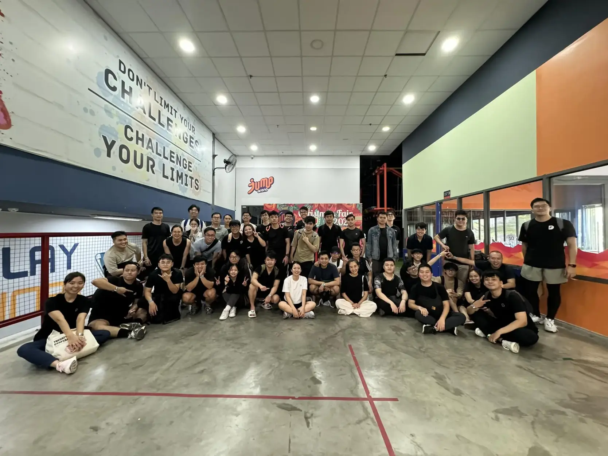

**An Engineering Manager with nearly 5 years at Dwarves reflects on his journey from focusing purely on technical skills to guiding team members' growth, highlighting the importance of creating a healthy environment where both junior and senior engineers can thrive while maintaining alignment with company goals.**

I guide and train people if they are assigned to me. Dwarves Team has a 60-day Program to evaluate, which is usually a 90-day plan, but based on the company size, the timeline can be adjusted to optimize teammate growth.

Newbies can find it struggling to catch up. It happens for everyone - though their abilities are excellent. Hence, newbies tend to do whatever their leader instructs. We have a different approach for Dwarves Team. In this woodland, we encourage people to envision their goals and do what it takes to reach them. The target changes flexibly based on their goals and progress - from weekly check-ups, then monthly, and finally rounds up after 6 months.

> "My job is to ensure a healthy environment for everyone to thrive. Young members need guidance and advice to orient their path, while seniors need goals to pursue."

Backed by Team Lead and Engineer Lead, we have 2 tracks for a career path. IC (Individual Contributor) and MT (Management Track). IC is built for teammates who find it challenging to fit in and wish to develop themselves individually. Meanwhile, MT is created for those who want to grow, socialize and work more with people.

At first, I didn't really enjoy sitting in a manager's seat. My focus was on developing technical skills only. But in the long run, the team should have someone to pay attention to, connect every teammate, and navigate them based on one direction. So I fit in that slot, expanding my knowledge and encouraging everyone to interact and work well with each other. Time goes by, and here I am - in charge as an Engineering Manager.

There are four key roles to deliver a good project outcome: Product Manager - who provides the answer for the "What"; Engineering Lead - who understands the "How"; Developer - who manages the deadline and connects all the joints of the codebase; and Engineering Manager - who allocates the right people for the job. The solid collaboration of these four roles forms a stable product quality.

I have conflicts to resolve too, either in the workload or with the people. I once met a fresher who wanted to experience working with startups. At that time, the company's demand was something different. One thing led to another, and he left. It's one of the problems you bump into once you're sitting in this position - finding the balance point between people's expectations and the company's direction.

What makes this team stand out is their hustle. I rarely have to worry about the team being lazy. It's like a code of conduct here - people know how to use their time and get things done.

My future goal is to become a CTO, maybe in around 5-6 years - or sooner if I'm lucky. That requires working with and understanding people, a lot. So I'm upgrading myself for the next big thing with what I'm doing now.

> "I'm upgrading myself for the next big thing with what I'm doing now."
