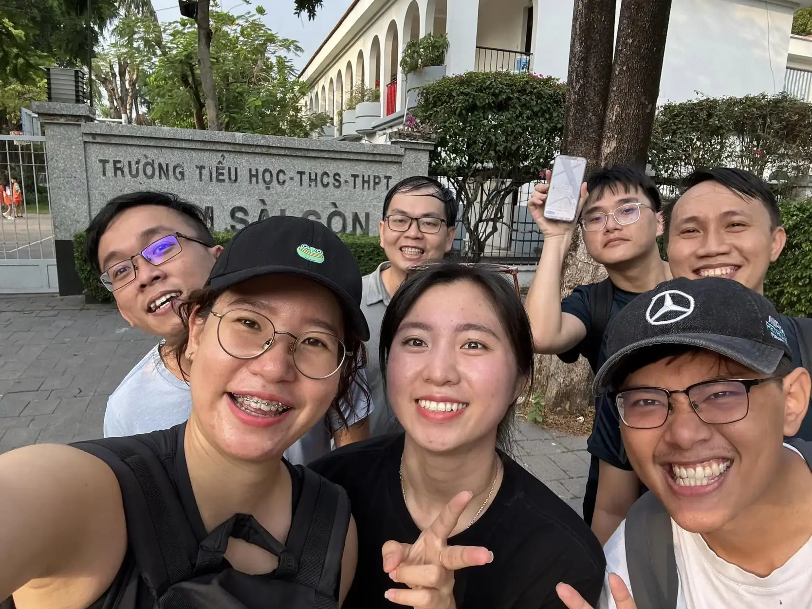
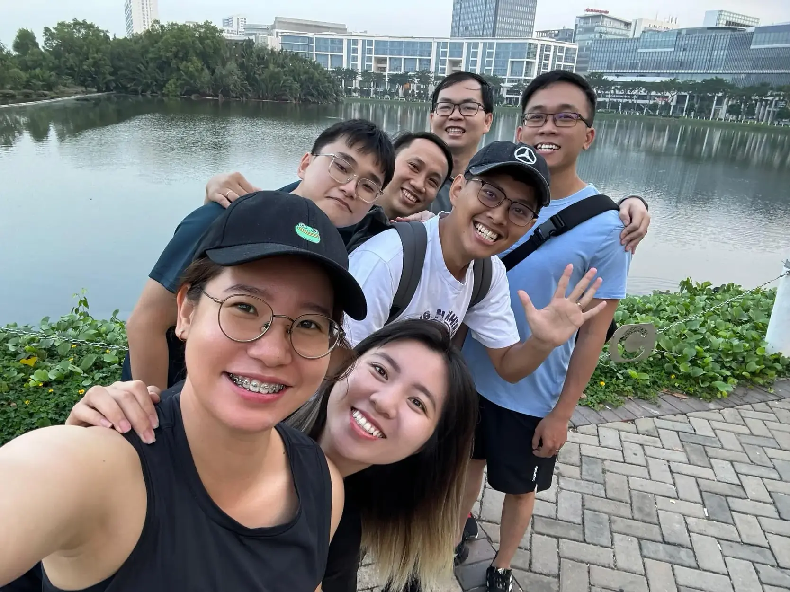

**A UI Designer reflects on her transformation from graphic design to product design, highlighting how Dwarves' startup environment allowed her to grow professionally by working on brand new projects, while emphasizing the critical importance of communication between designers and developers.**

I work for the graphic side, mainly on UI, app appearance, and app research to gain more insight for the team. Our workload depends on each project. A person can take care of both UX and UI design if the project is small. As a product designer, you're expected to know both.

I've been with the Dwarves for 5 years already. I graduated as a Graphic Designer and after 2 years working in this field, I didn't feel so good about my career path. There are just too many designers in this sector. By that time, UX & UI were becoming a thing. People started to know about it. So I decided to try it out. As graphic designers, you're welcome to work on ideas & creativity. But product designers are bound with technology, rules and terms. It was rough at first, but my decision stayed solid.

> "I work for the graphic side, mainly on UI, app appearance, and app research to gain more insight for the team."

Newbies usually seek big firms or local companies to start their careers. Since those corporations have well-structured projects, everything was well-developed. Our job was only to maintain and update. But somehow, this blocks me from learning and exploring. I used to jump between 2-3 local corporations since I couldn't find a fitting place to grow in UI & UX design. That's when HR reached out to me, and I knew about Dwarves.

At the moment, Dwarves was still a startup. This gave me more opportunities to learn since all our projects were brand new. Dwarves have chosen the hard mode since then. They were always ahead of their game, and I learned a lot from them. It's the main reason that convinces me to stay this long.

The office was very active before the pandemic. It took people a while to cope with the whole work-from-home mode. But I'm glad everyone was able to catch up with the productivity. It's a great experience working here. The journey includes high notes and little stuff that gets on my nerves.

There are times that people have their subjective opinions and are ready to protect them. I used to be the only designer on the team. That makes the communication issue between me and the rest of the developer team much harder. Our work scope is different, and so are our perspectives. We ended up arguing over everything.

So the team began to hold seminars, mostly to remove the roadblock once and for all. I got the chance to explain my work as a designer and understand things from a developer's point of view. It helped us to walk in each other's shoes. That move revamped our collaboration real fast. We know what others need and prepare to back them up.

> "The journey includes high notes and little stuff that gets on my nerves. But to sum up, it was quite an experience."

