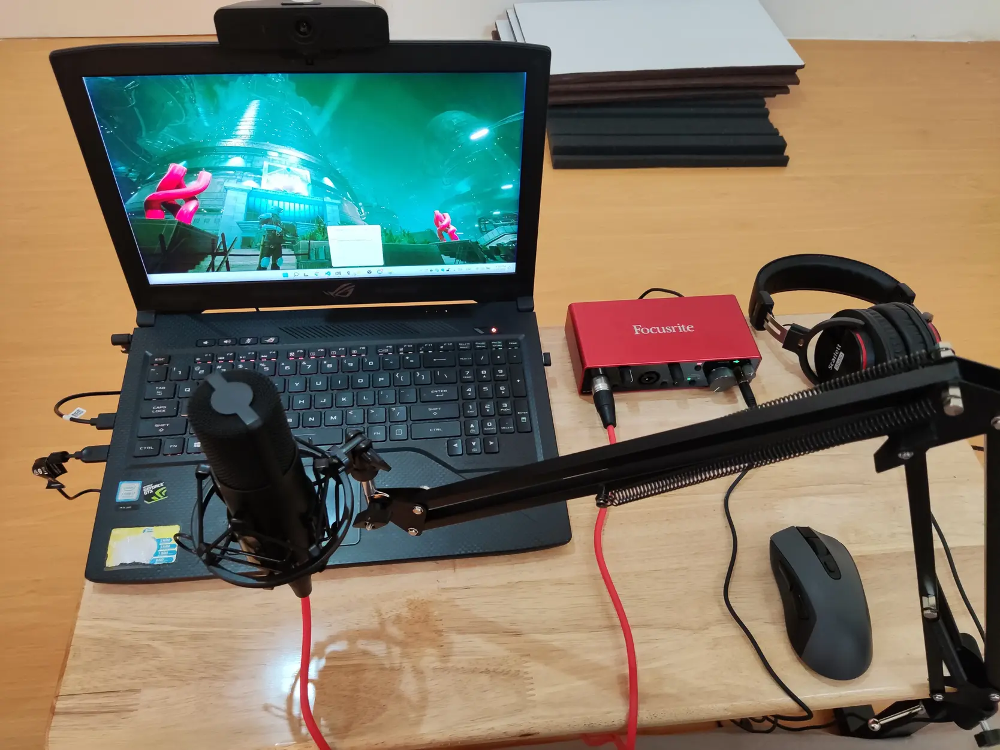
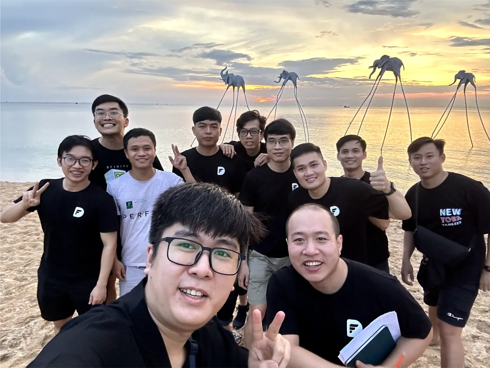

**A Data Lead and core contributor to Dwarves Brainery reflects on how remote working fits his lifestyle perfectly, providing the right balance between focused productivity and team collaboration, while highlighting how the company's support for remote setups helps everyone find their ideal work environment.**

I'm always at home, so working from home is awesome for me. My previous workplace required people to be at the office and hang out for drinks afterward, which was a bit overwhelming from my point of view. Working remotely fits me well, and I get work done without being distracted.

Going to the office can help you focus on your work. But it's more enjoyable at home! We still catch up through casual talks or sync up for a few minutes to ensure the work is going well. The office creates a good vibe for work, but it also blocks us from having real work sometimes. We can get disrupted by tedious and lengthy meetings, food ordering, or random discussions.

> "The office creates a good vibe for work, but it also blocks us from having real work. Working from home allows you to have time for yourself and still get things done."

I used to work for a Singapore firm that enabled me to work remotely from Vietnam. This working style has been my preference ever since. Working from home allows you to have time for yourself and still get things done. I can literally turn on the 4G and continue my work anywhere. And Dwarves Foundation gives teammates huge support for this. If you need equipment, just simply create a ticket. Whether it's a microphone, a webcam, or an ergonomic chair, the team is willing to supply it if it helps you work better.

Sometimes the people I work with don't feel so comfortable working from home. In that case, I'll invite them to go out and try pair working, if we're lucky to live in the same city. I'm glad to help teammates adapt to this working culture because I know how remote working can significantly benefit when you use it wisely. In return, the team even provides support costs for co-working spaces for the more extroverted team members.

In short, working from home only minimizes our chances of verbal communication. It doesn't, and can't affect our work if you approach it correctly. For me, it's the greatest work style ever.

