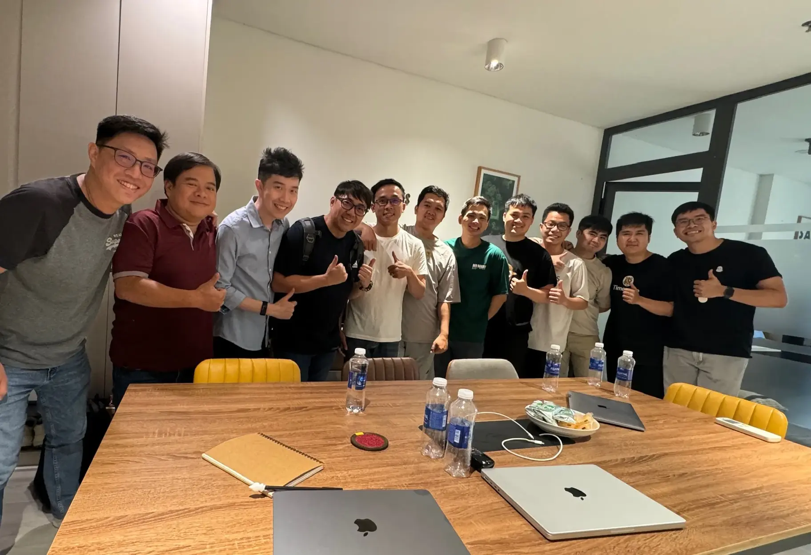

**A Senior Software Engineer with 7 years of experience reflects on his journey from startups to leading projects at Dwarves, emphasizing that the more you challenge yourself, the more interesting your work becomes, while sharing insights on mentorship and what makes a true senior engineer.**

Before joining Dwarves, I worked as a Tech Lead at a startup and as a Frontend Lead remotely for a company in the US. After giving myself a 3-month break, I joined Dwarves' Gravity project, eventually becoming a full-time engineer and lead builder for the project.

For me, focusing solely on Frontend would be boring. If you're too accustomed to one fixed thing without expanding into other aspects, work loses its excitement. I've worked in various roles, from Android to Web, from Backend to Frontend. So the title Full-stack Engineer still accurately describes my role as a Senior.

Each project has its own difficulties and responsibilities. I have to adapt to the project and find solutions to client requirements regardless of the environment. When we first built the system for Nghe Nhan, our team resources were limited. Client requirements had to be balanced with delivery speed given the available resources - that was a real challenge. From planning and task allocation to ensuring team work quality and product quality, everything needed careful attention.

The Nghe Nhan system was more complex than my previous projects. I had to balance updating and keeping pace with the client as features were continuously added. I needed to ensure the client understood that accelerating product build speed sometimes comes at the expense of quality. Working at Dwarves, especially in a senior role, presents challenging levels that help me learn and improve my capabilities.

In my view, you can learn a lot from a true Senior - from task management and team communication to problem-solving and solution development. The clearest sign that you're working with a Senior is the sense of comfort they provide. They're the first person you think of when facing difficulties.

I believe each company has different criteria for promoting someone to Senior. At Dwarves, a Senior needs to focus more on teamwork and communication, as well as product development mindset and seeing work in the big picture. Personally, I think seniors need to quickly acquire knowledge, build experience, and develop their vision for product development.

The truth is, my goal when putting in effort isn't to gain recognition or high praise. It's about the results I produce, creating quality products that are effective. Evaluation comes from others. I enjoy building products, so my goal is to complete the product. The product's results measure whether my output is good enough. If it's not, I take feedback and improve it rather than working for others' approval.

At some other tech companies, the knowledge gap between Senior and Junior can be quite wide. At Dwarves, I find I can still learn from junior team members. Whether I have a lot of work depends on how I manage tasks and handle project pressure. I usually list down tasks and prioritize them by importance. Each task needs to be addressed according to schedule without blocking other tasks, while ensuring everyone on the team has work to do.

I've noticed that being a leader for a fresh graduate significantly influences their future career path. When working together long enough, their work style tends to resemble mine, even their code style reflects my mindset. I think that's how I influence others as someone with more experience.

If team members need advice on what to learn or courses to take, I offer my perspective based on my experience. I won't share if I haven't experienced it myself. There's no real secret - I build trust with team members. Once they trust me, they'll follow my advice.

One thing I've learned in my journey to becoming a Senior Software Engineer: the more you challenge yourself, the more interesting things become.
