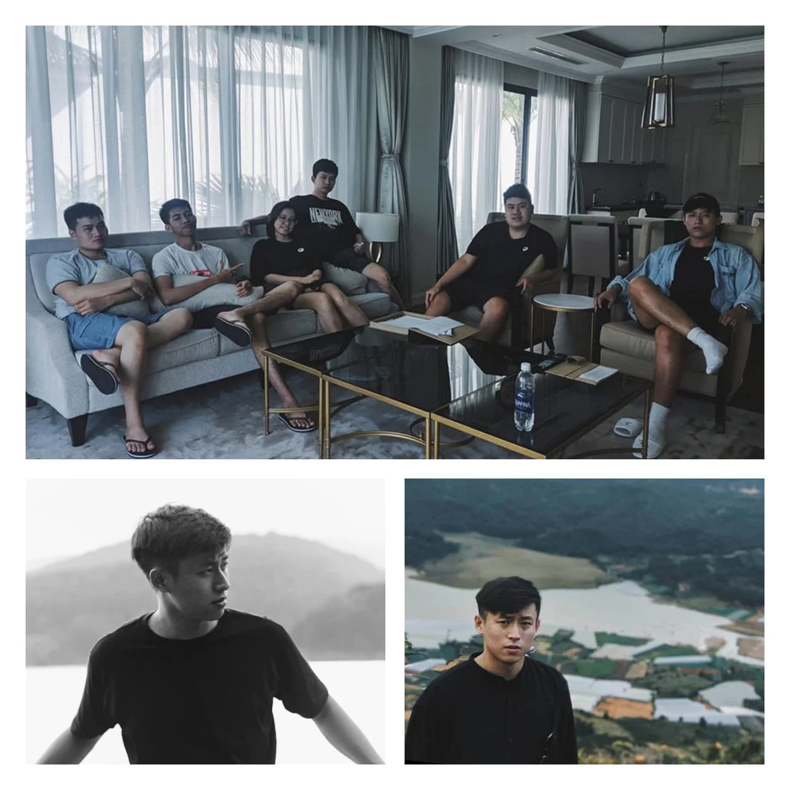

**A DevOps Engineer reflects on his transformative 5-year journey at Dwarves, from an introverted developer to a versatile team member who stepped outside his comfort zone through event organizing and embraced a '200% effort' motto that made him a client favorite.**

I came to Dwarves as an accidental fate. One of my friends asked me if I wanted to be part of a team that worked on cool projects and surrounded by like-minded people. I said yes, without a second thought. It was an uncanny call because my 2017 version was still figuring out how to finish the university degree. Joining any firm as a full-time job couldn't have been the right move at that time.

After completing my Associate's Degree, I had worked at a Japanese offshore company as a Fullstack Engineer. After deciding to quit that job to focus on getting my Bachelor's degree, I joined Dwarves and became one of the longest-contributing members at this tech firm.

I became a full-time Frontend Engineer after 4 months of part-time work. Dwarves didn't have any QC at that time besides **Huy Tieu**, and he became my mentor soon after that. I have worked in various engineering aspects, from Frontend to QC, Backend to DevOps. Until I joined Aharooms around 2020, where I finally decided to focus on my role as a Backend Engineer.

"Experiencing new things" has always been my life motto. True to this principle, I've constantly challenged myself during my time at Dwarves. From Frontend to QC, and now Backend along with DevOps, I've never allowed myself to stop learning.

The peers my age tend to throw themselves into gym, movies or dining after work to blow off some steam. And they do that on a schedule. A schedule that I refuse to follow, mostly because I'm used to living as someone who prefers to do things alone. I find it hard to confine myself to meeting the same people, and doing the same thing on a specific timeline.

2019 was when I finally let myself try out new things in different settings. Staying at home too long shrinks my comfort zone, so I needed to push myself out of it. That's when I signed up for GopherCon 2018 & 2019. The goal was not only to do another team activity but also to observe and understand how a well-organized event works from A to Z.

The most intriguing aspect as an organizer is taking the initiative to work with merchandisers, contacting and arranging the guest speaker's schedule. Thanks to those experiences, I was able to acknowledge what needed improvement in my communication skills and became more open to expanding my social connections.

By that time, I was still the team's youngest member. So part of my motivation was to catch up with the rest of the group - those terrific in soft skills. Event-organizing work was how I practiced and grew to complete myself.

My trait of having an eye for details sometimes leads to slower productivity. Thus, I'm still striving to optimize it. While I was working on Aharooms, staying up working until 1 or 2 AM was an everyday scheme. It bugs me to go to bed knowing I haven't finished the work. It's a principle to work with all I can, despite the role I'm playing.

Last July rounded up my 5th year as a Dwarves. It was one hell of a roller coaster ride. I play by a motto where I'm down to perform at a 200% effort. I guess that motto contributed to my success at Open Fabric, a recently wrapped up project where the teammates and the Project Lead endorsed me for being an absolute rock star. It's hard to describe the feeling, but 'proud' would be the right word.

Dwarves is scaling up and getting bigger every day. So as a long-time contributor, the newbies often come and ask me how to upgrade their career and self-development. I often advise: Give yourself the chance to try out everything until you find something you wouldn't trade the world for. Keep up the consistency in what you choose. On top of that, don't force yourself to work on what you hate. Meeting new people will help you grow. And remember to spend good times with colleagues, because that can be one of the best moments you remember about your workplace.

Looking back at my 2017 version, I've always been amazed by what I've learned and how I've changed.
