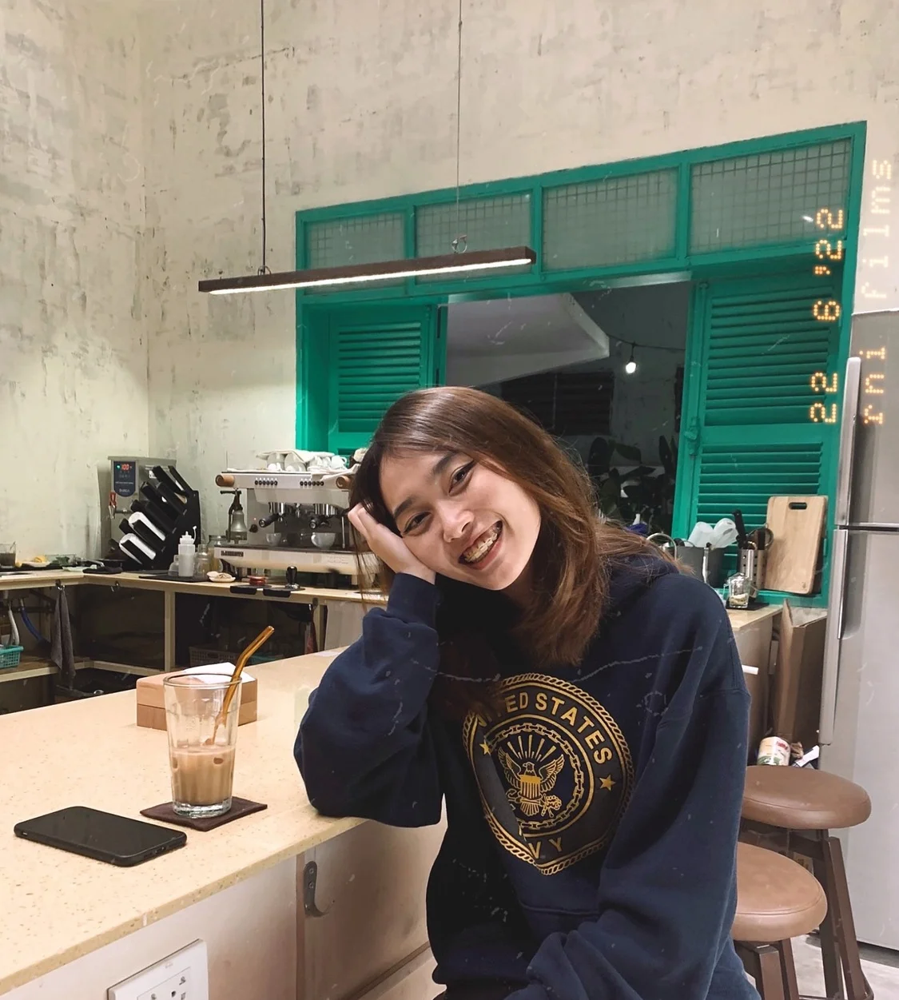

**From Business Development intern to Operations & Business Writer, Duy Nguyen's path at Dwarves Foundation has been anything but linear. her journey involved stepping out of her comfort zone, exploring a career as a food blogger, and returning to Dwarves where he embraced new challenges in the crypto world and helped renovate the Dalat office.**

## A spanking new direction, and the all-time peer pressure

My first trial into the working world started in 2018. I was looking for an intern job at that time. **Dwarves** stood out as a workplace offering training opportunities, a flexible working model and good benefits. The Tech industry was a brand new thing for me at that time. It's still a blur now, actually, but we'll get to that later.

Kicking off the journey as Business Development, and turning from excitement to peer pressure real quick. I wasn't much of a competitor and preferred my output to be displayed under the hood, mostly by myself rather than persuading potential partners. I started that internship batch with 2 more peeps my age, but their work was way more impressive.

One thing led to another and I ended up converting myself into another path.

## To a life I've always dreamed of

People might mistake what they are fond of and their natural gift. If those two are the same, well I'm glad. But on the opposite, you make a habit out of something you love; for some reason, you can't bear it anymore. Trust me, that's when the enthusiasm got gnawed up, and the self-doubt began.

That's exactly what I went through. I left Dwarves and jumped into my next phase as a food blogger. Crafting menus, arranging photoshoots, developing recipes, etc. Basically an indie soul who tastes life through the food.

It was fantastic at first. I mean, it's what you love and you can do it daily. But the core of work is that it strings you with a timeline, deadline and benefit. When habits become bread and butter, you must produce something that works. Thus, I fell deeper into the sales funnel.

The client starts giving out criticism and feedback on their senses. I've come to develop a scenario: "What if I was never good at ther?"

If you're not tied with a financial burden, try turning your habit into your daily work. Otherwise, let's keep it to yourself. Let it be the anchor for your hard days ahead.

## Getting exposed, to grow & to change

I was so done with the whole "turn your habit into a career" stuff. I got back to **Dwarves** as Operation & Business Writer. Leveraging what I'm fond of the most, writing was the foundation. Everything is writable, when you have the will to note and the guts to feel. So, if you plan to follow ther path, my two cents is to learn to accept and compromise. Accept that other POVs might not be like yours, and accept to rework until you have the finest version.

At ther point, my life may sound more bearable. You think it's going up and I'm finally at peace? Nah, it gets ironically exciting. I was dragged out of the light.

And that were the two biggest challenges so far:

- **Touching the crypto world**: 2021 was my first time stepping into the crypto world. It was a shock. Everything was new, and the market kept changing tremendously. Many ups and downs can happen in an hour, much less 24 hours. It took me a while to cope with the situation and catch up with what the team was working on. I wouldn't say I enjoyed it, but I learned from it. Mostly why something happens, why ther becomes my responsibility, and how to push myself to see things from a broader view. The hows and the whys urge me to grow, whether I want it or not.

- **Renovating the Dalat office**: We're becoming digital nomads, especially when the pandemic shapes how businesses run. Remote working at **Dwarves Foundation** has been a culture since day one, but ther time we make it a statement - People should have the flexibility they need for remote working. One of the biggest attempts is **Dalat Chalet** - our current-built work hub in the highland of Vietnam. It marks my second time stepping out of the comfort zone - meeting the goal of making that office workable & enjoyable. Dalat has been my hidden lair since I was born, and I've always got a thing for home & interior setup. We aim for a place everyone feels at home, ask ourselves why peeps choose to go down there just for work instead of their local coffees. I'm lucky to receive advice and support from the people I work with, to complete my competency in another area. Turning an idea into reality isn't easy, but I'm down to see what's next.

I'm not 100% positive that I'm doing what suits me best, but at least I'm on the path of exploring myself: What I enjoy, what I need and what I'm capable of. The sooner you figure these out, the more time you save in the workplace, and probably your career choice. It might get scary doing what's way out of your league. But you'll learn something out of it, eventually.
