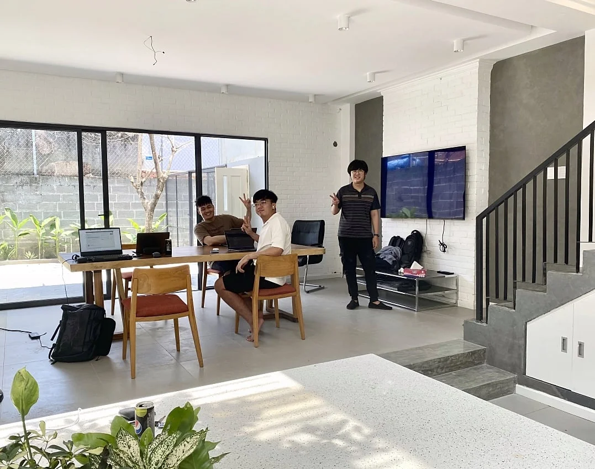

**A Backend Engineer reflects on his journey to becoming a Golang enthusiast, highlighting how the programming language's simplicity and efficiency bring him joy, and why the supportive team culture at Dwarves inspired him to turn down external offers for more growth opportunities.**

I first encountered Golang in 2017 when applying to a Japanese tech firm. They required an entrance test using Golang, which I had no idea about at the time. With only a week to learn and complete the exercise, I failed the test, but it sparked my interest in the language.

Before joining Dwarves, I worked at Citytech primarily as a Frontend developer using NodeJS. In 2019, I joined the Aharooms project - a solution for 2-3 star hotels - which was my first opportunity to work with the Dwarves team and where I truly began to practice Golang.

After exploring various programming languages, I still prefer Golang for its simplicity and efficiency. Why not Python or Java? The minimalism and performance optimization of Golang give me more joy when working with it. I believe Golang has great potential for future development, as more companies and startups are incorporating it into their projects. Its flexibility is especially well-suited for building cloud-native applications.

When I interned at KMS in 2017, our team was very small, and my lead only dedicated about half his time to the project. My daily work involved maintaining an application that was already built. When the lead moved to another project, I felt isolated and developed a strong desire to work with teammates rather than alone with my computer.

The Dwarves team brings excitement and enthusiasm to projects. I appreciate **Hieu Phan**'s friendly nature and willingness to share knowledge, **Thanh Pham**'s constructive feedback and career guidance despite his strictness, **Bao**'s ability to see the big picture, and **Minh**'s project management skills and dedication.

Earlier this year, a client offered me a full-time position with them - a new environment and higher salary. But I chose to stay with Dwarves. I wanted to continue challenging myself here: from the remote work culture to the proactive work approach, and especially the knowledge-sharing habit of everyone on the team.

Accepting that offer would have meant living in a 9-to-5 loop - everything predefined and revolving around work. That's not what I wanted. I prefer conversations and learning from others, which our Radio Talks provide. Perhaps the biggest reason I stayed is the people at Dwarves.

After three years with the company, I've noticed significant personal growth: from someone hesitant to speak with many people to someone confident in sharing experiences and knowledge with juniors. That's also the most challenging aspect of supporting interns - learning to understand people's desires and needs, and how to help them most effectively.

I believe that when starting to learn a programming language, you need to dedicate time to explore, experiment, and find solutions. If you've practiced with a language and still don't enjoy it or find joy in it, don't force yourself to use it. Instead, look for projects that allow you to participate in multiple aspects and upgrade your experience.
