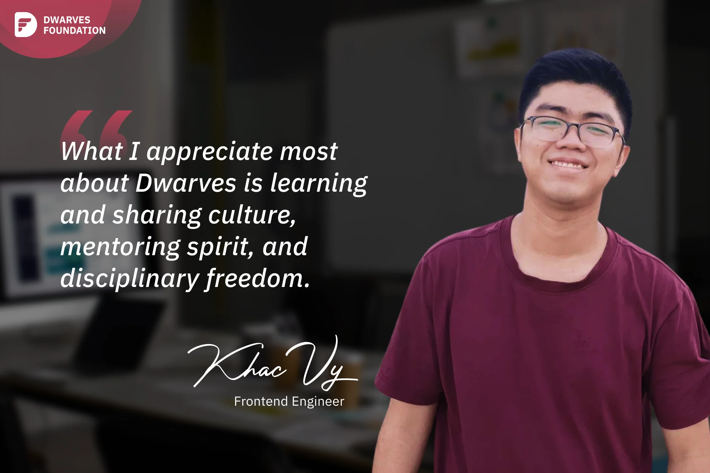

**A Software Engineer reflects on the unique learning culture at Dwarves, the value of mentorship relationships, and the liberating experience of remote work with self-management and accountability.**

Firstly, Dwarves has a great culture of learning and sharing. When I joined the company, I found this to be quite unique compared to my previous experiences. As an introverted guy, I used to keep most of my knowledge to myself and hesitated to share it with others. But since I started working here, I've noticed that everyone is eager to share and showcase their expertise through Monday Radio Talk and Friday OGIF sessions. It's like, "I know something, so why not share it with my colleagues? Who knows, it might be helpful." This transition has been significant for me, from being extremely introverted to being comfortable sharing with my team and even speaking with guests during tech events. At Dwarves, the team lives and breathes growth. I think that growth is our universal language, and we are constantly working to better ourselves, both personally and professionally. It's more than simply a job; it's a way of life.

The second thing I appreciate about Dwarves is the strong mentorship culture. Even after five years at here, my mentor is still **Thanh - Engineering Manager**. We are complete opposites. I tend to work based on my emotions, so if I feel bored, my productivity decreases. On the other hand, Thanh is extremely disciplined and principled. Whenever I lose focus or deviate from the right path, Thanh gently reminds me. He not only guides me on technical matters but also helps me develop a professional working style. A dedicated mentor from whom I can learn a lot about how to manage work, communicate, handle issues, and always put their profession first by attempting to master all facets of their job. Working with them, they allow me the freedom to speak up and are prepared to assist me from their perspective. I consider that person first in the event that I encounter any challenges. That's why I believe mentoring is crucial.

At Dwarves, almost every new engineer has a mentor, I mentor new peeps as well. Without mentors, newbies may take longer to grasp their strengths and weaknesses, making it harder to move on to what's ideal for them. Your help will be greatly valued if you put yourself in the position of newcomers. Look inward first; can you inspire confidence in others based on your exceptional performance? So, as a mentor for newbies at Dwarves, I always strive every day to upgrade my skills and knowledge day by day. The more in-depth your knowledge, the more your peers will trust you.

Lastly, there's the freedom to work. Dwarves has been working remotely even before the Covid-19 pandemic. Team leaders trust members to self-manage. It feels liberating. Since we work remotely, a day without output is like a day off. Dwarves does not pressure or assign responsibilities for anyone. Instead, everyone actively manages their time and works to produce the highest-quality work. Working here, I can proactively set a schedule that matches my personal life, receive help when I need it, be praised for my work, and always be motivated to work harder.
