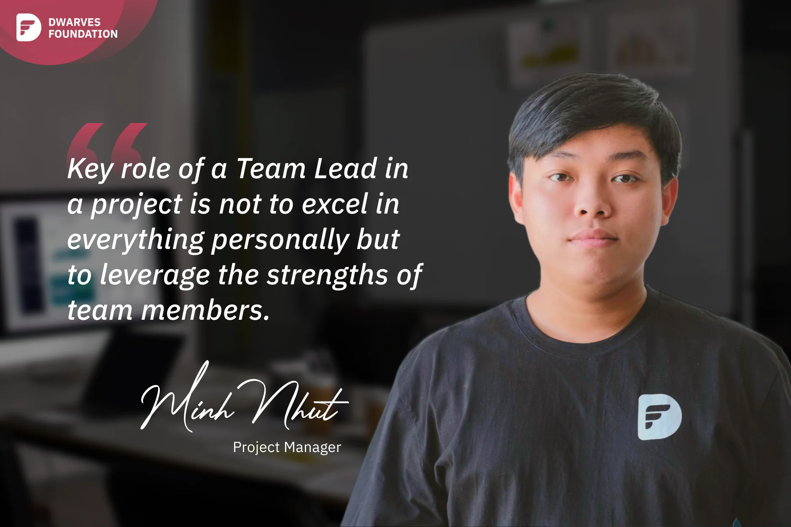

**A Project Manager reflects on his unusual career path from QA Engineer to Team Lead, emphasizing the importance of proactive engagement, earning trust from both Dwarves leaders and clients, and understanding that effective leadership is about leveraging team strengths rather than excelling at everything personally.**

It's commonly believed that QA Engineers are rarely promoted to management positions since they are more likely to be assigned to tasks relating to quality assurance and user advocacy. Most of the time, they might not be very involved in the technical side of the team. If you don't understand programming, leading a team is very hard. However, I consider myself fortunate because I was promoted to Team Lead from QA Engineer after 3 years.

I believe that the culture of being open to discuss, combined with the guidance from other leaders like **Thanh Pham**, **Huy Tieu**, and **Han**, makes me feel oriented and continuously developing. In my work, I tend to be proactive in various matters, even if they are not directly related to my scope of work. I remember when the voucher system team was working on a big project, I joined almost every conversation to discuss and give ideas, even if my involvement wasn't required. I wanted to contribute, so I jumped in, observed, and then proposed ideas or insights to guide the project. Sometimes, when the team faces issues that don't directly come from our side, I still proactively check and join discussions with other teams to understand the problems and suggest solutions.

After 2 years of working with client team, I have earned the trust of both the Dwarves leaders and client team, which led to my promotion to the role of Team Lead for the project. This has been a big motivation for me, knowing that the whole team trusts and supports me. Sometimes, I face challenges, not only in leading the QA team but also understanding the discussions of the dev team. There are contexts that dev team members are discussing that I may not fully grasp, so I have to ask for transparency.

I believe the key role of a Team Lead in a project is not to excel in everything personally but to leverage the strengths of team members to collectively achieve excellent results. To fulfill the responsibilities of a Team Lead, I must possess a developer's perspective, knowing how to manage tasks and run the team, both the QA team and the dev team. My goal is to deliver the most optimized solutions to our clients and ensure that all team members receive the recognition they deserve for their valuable contributions.
