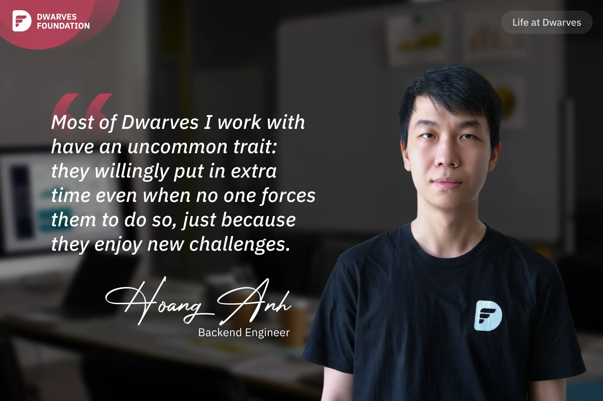

**An introverted engineer reflects on his decision to join Dwarves, appreciating the company's focus on personal development, recognition of individual contributions, and a culture where team members challenge themselves with new technologies.**

I was surprised since **Thanh Pham**, our Engineering Manager, had referred me for an interview in "Life at Dwarves" series. Honestly, I am a very introverted person; besides work, I do not participate in any team activities like dinners or hangouts. The company doesn't require us to if it's not really our scene.

After leaving my prior job, my buddy **Tuan Dao**, a BE engineer at Dwarves, convinced me to work there. I used Java at the interview, assuming I would fail because Dwarves's supreme stack is Golang. Yet I passed. This team, I think, places more weight on a candidate's potential, talents, and work ethic than on their actual skill set alone. Then I got two job offers at once, but I chose Dwarves even though the other company offered a slightly higher salary. I appreciate adjusting to new technologies and working in a dynamic, inventive workplace with talented people. After more than two years, I never regretted joining Dwarves.

Here, Dwarves emphasizes personal development while acknowledging the value of each individual. For example, I often have one-on-one conversations with Thanh. He always listens to what I want and sets up projects that match my goals and help me grow. While working here, I feel oriented, progressed, and, most importantly, recognized. My supervisor, **Huy Nguyen**, encourages me for my efforts each time I complete a task, which encourages me to keep going.

Most of Dwarves I work with have an uncommon trait: they willingly put in extra time even when no one forces them to do so, just because they enjoy new challenges. Each project here is like a playground for us to trial new technologies, tools, or features that each person challenges themselves with.

For instance, **Nhut Huynh**, my team's tech lead, is my closest model. In my years of work, I have never seen a QA become a tech lead. Nhut spends his weekends learning about technology, learning a lot and putting in a lot of effort to contribute to his projects. So I understand that being a tech lead who also has management abilities and specific expertise takes a lot of effort. I therefore have a lot of respect for everyone in the company. How can I let myself become a loser when I work in an environment where everyone is moving forward and trying their hardest?
