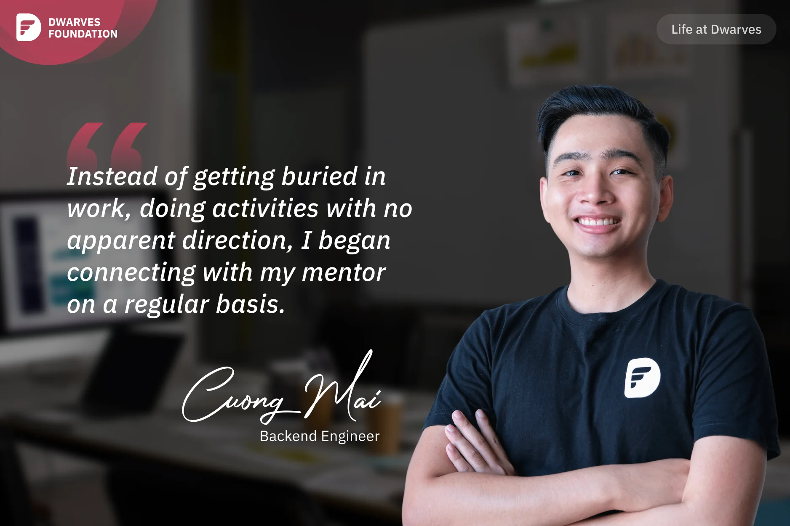

**A Backend Engineer recounts how a health scare transformed his approach to work, leading to better organization and a deeper appreciation for Dwarves' strong mentorship culture that extends beyond technical guidance to career development and personal support.**

During my first week at the company, I was hospitalised for a week for endoscopic surgery due to a stomach ulcer caused by too much medicine at the end of 2021. Prior to that, when I was working at my old job, my existence consisted of eating, sleeping, and working - as long as the cashflow continued coming in. However, after that health crisis, I began paying more attention to my diet, exercising regularly, and not letting work stress take over. It is definitely true, we won't be able to take any wealth with us when we die.

My working style has also changed a lot since that health scare. I've grown more organised as I've realised that every job problem has a solution and that nothing is insurmountable. Instead of getting buried in work, doing activities with no apparent direction, I began connecting with my mentor on a regular basis. At Dwarves, the mentor-mentee relationship is truly special, with enthusiastic and thorough guidance. **Tom** is my mentor at Dwarves, mentoring me through the first few months of the company and assisting me with Golang development.

After three months, I joined the company's software modelling group, where colleagues developers present, discuss technical solutions, and explain specific concerns. Every time I make a presentation or discuss something on a radio talk, I practise with the software modelling group and Tom beforehand, thanks to this group. I was missing several points the first time, stuttered through the presentation, and received a lot of comments from Tom, **Thanh**, and others. But, with time and repeated attempts, I earned a lot more confidence in my public speaking and presentation abilities. Many thanks to Dwarves for providing opportunities for me to share radio speeches and company presentations.

Dwarves mentors do more than give sound advise on the job; they also help shape careers and offer a confidential space to talk about personal problems. Tom was so helpful with my career path. When I told him I wanted to be a senior engineer, he helped me define the skills needed to improve, the projects I should work on, and how I might better my learning. Now that I have a clear path, all I have to do is keep working and improving day by day. Occasionally, I even discuss financial matters with Tom – he's quite skilled at financial management. And anytime I'm anxious about marital or family issues, I talk to Thanh. He shares his experience defying familial pressure not to marry soon 😃
