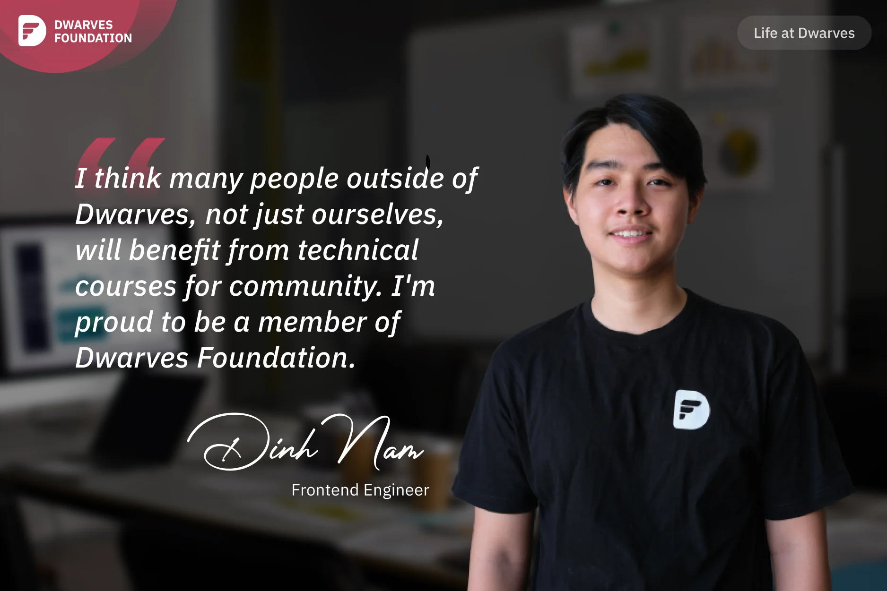
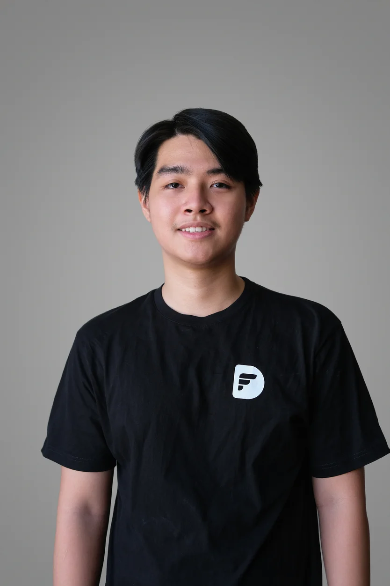

**A recent graduate shares his early career journey at Dwarves Foundation, highlighting the benefits of structured mentorship, the rapid professional growth he experienced, and his appreciation for the company's focus on creating learning opportunities for both employees and the wider tech community.**

I graduated just three months ago, but I've been with Dwarves for over a year now, since my third year at Bach Khoa University. I remember the internship period very well; our company invited our professors to teach us the fundamentals and practical aspects of the tech stack. Sometimes our professors taught us at 2 PM, and other times, they were busy and could only teach us at 7 or 8 PM. I would finish work at 6 PM, rush to grab some food, eat quickly to make it to the class, and I stayed at the office until 9 PM.

There were days when only **Thanh** (our Engineering Manager) and I were in the office. Even though we're a virtual company, I spent a lot of time in the office, usually next to Thanh. Even though Thanh wasn't pushing me much, but his solemn expression and air of intellectual seriousness made up for it. I guess it's because I was sitting next to my boss, plus when I first started, I had a lot of shortcomings, lacked professionalism, and needed frequent reminders from him, which made me quite nervous. But now that I'm used to the process, like checking in and updating work statuses, I'm less scared of my boss, hehe.

But thanks to that, I feel like I've grown quite rapidly. I received thorough training, regular mentorship from my line manager, and in the early stages of my career, being guided and challenged like this, I'm very satisfied. Another thing I really like about Dwarves is that the company has a lot of community-oriented activities.

Aside from the fact that Dwarves team often shares knowledge, research, writes tech blogs, and showcases publicly for the community, the senior members and leaders at Dwarves also organize free technical courses for the community. I signed up for our team's Golang training in August. And at the end of the course, my team came out on top in the demo showcase, earning ourselves 100 ICY tokens for our efforts. Looking back, I'm happy and proud of what I've accomplished.

I think many people outside of Dwarves, not just ourselves, will benefit from these kind of events. Joining the Dwarves Foundation was a great decision, and I'm happy to call myself a dwarf now.
