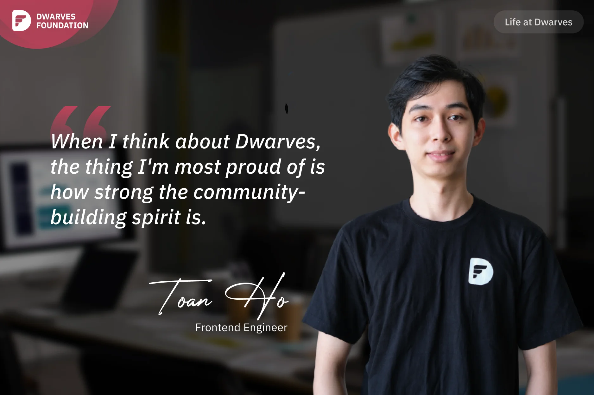

**A Frontend Engineer reflects on Dwarves' strong community-building culture, popular open-source projects, and the supportive work environment that fosters growth and learning.**

When I think about Dwarves, the thing I'm most proud of is how strong the community-building spirit is. There are also a lot of good and useful open-sources. For example, [Hidden Bar](https://github.com/dwarvesf/hidden), a small MacOS app that helps hide menu bar icons, was very popular in 2019. At the time, this Dwarves app had been highlighted on [HackerNews](https://news.ycombinator.com/item?id=21794858).

**NextJS Boilerplate** is another open source project I'm proud of. It's a production-ready front-end boilerplate built on NextJS that comes with TypeScript, SWR, TailwindCSS, Jest, testing-library, Cypress, and Storybook. Many engineers also use it until now [on GitHub](https://github.com/dwarvesf/nextjs-boilerplate).

I think Dwarves' spirit of building up for community partly comes from the company's culture of learning and sharing. On the Discord server, there are many channels where tech people can share what they've learned (#til: today I learn), talk about tech news and tech stacks (#news, #tech, #frontend, #backend, etc.). Since I started working at Dwarves, I've learned a lot, looked into and tried out new technologies, and mentoring.

There is a memory that I will never forget. A few months ago, I did a research with **Tom Nguyen** (Data Lead) on LLM, which was a very hot topic at that time. But there's a lot of research information that can't be found, I was very stressed, to the point that even when **Thanh Pham** (Engineering Manager) texted me, I didn't dare to respond for a whole day.

Then Thanh called my close friend and told him to encourage me: "Not every research has to produce an output, the important thing is that Toan can understand its process." If I were the boss, I'd be thinking, "let's just fire this guy already because he won't even respond to my messages." So I am very touched and thankful to Mr. Thanh for being patient with me and giving me support. An unforgettable memory at Dwarves!
