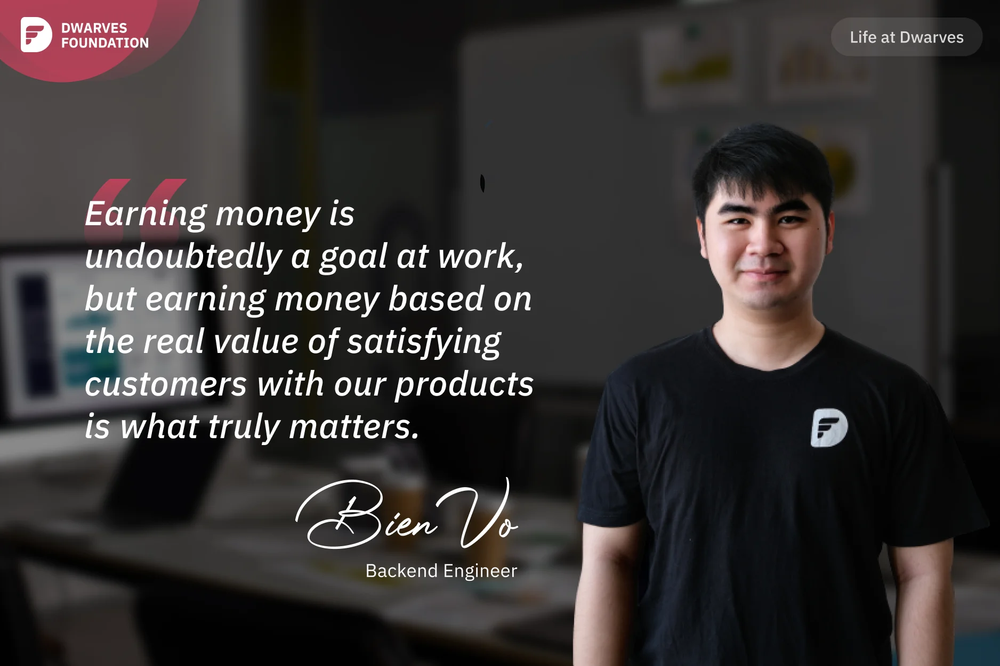

**A Backend Engineer who started as an intern recalls how mentors helped him overcome early challenges, and reflects on Dwarves' culture of responsibility toward client projects, focusing on delivering real value rather than just earning money.**

The early days at Dwarves were unforgettable for me. There were no easy projects suitable for interns, and the challenging projects seemed beyond my capabilities. I was so stressed and doubted my own abilities at that time. Fortunately, **Huy Nguyen** and **Minh Luu** helped me a lot. Instead of just assigning tasks to me and letting me figure things out on my own, they mentored and guided me on what I needed to learn in order to complete those tasks. They also helped me build confidence because I was overthinking too much. Thanks to them, my work became smoother, and I overcame the "early career shock" in my journey. This is the culture at Dwarves that I'm very proud of; these mentors always pay attention to supporting inexperienced young mentees, guiding their work, advising for their career paths.

For me, working in a company where I receive guidance, where my voice is heard, and where I can develop is a great happiness. Dwarves has a great culture, a strong sense of responsibility toward client projects, treating them as owners of the projects. Dwarves pays meticulous attention to detail, which delights clients, and we don't just jump from one project to another when extending contracts. It is precisely because of this that I often feel that I'm not good enough as I aspire to be. I always try to deliver better and make end users more satisfied when they use our products. Earning money is undoubtedly a goal at work, but earning money based on the real value of satisfying customers with our products is what truly matters.
