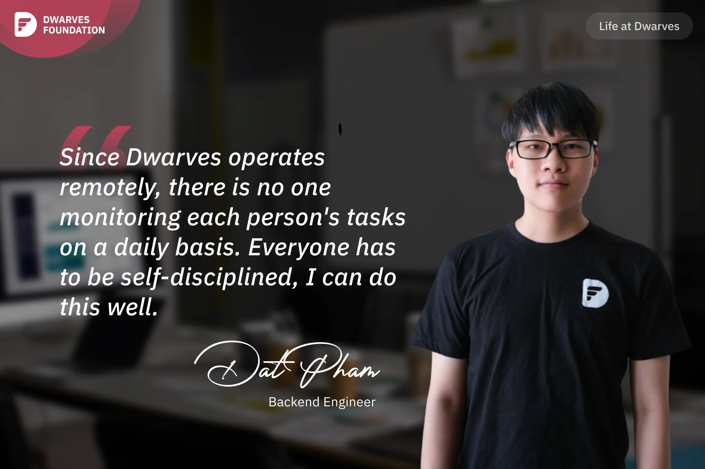

**A Backend Engineer shares his experience starting as an intern at Dwarves, adapting to remote work culture, and developing self-discipline that led to recognition as a Rising Star within the company.**

Back when I was studying at Bach Khoa University, there was a requirement in my third year to find a company for an internship. Coincidentally, Dwarves was offering interships, so I applied for BE position and got accepted.

**Ngoc Thanh** in Hanoi interviewed me, and has been my mentor ever since. During the interview, I had some knowledge of both FE and BE, but to be honest, my knowledge of FE was actually greater than BE. I only knew a little bit about Node.js, but I was completely clueless about Golang. I was hesitant and unsure if I would pass the interview, but luckily, I did. I think the reason I passed the interview was not because of the knowledge or skills I already had, but rather my work attitude and enthusiasm. Since the company operates remotely, there is no one monitoring each person's tasks on a daily basis. Everyone has to be self-disciplined, and this is something I can do well.

I still remember my first day at Dwarves. Company didn't require us to come to the office, but I dressed up neatly that day, wearing a white shirt, trousers, and dress shoes. When I arrived at the company, it was a complete "first-day-of-work shock." Other colleagues were wearing long pants to protect themselves from the sun, but at the office, they even took off their long pants and wore shorts for comfort. Oh my, it was such a shock for how casual everyone was. After working for a while, I got used to the company culture. Members work very freely and comfortably, with no one managing anyone. What matters is self-motivation and respecting the differences of each individual.

The thing I am most proud of during my time at Dwarves is that at the end of last year, during the company's annual review. Dwarves hold **Dwarves of The Year** award every year. I was voted for the "**Rising Stars**" award and received over 200 ICY as a bonus. This award is given to the employee who has shown the most development in the company. I guess, from being an intern with little knowledge, I learned a lot and developed significantly.
