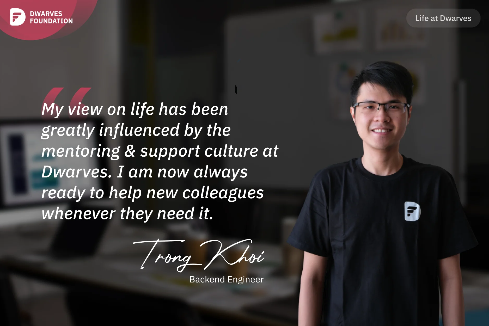
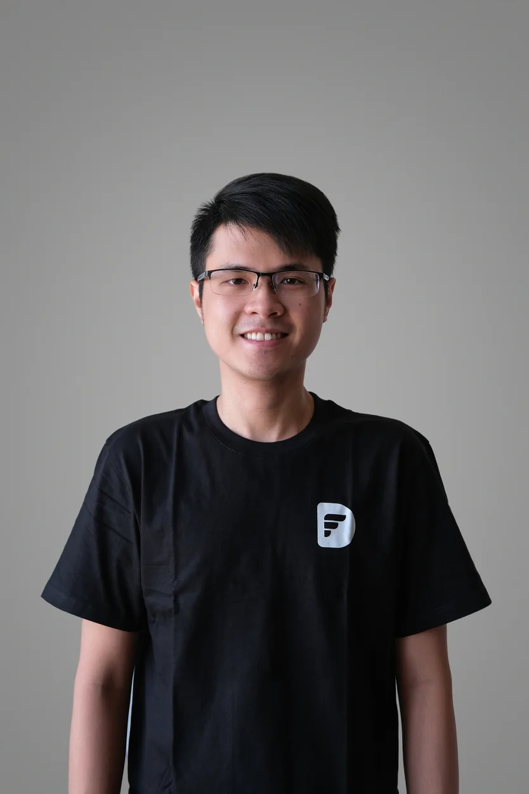

> From intense workload to personal transformation: a Backend Engineer shares how Dwarves' exceptional mentoring culture changed not just his technical skills, but his entire perspective on supporting others.

The most memorable experience I've had at Dwarves is when I had just passed my internship. At that time, I was working on three projects simultaneously: WeUp, WeGo, and Aharooms. As a fresher, I didn't have much experience, so each task took me a long time to complete. Although the official working hours started at 9AM, I would be at the company by 7 or 8AM. Then I work until 8 or 9 at night. When I arrived home, I continued working until the midnight, and this routine continued for three months. It was during this challenging time that I saw the most growth in my technical skills and problem-solving mindset, making it truly unforgettable.

I feel very lucky to work with such kind-hearted colleagues at Dwarves. I have never encountered such kind people in my life. When I was handling three projects at once and struggling with tasks that were beyond my expertise, I reached out to my line manager, **Huy Nguyen** for help. Then he referred me to **Quang**, saying that he knows about this particular issue. Although Quang was not working on the same project as me, he still took the time to share his screen and code with me. I am truly grateful for his support.

I also remember working with **Thanh Pham** on the Aharooms project. There was a tense meeting with the client one day, but when Thanh provided feedback to engineering team, he spoke in a calm manner without putting pressure on anyone or pushing them. He shoulders the pressure alone in his role as a leader, and he always protects his team in his own unique way.

My view on life has been greatly influenced by the great mentoring and support culture at Dwarves. Previously, I was quite introverted and believed that I only needed to focus on my own tasks without paying much attention to others. But after receiving so much help from the leaders and mentors, I am now always ready to help new colleagues whenever they need it.

