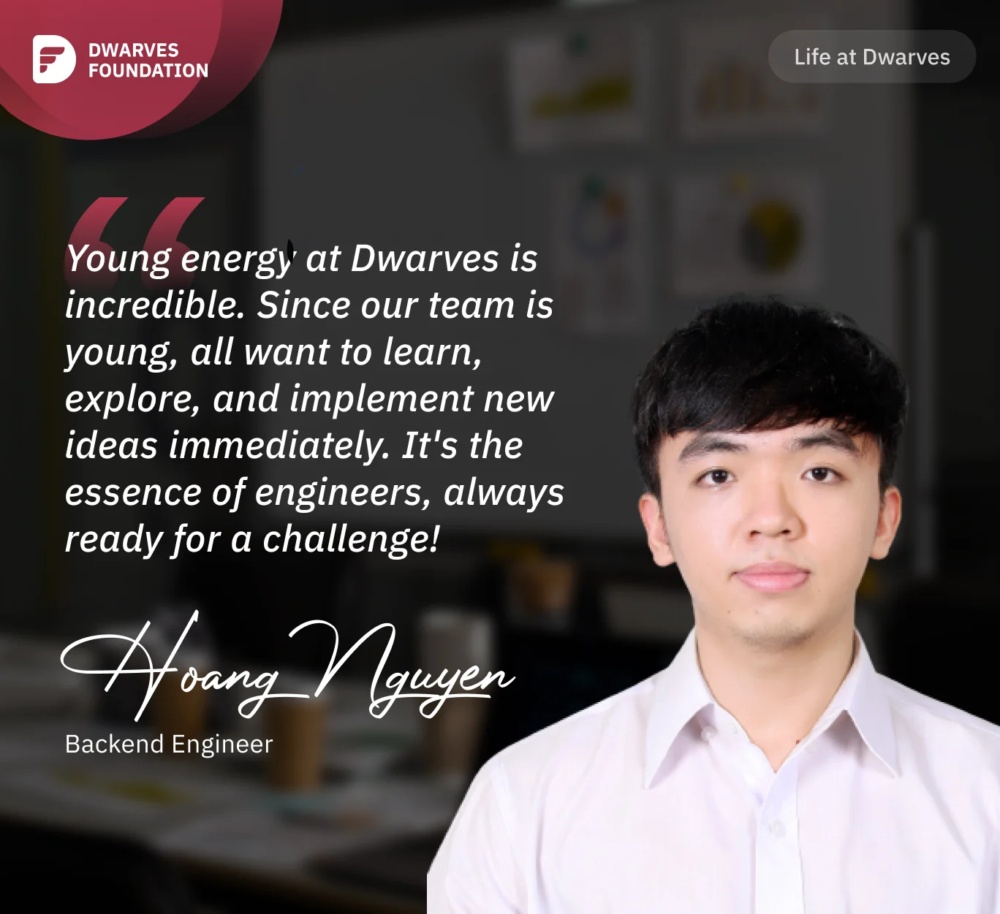

**From hardware to software engineering, a Backend Engineer celebrates the extraordinary youthful energy at Dwarves where engineers are constantly learning, sharing knowledge, and embracing new challenges with enthusiasm.**

When I joined Dwarves, I experienced the entire software lifecycle. Coming from a hardware engineering background, I had the opportunity to work on software for the Aharooms project alongside **Thanh Pham** and **Hieu Phan**. As a newbie, I received a lot of guidance from them. Thanh trained me in Frontend, while Hieu guided me in Backend development. I also acquired training in software development, application deployment, server, and system development.

When Aharooms gave requirements, I presented my ideas to mentors, who always encouraged me to try. Testing concepts, understanding product rollout, and working with third-party software teams was exciting. Lucky me, I learned a lot and progressed during the Aharooms project.

Later on, I also had the opportunity to work on NFT game projects, and now I do backend development for a large-scale green energy project.

What I love most about Dwarves is the **youthful energy** and the fighting spirit of the team. Being a young team, everyone is eager to try out interesting ideas without the fear of failure. People do what they like and think about what they want to do. Everyone is highly motivated to learn, understand, and explore. Knowledge sharing happens in various Discord channels like #til (today I learn), #tech, etc. It truly embodies the spirit of engineers.

I think this culture comes from Dwarves' mentorship culture, where mentors guide and influence mentees/newbies. When mentors provide guidance and direction, they themselves are constantly exploring new technologies and organizing courses on frontend, backend, and more. In an environment where mentors, leaders, and seniors are always learning and upgrading themselves, newbies are encouraged to do the same. That's why I am so proud of being a Dwarves member!
