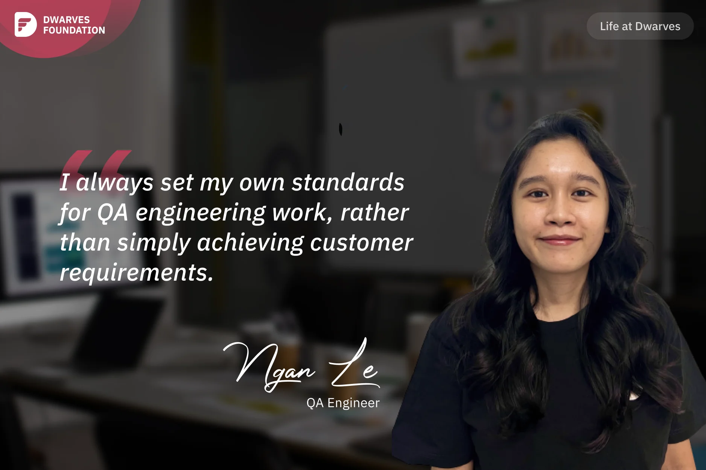

**A QA Engineer's journey from automation novice to skilled tester, emphasizing the importance of personal quality standards that go beyond client requirements and the supportive remote work culture at Dwarves.**

When I first joined Dwarves, I was interviewed to work on the Setel project as a fresher automation QA engineer, even though I knew very little about automation. Thanks to **Tuan**, who provided me with tremendous support and guidance in the realm of automation and manual skills for API testing, and **Nhut Huynh**, the team lead at Setel, who offered me plenty of opportunities to work on QA projects, from knowing almost nothing about automation, I now have solid API testing skills in web and Android domains.

Not only the people on the Setel team are incredibly supportive, but almost everyone at Dwarves is genuinely helpful. Whenever I have questions about benefits or salaries, I ping **Huy Nguyen** or **Giang**, and they always respond immediately and provide enthusiastic support. I think this is the culture at Dwarves. Since the company operates remotely, everyone must proactively offer enthusiastic support to other teams or individuals, making tasks easier to handle.

One unforgettable experience at Setel was when my team (**Nhut Huynh**, **Thinh**, **Hoang Anh**, and myself) worked extremely hard, including overtime on Friday, Saturday, and even Sunday. Despite having plans to go shopping for gifts with a friend over the weekend, I had to bring my laptop along, shop while being on a call with the team, and continue working. Due to the project's urgency, occasional bugs were encountered by end users. Each time an issue arose, I often felt stressed, even when the bug wasn't necessarily my fault or that of my team. Because I believed that allowing bugs to affect users was a big mistake for a QA engineer.

Fortunately, the client's campaign went smoothly. Our client didn't complain about our work because Dwarves team put in tremendous effort, including working overtime even on weekends, to deliver the best experience for end users.

I realized that I always set my own standards for QA engineering work, rather than simply achieving customer requirements. That's why, even when no one criticised my work, I felt responsible when end users encountered bugs. I often set high expectations for myself and work hard to uphold them in order to provide great job results.
