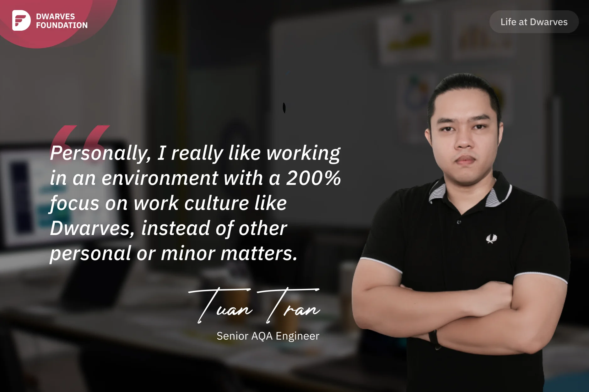

**A Senior Automation QA Engineer shares his perspective on Dwarves' work-focused culture, his experience mentoring team members, and the value of technical knowledge sharing that extends beyond the company walls.**

I've only been with Dwarves for a little over a year. I felt quite puzzled when I first joined. I was one of the youngest staff at the previous firm, but I am one of the oldest at Dwarves. OMG! Because I'm older and have more years of work experience, the team leader, **Nhut Huynh**, was initially hesitant to lead me. I actively shared with Nhut; don't be shy; I'm always ready to assist Nhut so that the team can complete the job as efficiently as possible. That's why we understand each other better.

I have a lot of experience in QA, both manual and automation. I also teach online and have courses on automation QA, currently my mentees are also quite successful at big corps. So when I joined the team, I mentored **Ngan Le** in QA automation as she desired. However, Ngan's projects are all about manual QA, so I frequently share Ngan's workload with manual QA chores while also dividing the automation projects with Ngan so that she could practice.

Personally, I really like working in an environment with a 200% focus on work culture like Dwarves, instead of other personal or minor matters. I also appreciate how the Dwarves team frequently shares technical events such as Radio Talk and Tech Event. It not only allows Dwarves members to share and learn about new technology, but it also allows the tech community, partners, and clients to learn more about Dwarves' activities. This is something very special about Dwarves!
