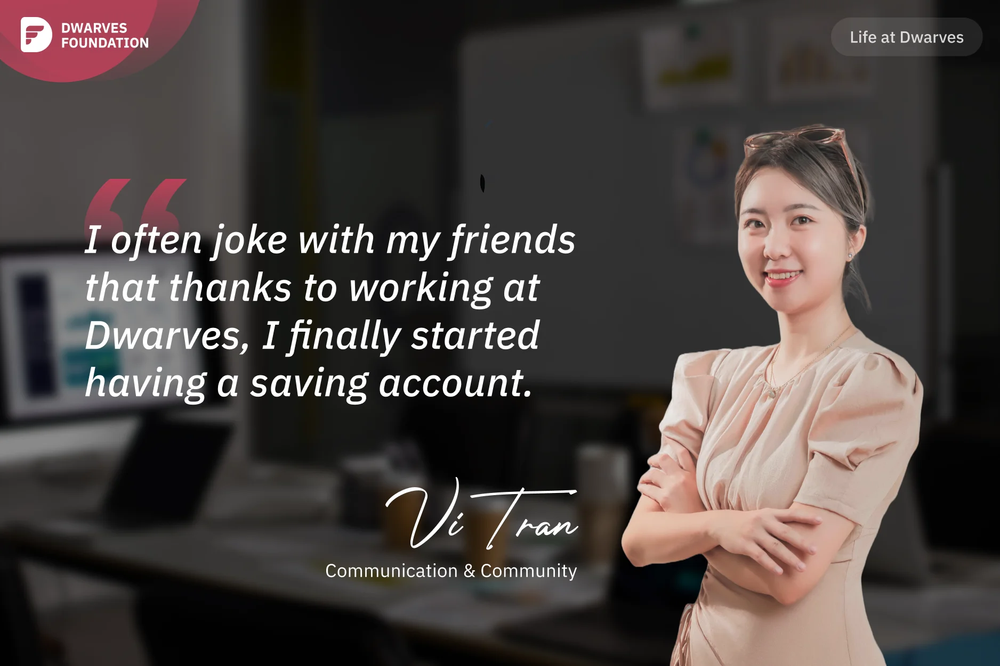

**A Communication & Community specialist describes her transition to the tech industry, initially struggling with tech terminology and high expectations, before finding her footing organizing successful tech events and building financial stability through remote work.**

2023 was a year of important decisions in my life. I transitioned to the tech industry, starting to work for a remote company like Dwarves, and moved back to hometown, living the country life. That's why I often joke with my friends that thanks to working at Dwarves, I finally started having a saving account.

When I first joined Dwarves, it was like entering a tech jungle. I had no clue about all the tech language other colleagues were speaking. Although I was in a marketing & communication role, the tech industry had its own unique aspects, and most of my previous industrial marketing experiences didn't apply. Moreover, my line manager had high expectations, so during the first 1.5 months, I just thought that I couldn't bear the pressure and wanted to end probation early. After consulting **Giang** and my friend **Tay Nguyen**, I decided to stay at Dwarves. This was a great opportunity for me to develop in the tech industry with the mentoring of **Nikki** and **Han Ngo**.

Gradually, I overcame the challenges and had many opportunities to organize tech events with major partners like AWS, VietTech, GrokkingVN,... both online, offline, and hybrid. We also offered free technical courses like Golang and Frontend Course. And they were a hit! We received a huge response from the community.

I also worked on Techie Story project, interviewing many Vietnamese engineers in the US, Singapore, EU, etc. Hearing their stories motivated me and helped me comprehend their struggles, motivating me to try harder. However, to improve my skills as a tech marketer, I'm still learning more about knowledge in tech industry. Lucky for me, all Dwarves engineers are always happy to "tutor" me.
