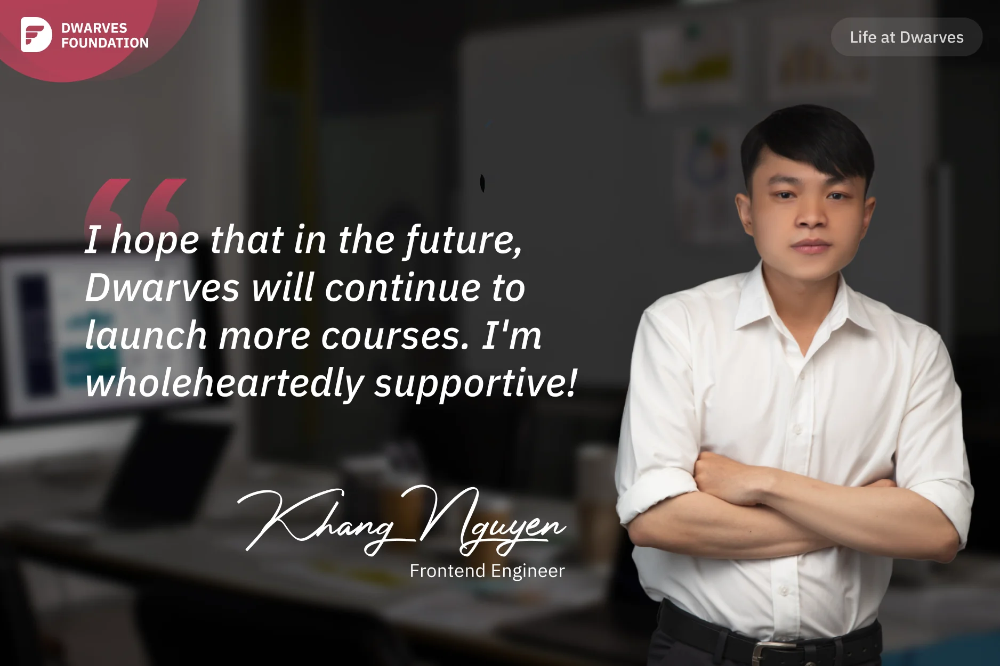

**A community member reflects on his journey with Dwarves Foundation, highlighting the high-quality frontend course, the valuable technical knowledge gained, and the supportive learning environment that led to unexpected recognition and rewards.**

Being invited to interview for Life at Dwarves series, I was surprised because I am not a Dwarves employee. Participating actively in Dwarves Discord community may help me gain this opportunity.

Last year, **Thanh Le**, a tech blogger whom I followed, introduced me to Dwarves while I was seeking a new opportunity. I applied to work at Dwarves but wasn't chosen. Since then, I've followed Dwarves and read their technical blog posts. When Dwarves announced Frontend Course 2023, I registered immediately.

I have to say, this is the most well-organized course I have ever taken. Before this, I tried FrontEnd Master and other frontend courses, but none were as good. I appreciate the high-quality course content I can apply at work. I learned how to use a11y-compliant dialogs, Zod forms, and React Query server state. I especially appreciated utilizing Orval to connect frontend and backend. This insight expanded my understanding of frontend-backend integration. I also learned how to effectively manage libraries like React Query and React Hook Form. And I will definitely apply Orval to my upcoming pet projects because it's so useful.

A memorable experience in the course was meeting my teammate, **Mr. B 1998**, who has 5 years of work experience. Along with learning from Dwarves, I got support from them and had Mr. B 1998 review my code. After finishing the training, our final project won first place, earning me tokens from Dwarves. It was an unexpected bonus that improved my learning motivation and excitement.

Once again, I want to thank Dwarves for their hard work in providing this course freely to community. I hope that in the future, Dwarves will continue to launch more courses. I am wholeheartedly supportive!
