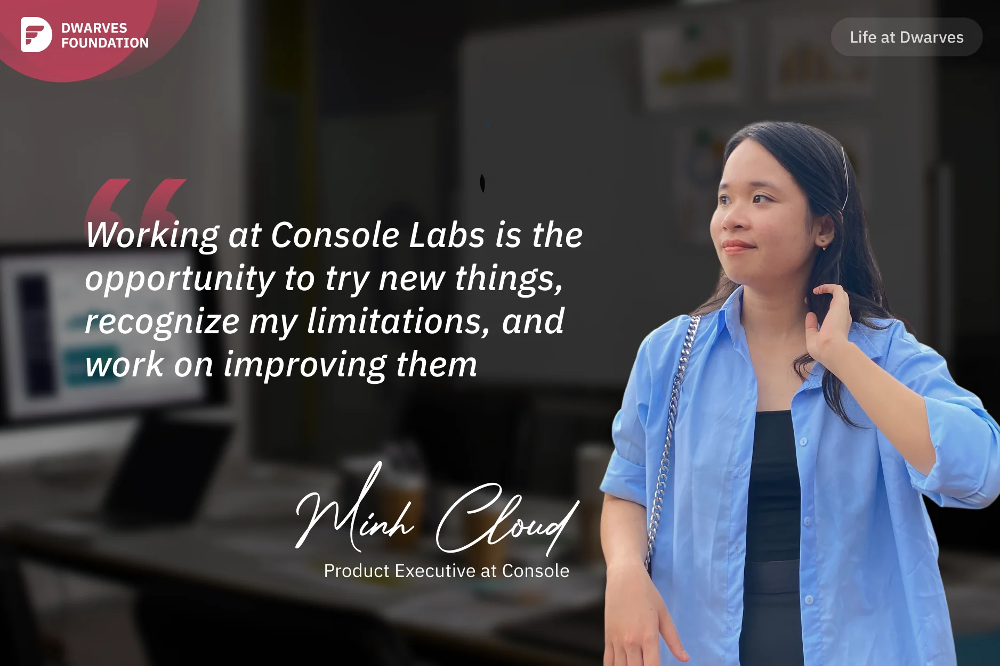

**A Product Executive shares how working at Console Labs (Dwarves) transformed her daily routine through remote work, while also challenging her introverted nature and encouraging her to expand her horizons through networking and stepping outside her comfort zone.**

I saw that Console was hiring for a Product Data Intern position in Sep 2022, when I was still a third-year student, and I decided to give it a try in the web3 industry. Although I had some experience working on products for a tech company and even building my own product in the HR field, I wasn't very confident to apply to Console Labs. It was competitive, had great benefits, and paid well.

Luckily, I passed and got the opportunity to work remotely at Console Labs, which made my life much easier. At my old company, I travelled 34km each way and dealt with Hanoi traffic for 2-3 hours a day. Therefore, working remotely gave me more time to exercise, earlier arrival at school, and more time to rest.

One of the things I enjoy most about working at Console Labs is the opportunity to try new things, recognize my limitations, and work on improving them. It shakes my comfort zone. When **Han** told me that researching and designing the product would just be part of the job, I was extremely impressed. He advised me to expand my horizons and my network. Because I am naturally introverted, I felt uneasy and nervous.

In 2023, I visited Saigon and met a lot of interesting people from different fields. I said to myself, "Oh wow, I don't really dislike talking to people, it's actually nice." I talked to product builders during networking sessions instead of just researching it as I did before. I understood how they built it, who they were targeting, and how they planned to develop it. These encounters shifted my self-esteem and given me the courage to move outside of my comfort zone.

_Console Labs is an experimental labs for Web3 products backed by Dwarves Foundation._
