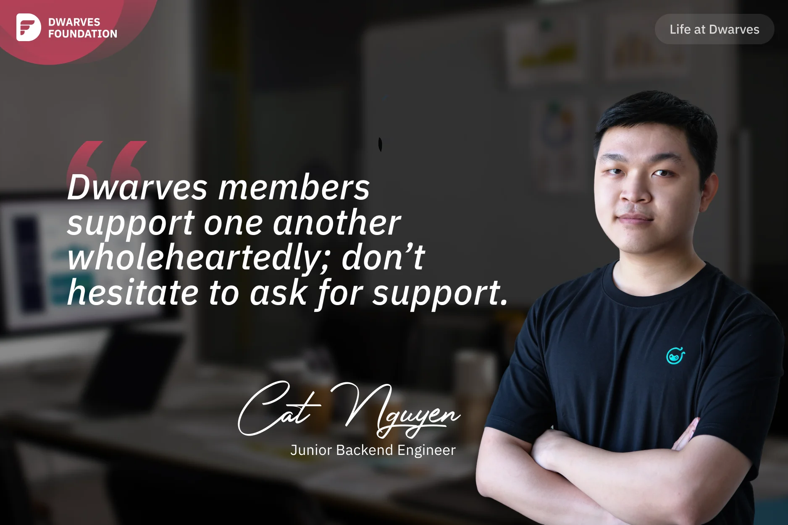

**A Junior Backend Engineer recounts her journey at Dwarves Foundation, from being attracted by their distinctive logo to finding satisfaction in remote work and learning the important lesson that seeking help from supportive team members is key to professional growth.**

My journey with Dwarves began with a glance at their logo during my senior year at Bach Khoa University. While browsing through tech job listings on the university's website, Dwarves' distinctive red logo caught my eye amidst a sea of white logo backgrounds. I read the JD, found it aligned with my aspirations, aced the test, sailed through interviews, and here I am.

Though I've only been with Dwarves for just over a year, my job satisfaction is a solid 10/10. Thanks to remote work, I save 2-3 hours on commuting, granting me more time for fitness, knowledge updates, and quality moments with my parents.

In my year with Dwarves, I've worked on two projects: Console Labs and another client project. Starting at Console, I received big support from **Khoi** and **Tuan Dao**. Even with seemingly simple questions, they patiently explained and provided me with reading materials. I did appreciate it.

And the most memorable experience was tackling the client project, where the difficulty level soared, delving into domains I hadn't touched before. For two weeks in a row, I worked tirelessly until 11PM to complete difficult tasks. As a newcomer, I hesitated to seek guidance initially, only turning to **Bien Vo** for the toughest queries. Then **Thanh Pham** caught up and assigned **Hieu Phan** as my mentor. Lucky me!

Despite the steep learning curve, I realized a crucial lesson: when in doubt, reach out to Dwarves Team for support; their unwavering support propels both personal and professional growth.
