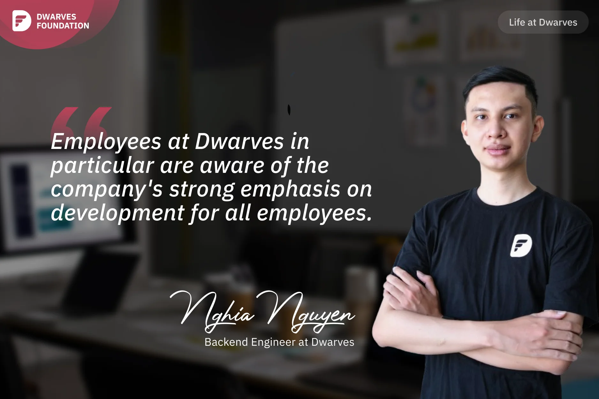

**A Backend Engineer shares his appreciation for Dwarves' welcoming atmosphere and strong focus on continuous learning, highlighting how the mentorship program and opportunities to write technical articles have significantly improved his skills and confidence.**

The best memory I have of Dwarves is my first company dinner, even though I hadn't officially onboarded yet. Even though I wasn't a part of the company, Dwarves members were keen to talk to me, which made me feel neither lost nor alone. That day, I spoke with senior members such as **An** and **Hieu Phan**, who eventually became my Dwarves mentors. Upon our first meeting, I was impressed by how friendly and welcoming the Dwarves were to newcomers.

No matter what their position, everyone at Dwarves supports each other respectfully. When newcomers like I needed help, people were wholeheartedly supportive. **Nikki Ngoc Truong**, COO at Dwarves, was really supportive when I asked her for help reviewing my profile for client pitching, despite the fact that we're not on the same team. She went over it six or seven times, pointing me faults in my writing and posing questions to assist me highlight my abilities and projects. Previously, I didn't give much thought to writing, such as documenting or taking succinct notes. Thanks to the writing experiences and continuous feedback, my writing skills have gotten better as well.

Members at Dwarves in particular are aware of the company's strong emphasis on development for everyone. For example, the mentor-mentee program ensures that every new member has a senior mentor who not only guides them in their career path but also provides guidance on various soft skills and knowledge. Another example is the Brainery and Tech Radar series at Dwarves, which have helped me develop significantly. From someone who didn't know how to write documentation, I now frequently write tech blogs and brainery articles about the technologies I'm working on.

Each time I write an engineering article, I often seek the advice of **Tom Nguyen**, who has extensive knowledge and provides insightful reviews. Tom gives valuable keywords and asks thought-provoking questions, allowing me to gain more experience and insights when exploring new technologies.
