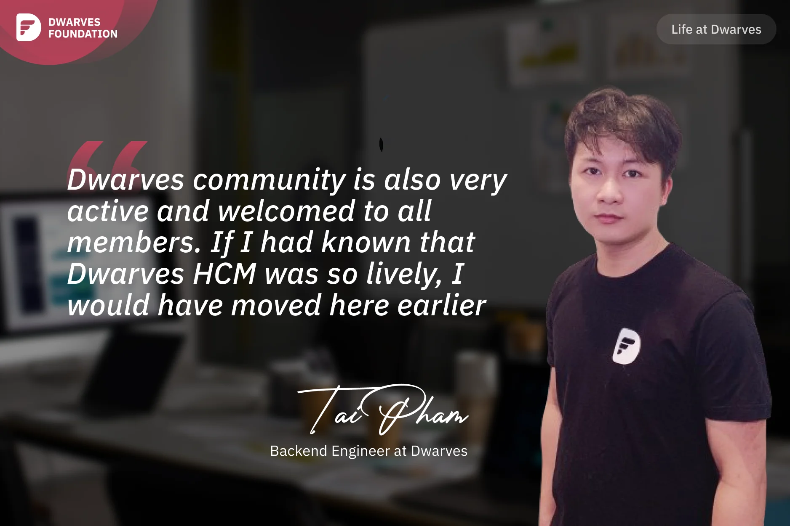

**A Backend Engineer recounts his journey with Dwarves Foundation, from discovering the company through tech blogs to appreciating their active community engagement, warm welcome to newcomers, and dedication to knowledge sharing across various tech communities.**

I learned about Dwarves through WeBuild Community. I frequently read tech blogs written by WeBuild members, especially **Thach**, a Dwarves Alumni. Over time, I became interested in this company and started following CEO **Han**. When I saw his job posting at the end of 2021, I applied, and I've been working there ever since. Later on, I even referred my older brother, **Ngoc Thanh**, to work at Dwarves, hehe.

Dwarves community is also very active and welcomed to all members. I recently moved from Hanoi to Saigon just over a month ago. Dwarves members in Saigon greeted me warmly. When I first arrived, **Nam** even took me around Saigon, introducing me to places to visit. **Hieu Phan** cooked for me and invited me to go swimming. Since the company operates remotely, weekdays are quiet, but weekends are bustling. Members of the board game club, such as **Phat**, **Bien**, **Quang**, **Huy Tieu**, **Huy Nguyen**, **Hoang Anh**, **Han**, and others, generally come together on weekends to play board games. That's why if I had known that Dwarves HCM was so lively, I would have moved here earlier. 😄

I believe Dwarves has a strong culture of community building and sharing. It's not just about the communities created by Dwarves, such as Dwarves Discord and Techie Story, but also about Dwarves members actively participating in other communities. They are active members of Golang Vietnam, WeBuild, and other communities. I recall that in 2021, when Vietnam was under lockdown, WeBuild and Dwarves hosted community calls for developers to share their experiences and the state of the tech industry at that time. It was cozy and memorable. In 2023, Dwarves also held regular tech events with other communities and offered technical training such as Golang and front-end courses. That is why I take such pride in being a Dwarves member.
