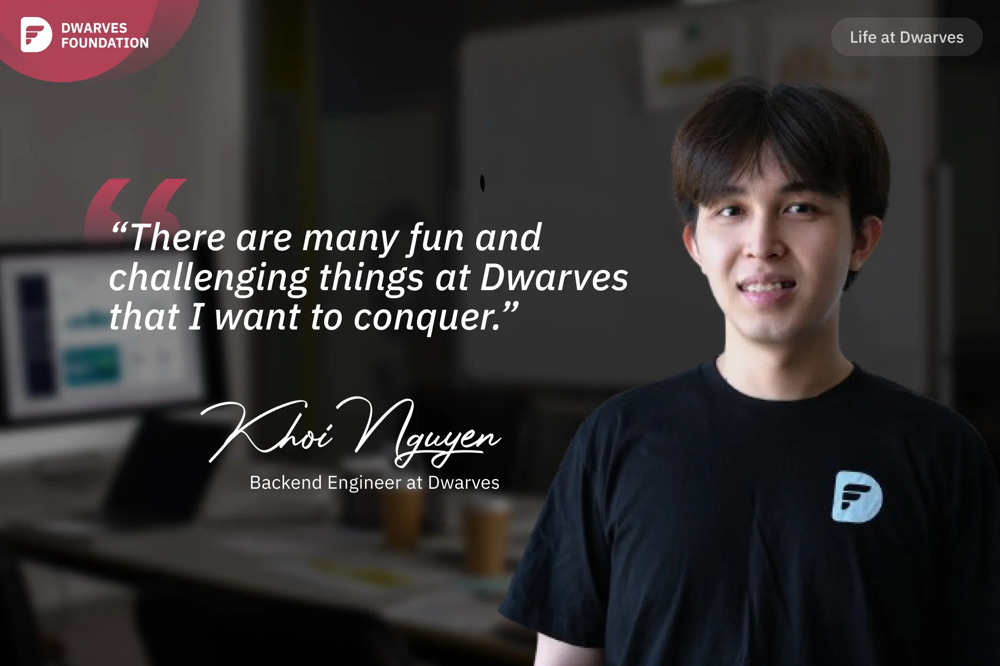

**A Backend Engineer explains why he's stayed with Dwarves for nearly two years, citing the engaging challenges like learning new languages, participating in courses to expand his skillset, and appreciating the company's commitment to sharing high-quality technical knowledge with the wider community.**

I'm normally ready to jump and find a more suitable environment when my job becomes too boring or I don't learn much. However, I have been committed to Dwarves for nearly 2 years, and I still enjoy working here. There are many fun and challenging things at Dwarves that I want to conquer. For example, I recently learned a new language, Elixir, for a project I worked on with a client. Working with a new language was fun. Elixir is not widely used in the tech market in Vietnam now, and most of the job openings are from foreign market.

I also enjoy participating in tech events or courses by Dwarves. Two months ago, I joined Frontend Course 2023 (FE23) to try to become a full-stack engineer. This was a challenging time when I have a fulltime job and enroll a heavy course at the same time. My team coded an AI-assisted chess game as our final project. On demo day, our CEO **Han** played the game, and I was worried if there were any mistakes. But luckily, the AI bot won against Han. Our final project even won the "Favorite Project" award! 😄

At Dwarves, mentors are assigned to junior or fresh colleagues joining us for each project. For the FE23 final project, I was fortunate to have **Tom Nguyen** as my mentor, and I was very excited. Tom has extensive knowledge in various fields and is like a brain master, yet also humble. He has a strong ability to abstract knowledge and apply it to real-world work circumstances. So, when he mentored me on topics like AI and LLM, I learned a lot.

Another thing that I appreciate Dwarves is that it also shares its knowledge, case studies, and research through brainery, hashnote, and tech blogs to community. I've also contributed a few articles to the brainery. Most of my IT friends at other companies know about Dwarves' tech blogs and agree that the content is high-quality, unique, and impressive. This makes me proud of Dwarves, a company that not only provides opportunities for personal development but also contributes to community and earns recognition from it.
