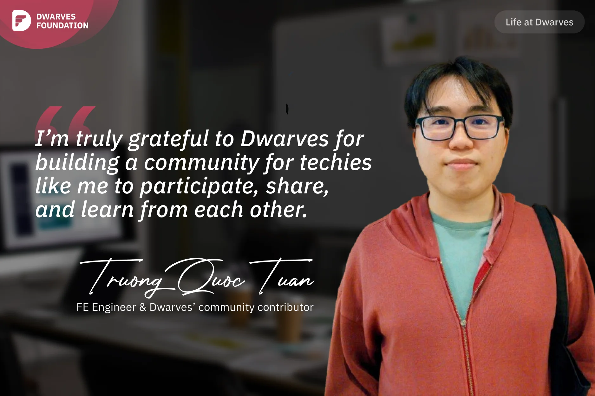

**A Frontend Engineer and community contributor reflects on his journey with Dwarves' open community, from initially feeling overwhelmed to earning recognition for his contributions, and appreciating the foundation's commitment to remote work, open knowledge sharing, and fair treatment of all community members.**

I knew Dwarves in 2019 through a recruitment channel and have followed them since. In 2022, when I saw Dwarves' public server on Discord, I joined immediately. At first, I felt overwhelmed because I didn't fully understand the discussions due to my limited knowledge and expertise. However, after attending more Radio Talks, I grew more involved and found this community vibrant and interesting.

My most memorable experience with Dwarves was at the end of 2022. After a long day of deadlines, I received a Discord mention during the award ceremony that I was awarded "Trustees - Most trusted members" and received 152 ICY. I clearly remember feeling surprised and happy at that time, because I had no idea about this award before. I do appreciate that even if I'm not a Dwarves member, and I'm still recognized and honored.

I really like Dwarves community, and three things impress me the most. First, Dwarves work remotely full-time, allowing members to work anywhere with a laptop and Internet. This helps members to arrange their personal lives flexibly and freely. The second thing is that Dwarves share openly. In many other companies, information about experiences, tech stacks, and boilerplate code is often not shared with outsiders. But at Dwarves, all said information is publicly shared, from playbooks and boilerplate code to internal notes, helping community members learn and develop skills. And finally, Dwarves is a fair community. Everyone, whether an outsider or a Dwarves members, is treated equally and given the opportunity to participate in community activities and decisions. It is a place where all members are valued and appreciated based on their abilities and contributions.

After nearly 2 years of joining in Dwarves community, I have learned a lot. I'm truly grateful to Dwarves for building a community for techies like me to participate, share, and learn from each other.

Just a "flex" that I was rewarded in Dwarves Of The Year for two consecutive years as a community contributor: [Dwarves of the Year 2022](https://note.d.foundation/memo/dwarves-of-the-year-2022/)
