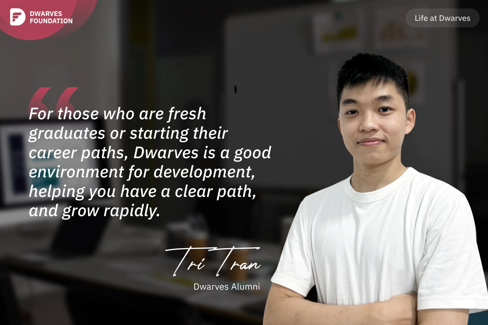

**A Dwarves alumnus shares his appreciation for the strong mentorship, open community, and growth-focused environment at Dwarves Foundation, explaining why it provides an ideal starting point for fresh graduates and career beginners to develop rapidly with clear direction.**

I started working at Dwarves during my 3rd year of university, and kept working there after graduation. Although I no longer work at Dwarves, I highly value my personal development during my time there and I still see the growth of Dwarves community.

When I first joined Dwarves, I was lucky to have **Thanh** as my mentor, helping me adapt to the work environment and develop my skills. During my first two weeks, Thanh trained me on everything from A-Z, which was important for a newbie like me. Thanh not only worked with me but also took the team out for meals, which made me motivated despite the pressures of studying, working, and writing my graduation thesis.

Dwarves is an open community that welcomes both alumni and non-members, allowing me to build a win-win relationship. Even as a Dwarves alumnus, I stay connected with fellow members on Discord. I sometimes share interesting articles from Dwarves with my current company to learn from because Dwarves regularly invests time and resources in researching new tech stack. Personally, I love learning and staying updated on new tech, and Dwarves is a good place for sharing and gaining new knowledge. Contributing to Dwarves community often brings rewards, so I happily continue to do so without any loss (hehe).

If you are a fresh graduate or a newbie, Dwarves is a good environment to help you have a clear career path, and grow rapidly. When I first joined Dwarves, I was surprised that all members have a high mindset for continuous learning. This creates an environment of talented and eager-to-learn individuals that has sped up my own development. Another special thing about Dwarves is that mentors will provide guidance on career paths for their mentees. When I graduated, I was unsure about my direction, but mentors with experience advised me on my career development, which helped me a lot. I am truly grateful for the time I spent with Dwarves right after graduating. It provided me with a strong foundation for my career path moving forward.
