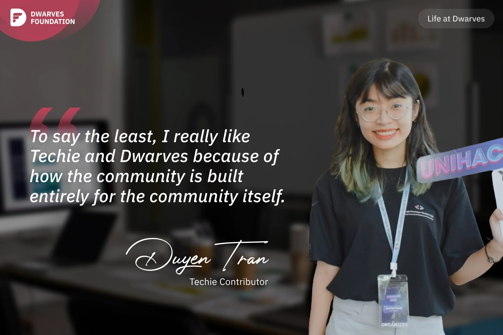

**A Techie contributor reflects on her decision to join the Dwarves community initiative that highlights the stories of tech professionals worldwide, valuing the open, supportive environment and the opportunity to connect with inspiring engineers while sharing their experiences beyond just technical aspects.**

In late 2022, after discovering Dwarves by chance, I went through their the activities such as radio talks and webinars on Discord. I was impressed by how an open and supporting the community was to its members.

After participating in a few tech events organized by Dwarves, I also noticed that the members are very talented and energetic. I did want to contribute and support for this tech community, so I joined **Techie Story** project - a non-profit project run by some Dwarves members to honor life stories of tech people who have been continuously contributed to Science, Technology & Innovation.

Since joining, I've had the opportunity to listen to and talk with Vietnamese engineers all over the world. There's more to this industry than just the technical aspects, so our team wants to recognize all aspects of work and life in this field. I've learned that their achievements are not solely based on luck, but rather on a path filled with challenges, tremendous effort, and perseverance. By listening to and sharing these stories, my hope is to inspire more people. Additionally, apart from the financial support, Techie has provided me with the chance to connect with talented engineers that I have learned a lot, allowing me to expand my network within the tech industry.

To say the least, I really appreciate Techie and Dwarves because of the community they have created, which is entirely focused on supporting its members. It provides a healthy environment where members are encouraged to learn and grow. If you're interested in Techie Project, I encourage you to join Discord channel and ping me.
