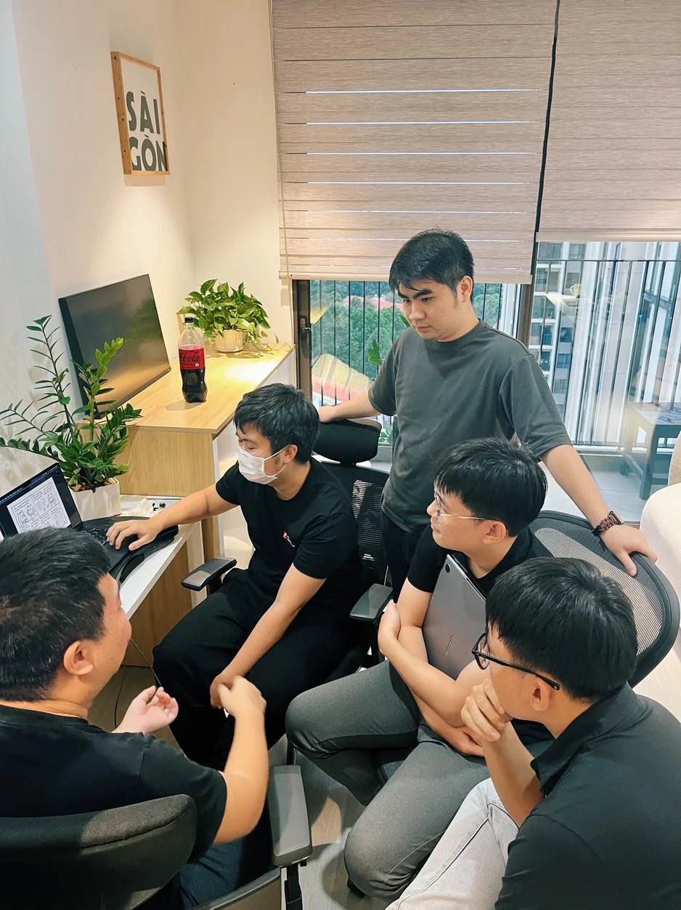

**An AI Developer Intern reflects on how Dwarves' hybrid working model transformed his learning experience, providing both the focus of remote work and the accelerated knowledge transfer of in-person collaboration, especially through mentorship and spontaneous knowledge sharing.**

I started at Dwarves working remotely, focusing on LLM/AI. While remote work gave me space and focus, coming into the office changed everything. Learning here doesn't happen through formal presentations or scheduled meetings but in quick exchanges with everyone - from the CEO to team members.

Hybrid work became a faster way to learn. The instant feedback and casual conversations about LLM trends helped me understand things much more quickly. The insights I gained in person were far more valuable than figuring things out alone at home.

> "The quick chats turn into real learning moments. In an environment where mentors and seniors are always learning, newbies feel encouraged to do the same. It's all rooted in Dwarves' mentorship culture."

When I struggled with an LLM model, a quick whiteboard session with **Tom** and the team solved it in minutes, saving me hours of trial and error. One time, I was stuck on a complex problem, and instead of spending days figuring it out alone, I sat down with Tom, who explained it step-by-step. In that moment, everything clicked.

I also learned a lot by observing how others tackled challenges. Watching my mentor optimize code taught me more than weeks of remote tutorials could have. Seeing Tom and senior engineers solve problems in real-time helped me grasp concepts much faster than any online guide.

> "Watching Tom handle real problems taught me more than any guide or online course could. I learned by seeing how he approached challenges."

Working on projects with input from different team members gave me a broader view of collaboration. Being in the office helped me sharpen skills that are harder to develop remotely, like thinking on my feet and explaining complex ideas clearly.

At Dwarves, I was impressed by how everyone, from the CEO to new employees, understands the latest LLM trends and how GenAI tools assist us in accelerating product development. Learning new technology is difficult, but sharing ideas, insights, and hands-on experience from senior staff in the office is the best way to speed up the process.

If you're part of the Dwarves community, you'll notice our culture of continuous learning and knowledge sharing. I also contribute by sharing my knowledge with the team. Sharing is not only a way to contribute to the collective good but also a powerful tool for personal growth. By sharing with each other, we solidify our own understanding and gain new perspectives.

The hybrid setup offers the best of both worlds. I can focus deeply when working remotely but get that extra boost from being in the office when needed. The goal is simple - helping each other improve and push forward, with support from the entire team along the way.
