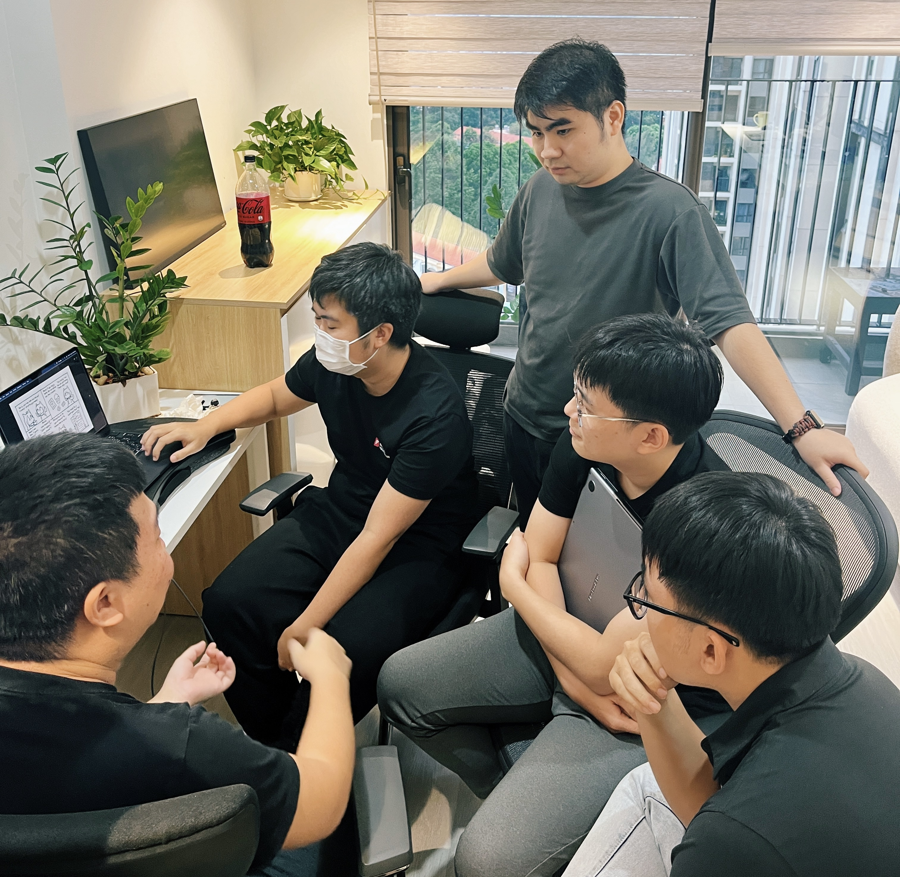

**Life at Dwarves #27** shares the journey of [@datnguyennnx](https://memo.d.foundation/contributor/datnguyennnx/), an AI/LLM intern. Starting out remotely, Dat soon saw the benefits of Dwarves’ hybrid working model. With guidance from [@tom](https://memo.d.foundation/contributor/tom) and others, he’s been able to dive into real-world learning, picking up skills on the go. Dat’s journey is all about practical experience, quick exchanges, and real teamwork - exactly how we like to do things here.

### Learning by doing at Dwarves
Starting at Dwarves remotely, I dove into LLM/AI. Remote work gave me focus, but being in the office changed everything. Learning here doesn’t happen through formal meetings - it’s quick, spontaneous exchanges with everyone, from CEO to teammates.

### Real-time learning at the office
Hybrid work became a quicker way to learn. In the office, instant feedback and casual conversations on LLM trends pushed my understanding forward much faster than working alone at home.

> “The quick chats turn into real learning moments. In an environment where mentors and seniors are always learning, newbies feel encouraged to do the same. It’s all rooted in Dwarves’ mentorship culture.”
> 

One time, I was stuck on an LLM model, and a quick whiteboard session with [@tom](https://memo.d.foundation/contributor/tom) and the team solved it in minutes, saving me hours of trial and error.

### Learning by watching and doing
Observing how others, like [@tom](https://memo.d.foundation/contributor/tom) or CEO, handled challenges taught me more than online guides, my learning feel more real. One session where my mentor optimized code gave me insights I couldn’t have gained from remote tutorials.

Seeing everyone solve problems in real-time helped me grasp things much faster. Working on projects with input from different team members broadened my view on how to collaborate effectively.

### The value of being face-to-face
Learning here happens naturally. Everyone shares what they know through the work itself. No formal lessons needed - just quick exchanges and hands-on collaboration. Being in the office helped me sharpen skills that are harder to develop remotely, like thinking on my feet.

### Growing with the whole team
The hybrid setup offers the best of both worlds. I can focus remotely but get that extra boost from being in the office when needed. The goal is simple - helping each other improve and push forward, with support from the entire team along the way.
