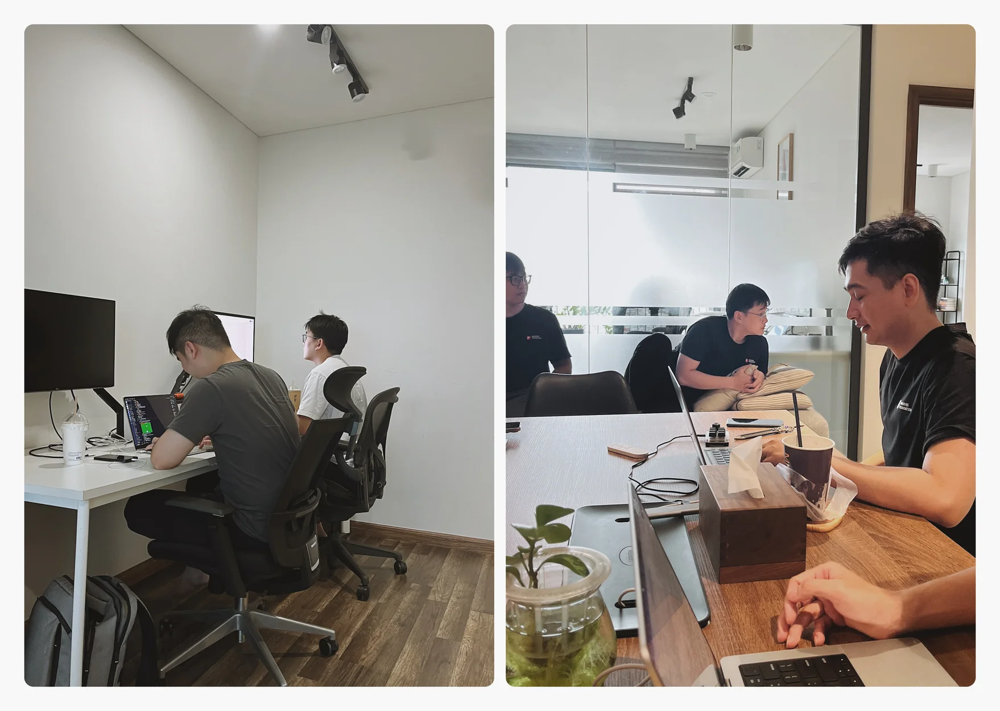
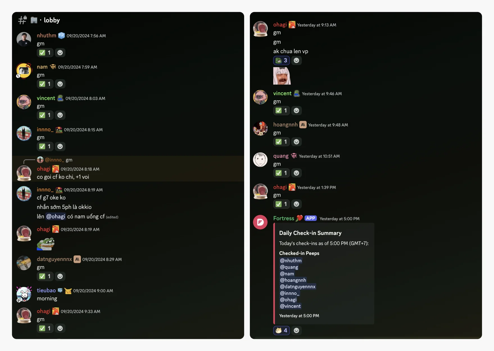
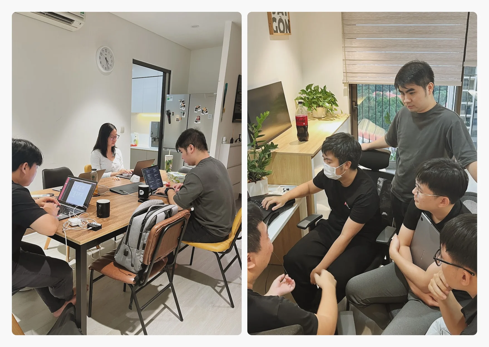
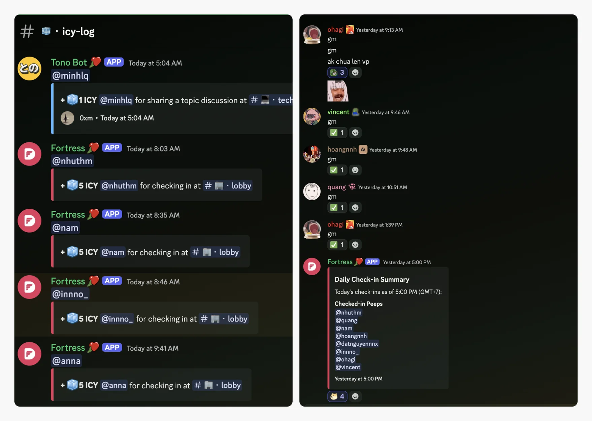

## Back to the office: A home away from home

Since the start, Dwarves has valued flexibility, allowing our team to work where inspiration strikes. But there's something special about being together—learning, sharing knowledge, and working side by side.

That's where our hybrid working model steps in.

We didn’t aim to fill desks but to create a space where you can learn, connect, and rediscover the energy that comes from working alongside others, even if it’s just for a day or two.

### What makes the Dwarves office different

As a borderless software team, we know not everyone finds comfort or focus working remotely all the time. Even local cafes have their charm, but let’s be honest—it’s not always smooth sailing. That’s why our engineers have the full support they need to perform at their best.

1. Work in comfort:

From Apple Studio Displays to Herman Miller chairs, we’ve set up workspaces adapt to you. Whether you need a quiet corner or an open area for brainstorming, you’ll find a spot that suits your style.

2. Productivity perks:

Distractions? Not here. With high-speed internet, tranquil meeting rooms, subsidized meals, and 24/7 access, you have everything you need to stay in the zone.

3. A supportive environment that fuels growth:

Every interaction, every conversation, is a chance to pick up something new or share what you know.

### Why our office check-in is worth it

We’ve added a little extra motivation to make coming into the office more rewarding. Every time you check in at 🏢・lobby, you’ll earn 5 ICY tokens as part of our daily team perks. It’s our way of encouraging you to take advantage of everything the office offers and to make every visit count.

- Simple and quick: Check in, earn your ICY. Kick-off your day with a little boost.
- Earn while you work: Whether you're here for a focused work or to catch up with teammates. You’re rewarded just for showing up.
- Stay connected: These perks are little a reminder that we’re building something together, day by day.
  

### Shaping a place for real learning

Why leave your home office? What makes this place worth the trip? It’s not about fancy setups. Team members who hadn't visited in a while began dropping by, finding new ways to connect.

When @tom picks up a new skill, he shares it with everyone in person. It was him, standing by a desk, showing others in real time. These face-to-face exchanges spread knowledge throughout the team effortlessly. We didn’t force people back; they started coming in because something changed.

You see, there are things you can’t capture in a digital thread. A quick tip, a shared screen, a face that lights up when they finally get it. That’s learning.

We didn’t aim for a typical office with rigid desks. Instead, we created a space where reaching out feels natural, and where every conversation might teach you something new, where knowledge isn’t just passed around—it’s lived and experienced.

### Real voices: What our team says

Don’t just take our word for it—here’s what some of our team members have to say about coming back to the office:

- “The quick chats turn into real learning moments. In an environment where mentors and seniors are always learning, newbies feel encouraged to do the same. It’s all rooted in Dwarves' mentorship culture.” - @datnguyen
- "Working from the office helps me stay focused, and it's easy to reach out when I need a hand. It feels good to have that balance." – @vincent
- "I appreciate the mix of working remotely and coming in. The face-to-face chats and shared meals make it feel more connected. It truly embodies the spirit of engineers." – @nhuthuynh
- "It’s not just about working harder; it’s about working smarter. I’ve shared a lot of knowledge by bouncing ideas off my teammates" – @tom
- "Being at the office a couple of days a week has made it easier to separate work and home life. Plus, it's good to see everyone now and then." – @nam

### Where work meets growth

Though this is still in the early stages, some of us have already reached the hub and made it their go-to spot for getting into the zone. We’d be glad to have you as one of them.

Along with everything, we do everything we can to level up our team. In the end, it’s not just about work; it’s about how we grow, together.

---

## Office Check-in Process for ICY Token Rewards

A guide on how to check in at the office and claim ICY token rewards.

Remote work is great, but there's something about the in-person vibe that helps us learn, share, and connect. To make the most of our hybrid style, we’ve set up an easy check-in process to reward those who pop by the office:

### Arriving at the Office

Find your spot and get comfortable. Our office is set up for focus and creativity, so you’ll find a space that works for you.

### Connecting to the Office Wi-Fi

Once you’re settled, make sure to connect to the office Wi-Fi. This keeps you linked to our system and ensures you’re ready to check in.

### Getting on Discord

Open Discord on your device and make sure you’re logged into the Dwarves server. If you haven’t joined yet, now’s the time.

### Checking In

Head over to the 🏢・lobby channel. Type "gm" (short for "good morning") and hit send. That’s it—you’re officially checked in for the day.

### Earning Your ICY Tokens

After your "gm" message, our system will credit you with 5 ICY tokens, worth about $7.5. It’s our way of saying thanks for being here and joining the in-person energy.

### Making the Most of Your Time

You’re all set! Now’s your chance to catch up with teammates, share ideas, or just enjoy the office vibe. These face-to-face moments make all the difference.

Introduction:

- Why we're embracing a hybrid working model at Dwarves.
- How this campaign encourages team members to blend the best of remote and office life.
  What We Offer:

- Work in Comfort: Access to Herman Miller chairs, Apple Studio Displays, and dedicated desks.
- Productivity Perks: High-speed internet, tranquil meeting rooms, and 24/7 access.
- Supportive Environment: Subsidized parking, lunch, and dinner.
  Addressing Common Challenges:

- Overcoming the distractions of working from home.
- Creating a clear work-life boundary.
  Why Choose the Office Over a Café?

- Consistent comfort: Ergonomic setup and guaranteed workspace.
- Reliable resources: High-speed internet and access to equipment.
- Community vibe: Connect with teammates for collaboration and learning.
  The Heart of Hybrid Working at Dwarves:

- Our commitment to supporting a learning culture, whether in-office or remote.
- How hybrid work nurtures team bonding, both during and beyond work hours.
  Team Testimonials:

- Gather insights from teammates about their experiences with hybrid work.
- Showcase how spending time at the office has boosted their productivity and collaboration.
  Closing Thoughts:

- Encourage team members to come by, check-in, earn ICY, and experience the Dwarves’ hybrid work culture firsthand.
