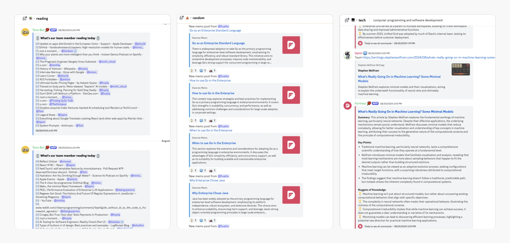

Life at Dwarves | Learning and knowledge sharing culture

At Dwarves, we believe learning is the key to success. We're not just talking about it; we're actively building a culture where sharing knowledge is valued and rewarded.

By participating in our learning activities, you not only grow but also get recognized for your contributions. We've set aside a monthly pool of 2500 ICY (around $4000) to reward those who actively share their knowledge. 70% of this pool goes to contributors who bring valuable insights to the community, especially in our focus areas: AI/LLM, Golang, Software Architecture, and Blockchain.

You can check out how ICY is distributed in the 🧊・earn-icy channel.

How to Get Involved

- Share your insights: Drop interesting links or ideas in research channels like 💻・tech or 💡・til, and you’ll get noticed.
- Join our OGIFs: Got a topic you’re passionate about? Share it during our sessions or submit your notes to the memo.
- Contribute to open source: We love building tools that boost productivity. If you're into that, hop into 🦄・build and start creating something awesome.
  We hope to create a welcoming community for everyone who joins in.

\_

Life at Dwarves is a series of stories about people, perspectives, and lives at Dwarves.

Be part of our journey: discord.gg/dwarvesv

