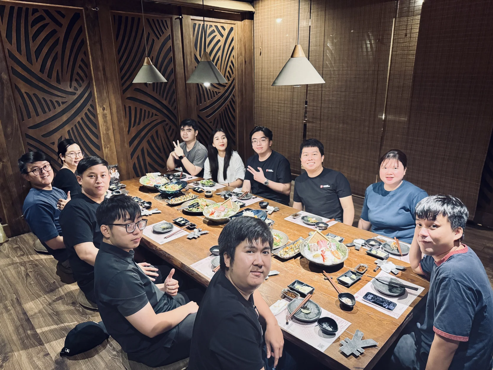
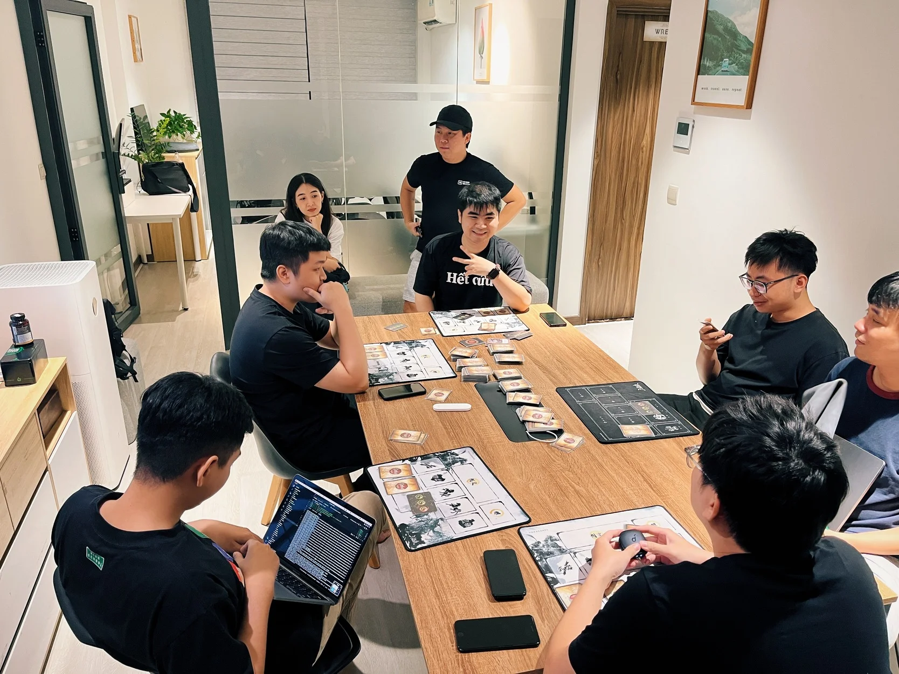
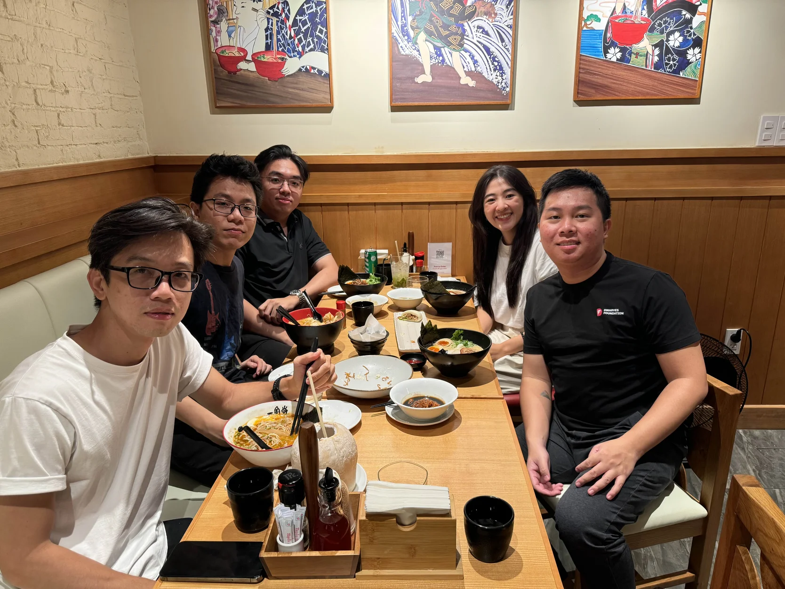

Dwarves Hangouts: Casual Moments, Real Connection

A typical Friday afternoon rolls in, and as the workday winds down, someone casually drops a message in the chat: “Board games this weekend?” No formal event, no big announcements - just the kind of spontaneous hangout that happens regularly.

Our connection happens in the little moments - grabbing coffee, swapping ideas over lunch, or unwinding with a round of Legends of the Three Kingdoms. Senior engineers and interns alike are part of the same conversation, with no hierarchy getting in the way.

What makes our hangouts special is that they feel more like friends catching up than colleagues going through the motions. A dinner gathering or an impromptu meetup at a favorite local spot carries the same vibe: relaxed, open, and built on mutual respect.

Even remotely, our connection remains strong. We’re always just a message away on Discord, sharing thoughts during the workday or dropping a meme to lighten the mood. The mix of work and play, formal and informal, keeps the team close, even when miles apart.

This laid-back style means that when we come together, things click. Ideas move fast - no need to force it. Conversations are natural, and work feels less like a grind and more like something we’re doing together.

\_

Life at Dwarves is a series of stories about people, perspectives, and lives at Dwarves.

Be part of our journey: discord.gg/dwarvesv

